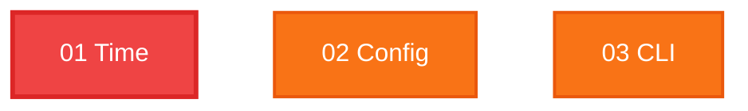

# Loom Development Workflow

## Backlog Lifecycle

```mermaid
%%{init: {'theme': 'base', 'themeVariables': { 'primaryColor': '#6366f1', 'primaryTextColor': '#fff', 'primaryBorderColor': '#4f46e5', 'lineColor': '#94a3b8', 'secondaryColor': '#f472b6', 'tertiaryColor': '#34d399', 'background': '#0f172a', 'mainBkg': '#1e293b', 'nodeBorder': '#475569', 'clusterBkg': '#1e293b', 'clusterBorder': '#475569', 'titleColor': '#f8fafc', 'edgeLabelBackground': '#1e293b'}}}%%

flowchart TB
    subgraph STAGE["📦 CRATE STAGING"]
        direction TB
        s1[libs/loom-pipe/BACKLOG.md]
        s2[libs/loom-config/BACKLOG.md]
        s3[libs/loom-cli/BACKLOG.md]
    end

    promote{{"⬇️ Promote to Global"}}

    subgraph STACK["📚 GLOBAL PHASE STACK"]
        direction TB
        index[(backlog/README.md)]
        p03[🔹 03-cli-command-structs.md]
        p02[🔹 02-multi-file-merge.md]
        p01[🔸 01-time-operators.md]

        index --> p03
        p03 --> p02
        p02 --> p01
    end

    pop{{"⬇️ Pop Next Phase"}}

    subgraph WORK["🚀 EXECUTE"]
        direction TB
        impl[🛠️ Implement]
        test[🧪 Test]
        review[👀 Review]

        impl --> test
        test --> review
    end

    complete{{"⬇️ Mark Complete"}}

    subgraph DONE["✅ ARCHIVE"]
        direction TB
        remove[🗑️ Delete Phase File]
        renum[🔢 Renumber Stack]
        summary[📋 Update backlog/README.md]
    end

    subgraph LOG["📝 CHANGELOG"]
        direction TB
        cl1[libs/loom-*/CHANGELOG.md]
    end

    STAGE --> promote
    promote --> STACK
    p01 --> pop
    pop --> WORK
    WORK --> complete
    complete --> DONE
    DONE --> LOG

    %% Styling
    classDef staging fill:#6366f1,stroke:#4f46e5,stroke-width:2px,color:#fff
    classDef phase fill:#8b5cf6,stroke:#7c3aed,stroke-width:2px,color:#fff
    classDef nextPhase fill:#ef4444,stroke:#dc2626,stroke-width:3px,color:#fff
    classDef index fill:#f472b6,stroke:#db2777,stroke-width:2px,color:#fff
    classDef action fill:#1e293b,stroke:#94a3b8,stroke-width:2px,color:#94a3b8
    classDef work fill:#22c55e,stroke:#16a34a,stroke-width:2px,color:#fff
    classDef done fill:#06b6d4,stroke:#0891b2,stroke-width:2px,color:#fff
    classDef changelog fill:#fbbf24,stroke:#d97706,stroke-width:2px,color:#000

    class s1,s2,s3 staging
    class p02,p03 phase
    class p01 nextPhase
    class index index
    class promote,pop,complete action
    class impl,test,review work
    class remove,renum,summary done
    class cl1 changelog

    linkStyle default stroke:#94a3b8,stroke-width:2px
```



## Structure

```
libs/
├── loom-assert/
│   ├── CHANGELOG.md          ← Crate changelog
│   └── ...
├── loom-cli/
│   ├── BACKLOG.md            ← Crate-specific staging
│   ├── CHANGELOG.md          ← Crate changelog
│   └── ...
├── loom-codec/
│   ├── CHANGELOG.md
│   └── ...
├── loom-config/
│   ├── BACKLOG.md
│   ├── CHANGELOG.md
│   └── ...
├── loom-core/
│   ├── CHANGELOG.md
│   └── ...
├── loom-cortex/
│   ├── CHANGELOG.md
│   └── ...
├── loom-error/
│   ├── CHANGELOG.md
│   └── ...
├── loom-io/
│   ├── CHANGELOG.md
│   └── ...
├── loom-pipe/
│   ├── BACKLOG.md
│   ├── CHANGELOG.md
│   └── ...
├── loom-runtime/
│   ├── BACKLOG.md
│   ├── CHANGELOG.md
│   └── ...
├── loom-signal/
│   ├── CHANGELOG.md
│   └── ...
├── loom-sync/
│   ├── CHANGELOG.md
│   └── ...
└── loom/
    ├── CHANGELOG.md
    └── ...

backlog/
├── README.md                  ← Phase index & completed summary
├── 01-time-operators.md       ← Next up (top of stack)
├── 02-multi-file-merge.md     ← Queued
└── 03-cli-command-structs.md  ← Queued
```

## Phase Stack Rules

| Rule | Description |
|------|-------------|
| **LIFO Order** | Phases numbered sequentially; lowest = next to execute |
| **Dependencies** | Higher phases may depend on lower phases first |
| **Promote** | Crate `BACKLOG.md` → global `backlog/XX-name.md` |
| **Execute** | Pop phase 01, implement, test, review |
| **Complete** | Delete file, renumber stack, update `backlog/README.md` |
| **Changelog** | Update affected `libs/*/CHANGELOG.md` files |

## Current Stack

| # | Phase | Crate | Status |
|---|-------|-------|--------|
| **01** | Time Operators | loom-pipe | 🔸 NEXT |
| 02 | Multi-File Config Merge | loom-config | 🔹 QUEUED |
| 03 | CLI Command Structs | loom-cli | 🔹 QUEUED |

## Dependencies



## Crate Changelogs

Each crate maintains its own `CHANGELOG.md`:

| Crate | Recent Changes |
|-------|----------------|
| `loom-error` | Serde support for `Error` and `ErrorCode` |
| `loom-runtime` | Error aggregation, result metadata, dynamic layers |
| `loom-pipe` | Sequence, branch, logical, retry, result/option operators |
| `loom-config` | Config integration, validation with garde |
| `loom-cli` | Output behavior, structure simplification |
| `loom-assert` | — |
| `loom-codec` | — |
| `loom-core` | — |
| `loom-cortex` | — |
| `loom-io` | — |
| `loom-signal` | — |
| `loom-sync` | — |
| `loom` | — |

## Completed Work

Phases removed from stack after completion (also recorded in crate changelogs):

- **Sequence Operators** - Flatten, flat_map, chunk, window, concat
- **Control Flow & Result Ops** - Branch, and/or, retry, unwrap/expect operators
- **Error Aggregation** - `loom_error::Result<Value>` in `LayerResult`
- **Config Integration** - `loom-config` crate with env var support
- **Pipeline Rewrite** - Layer trait infrastructure
- **Fork/Join** - Renamed spawn→fork, added `.join()`
- **Result Metadata** - Timing metrics (`elapsed_ms`, `throughput`)
