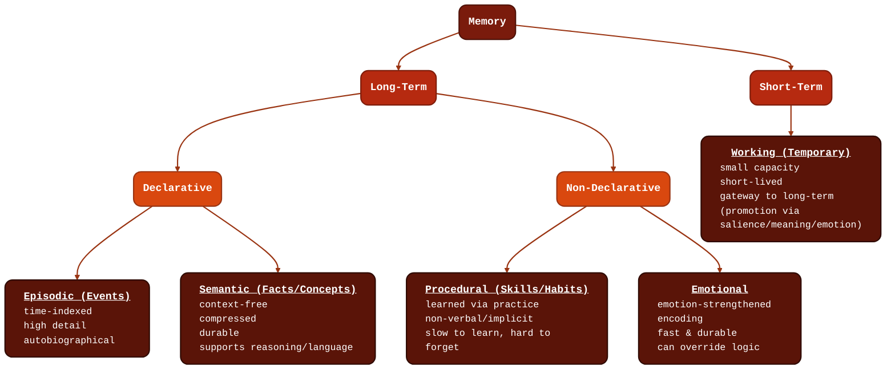

# Memory

<pre>
├── <a style="text-decoration:none" href="../README.md">..</a>
├── <a style="color:#50C87B;text-decoration:underline" href="./1.MEMORY.md"><b>Memory</b></a>
│   ├── <a style="text-decoration:none" href="#components">Components</a>
│   ├── <a style="text-decoration:none" href="#facets">Facets</a>
│   │   ├── <a style="text-decoration:none" href="#declarative-episodic-semantic">Declarative</a>
│   │   └── <a style="text-decoration:none" href="#relational-episodic-semantic">Relational</a>
│   ├── <a style="text-decoration:none" href="#types">Types</a>
│   │   ├── <a style="text-decoration:none" href="#episodic-events">Episodic</a>
│   │   ├── <a style="text-decoration:none" href="#semantic-facts-concepts">Semantic</a>
│   │   ├── <a style="text-decoration:none" href="#procedural-skills-habits">Procedural</a>
│   │   ├── <a style="text-decoration:none" href="#emotional">Emotional</a>
│   │   └── <a style="text-decoration:none" href="#working-temporary">Working</a>
│   ├── <a style="text-decoration:none" href="#datapoints">Datapoints</a>
│   │   ├── <a style="text-decoration:none" href="#attention--salience-gatekeeper">Attention / Salience</a>
│   │   ├── <a style="text-decoration:none" href="#emotional-valence--arousal">Emotional Valence &amp; Arousal</a>
│   │   ├── <a style="text-decoration:none" href="#meaning--semantic-integration">Meaning / Semantic Integration</a>
│   │   ├── <a style="text-decoration:none" href="#contextual-binding">Contextual Binding</a>
│   │   ├── <a style="text-decoration:none" href="#outcome--consequence">Outcome / Consequence</a>
│   │   └── <a style="text-decoration:none" href="#repetition--reinforcement">Repetition / Reinforcement</a>
│   ├── <a style="text-decoration:none" href="#modulators">Modulators</a>
│   └── <a style="text-decoration:none" href="#citations">Citations</a>
└── <a style="text-decoration:none" href="./2.ENTITY.md">Entity</a>
</pre>

A memory is a stored representation of information from experience that the brain (or a system) can retrieve later to influence prediction, decisions, or behavior.

> 🧠 A **durable, retrievable trace** that binds content (what) to enough **state/context** (when/where/who/why/how it mattered) that the system can reuse it later.

The brain stores information when **salience + meaning + context + consequence exceed a threshold**, and it stores different projections of the same event into different memory systems/types.

## Components

- **Content** → the thing learned *(fact/event/skill/association)*
- **Cue(s)** → what can trigger recall (keywords, people, place, goal, emotion)
- **Context** → situation metadata (time, location, participants, thread/state)
- **Strength** → priority/durability (salience, repetition, confidence)
- **Effect** → what it’s used for (recommendation, warning, personalization, planning)

## Facets

*"A memory can be highly declarative (consciously reportable) and also highly relational (stored as bindings among elements)."* [^Squire]

A memory **facet** is a named attribute (often a score or structured field) that describes **how a memory should be interpreted, stored, retrieved, or prioritized**—independent of the memory’s content.

### Declarative ([Episodic](#episodic-events), [Semantic](#semantic-facts-concepts))

*"the form of long-term memory that is **available to conscious awareness** and is **expressed through recollection**—i.e., you can explicitly report what you remember (facts or events)"* [^Squire]

### Relational ([Episodic](#episodic-events), [Semantic](#semantic-facts-concepts))

*"**represents the relationships among elements of experience** (e.g., who was with whom, which object was where, what happened before/after what), and it emphasizes that the hippocampus supports memory for “all manner of relations” among the constituent elements of scenes or events."* [^Konkel]

## Types

### Episodic (Events)

*"the ability to consciously remember personally experienced events as being located in a particular time and place."* [^Tulving]

> 💭 *“That thing that happened to me.”*

> 💾 Stored when an experience is distinct, emotionally weighted, or personally meaningful.

#### Datapoints

1. Context (time, place, people)
2. Emotional salience
3. Narrative sequence
4. Outcome
5. Personal relevance

#### Characteristics

1. Time-indexed
2. High detail, low compression
3. Fragile, decays or transforms
4. Source of autobiographical identity

### Semantic (Facts, Concepts)

*"a type of declarative (explicit) long-term memory that stores general knowledge—facts, concepts, meanings, and relationships—that is not tied to a specific time or place of learning."* [^Tulving] 

> 💭 *"Things I know."*

> 💾 Stored when information can be generalized and reused.

#### Datapoints

1. Meaning / abstraction
2. Relation to existing concepts
3. Frequency / reinforcement
4. Usefulness for prediction

#### Characteristics

1. Context-free
2. Highly compressed
3. Durable
4. Supports reasoning and language

### Procedural (Skills, Habits)

*"a form of nondeclarative (implicit) long-term memory for skills and habits—it is expressed through performance (“doing”) rather than through conscious recollection (“remembering”)."* [^Squire]

> 💭 *"Things I can do."*

> 💾 Stored through practice, not description.

#### Datapoints

1. Repetition
2. Error feedback
3. Reward signal
4. Motor/sensory coupling

#### Characteristics

1. Non-verbal
2. Non-conscious recall
3. Very slow to learn, very hard to forget

### Emotional

*"memories whose encoding and long-term retention are strengthened by emotional arousal, due to amygdala-mediated modulation of memory consolidation in declarative and nondeclarative memory systems."* [^McGaugh]

> 💭 *"Things that feel dangerous or rewarding"*

> 💾 Stored immediately if survival-relevant

#### Datapoints

1. Emotional intensity
2. Threat/reward signal
3. Rapid association
4. Physiological state

#### Characteristics

1. Fast
2. Durable
3. Often non-verbal
4. Can override logic

### Working (Temporary)

*“the small amount of information that can be held in mind and used in the execution of cognitive tasks.”* [^Baddeley]

> 💭 *"What I'm holding right now"*

> 💾 Not stored unless promoted by salience, emotion, or meaning.

#### Datapoints

1. Current goal relevance
2. Task demands
3. Attention bandwidth

#### Characteristics

1. Small capacity
2. Short-lived
3. Gateway to all other memory systems

## Datapoints

- [Attention / Salience](#attention--salience-gatekeeper)
- [Emotional Valence & Arousal](#emotional-valence--arousal)
- [Meaning / Semantic Integration](#meaning--semantic-integration)
- [Contextual Binding](#contextual-binding)
- [Outcome / Consequence](#outcome--consequence)
- [Repetition / Reinforcement](#repetition--reinforcement)

### Attention / Salience (Gatekeeper)

> 💭 *"Was this worth noticing?"*

#### Signals

- Novelty (new vs expected)
- Surprise / prediction error
- Emotional intensity
- Goal relevance
- Social relevance (people > objects)

> 👉 **If this fails, nothing is stored!**

### Emotional Valence & Arousal

> 💭 *"How strongly did this matte?"*

#### Signals

- Threat / reward
- Fear, joy, shame, pride
- Stress hormones (adrenaline, cortisol)

#### Effects

- Boosts encoding strength
- Biases toward long-term storage
- Enhances recall priority

### Meaning / Semantic Integration

> 💭 *"Does this connect to what I already know?"*

#### Signals

- Fits an existing concept/schema
- Explains something
- Updates a belief
- Compressible into an abstraction

#### Effects

- Determines semantic vs episodic
- Drives generalization
- Enables inference later

### Contextual Binding

> 💭 *"Where does this belong?"*

#### Signals

- Time
- Place
- Participants
- Ongoing narrative
- Internal state (“who I was then”)

#### Effects

- Enables episodic recall
- Supports “mental time travel”
- Enables memory disambiguation

### Outcome / Consequence

> 💭 *"Did this change anything?"*

#### Signals

- Decision made
- Action taken
- Error or success
- Social response
- Reward or punishment

#### Effects

- Drives consolidation
- Increases durability
- Prioritizes replay during sleep

### Repetition / Reinforcement

> 💭 *"Did this happen again?"*

#### Signals

- Frequency
- Rehearsal
- Recall attempts
- Reuse in reasoning

#### Effects

- Transitions episodic → semantic
- Strengthens procedural learning
- Prunes weak traces

## Modulators

A *modulator* increases or decreases the **priority/durability** of a memory type.

| **Name**                              | **Effect**                            |
|---------------------------------------|---------------------------------------|
| Sleep                                 | Consolidation, replay                 |
| Stress                                | Bias toward **emotional memory**      |
| Social relevance                      | Boosts **episodic + semantic**        |
| Prediction error                      | Forces encoding                       |
| Recall attempts                       | Strengthens trace                     |
| Narrative coherence                   | Improves **episodic retention**       |

## Citations

[^Squire]: **Larry R. Squire** *(Distinguished Professor of Psychiatry, Neurosciences, and Psychology, University of California San Diego)* [Memory and Brain Systems (1969-2009)](https://www.jneurosci.org/content/29/41/12711/)

[^Baddeley]: **A Baddeley** *(Medical Research Council, Applied Psychology Unit, Cambridge, United Kingdom.)* [Working Memory](https://pubmed.ncbi.nlm.nih.gov/1736359/)

[^McGaugh]: **James L. McGaugh** *(Center for the Neurobiology of Learning and Memory, Department of Neurobiology and Behavior, University of California, Irvine 92697-3800, USA.jlmcgaug@uci.edu)* [The Amygdala Modulates the Consilidation of Memories](https://pubmed.ncbi.nlm.nih.gov/15217324/)

[^Tulving]: **Endel Tulving** *(Professor of Psychology at Washington University in St. Louis)* [Episodic and Semantic Memory](https://alicekim.ca/EMSM72.pdf)

[^Konkel]: **Alex Konkel** *(Beckman Institute, University of Illinois Urbana-Champaign IL, USA.)* [Relational Memory and the Hippocampus](https://pubmed.ncbi.nlm.nih.gov/20011138/)