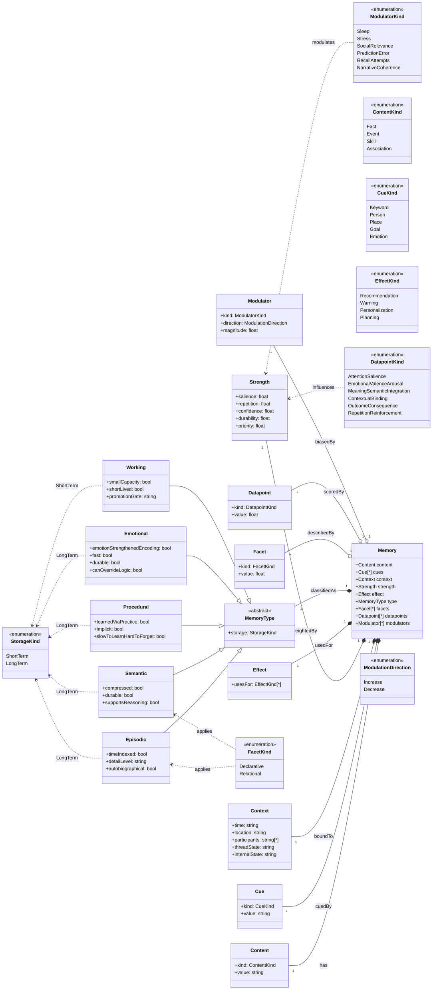

# Entity

<pre>
├── <a class="merc-route--inactive" href="../README.md">..</a>
├── <a class="merc-route--inactive" href="./1.MEMORY.md">Memory</a>
└── <a class="merc-route--active" href="./2.ENTITY.md"><b>Entity</b></a> 👈
</pre>

