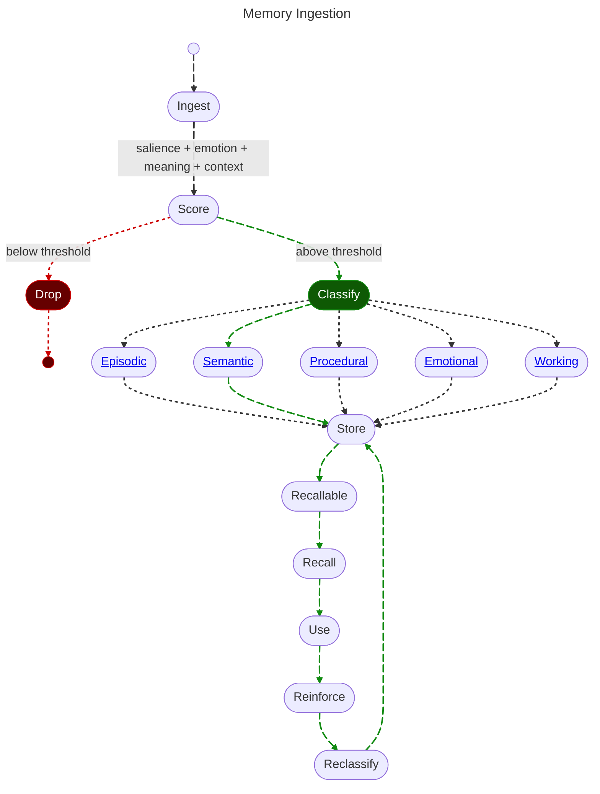

# 2. Ingestion

<pre>
├── <a href="../README.md">..</a>
├── <a href="./1.MEMORY.md">Memory</a>
├── <a href="./2.INGESTION.md"><b>Ingestion</b></a> 👈
└── <a href="./3.RECALL.md">Recall</a>
</pre>

**Memory Ingestion** is the process of transforming raw conversational text into a structured object with metadata that will make similarity based retrieval possible.

## 2.1 Score

By measuring the input using a classifier against our significant [datapoints](./1.MEMORY.md#datapoints), we can create a weighted score.

If said score is *under* our threshold, it is not worth remembering. Otherwise we continue on to further classification.

## 2.2 Classify

## 2.3 Store

## 2.4 Recall