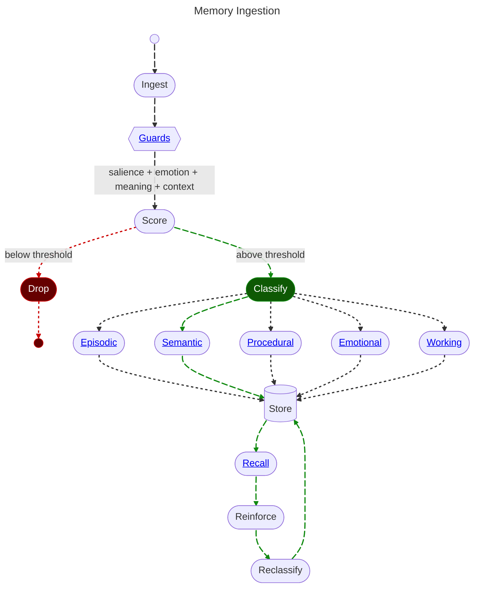

# 2. Memory: Ingestion

<pre>
├── <a href="../README.md">..</a>
├── <a href="./1.MEMORY.md">1. Memory</a>
├── <a href="./2.INGESTION.md"><b>2. Ingestion</b></a> 👈
|   ├── <a href="#21-score">2.1 Score</a>
|   ├── <a href="#22-classify">2.2 Classify</a>
|   └── <a href="#23-store">2.3 Store</a>
├── <a href="./3.GUARDS.md">3. Guards</a>
└── <a href="./4.RECALL.md">4. Recall</a>
</pre>

**Memory Ingestion** is the process of transforming raw conversational text into a structured object with metadata that will make similarity based retrieval possible.

## 2.1 Scoring

By measuring the input using a classifier against our significant [datapoints](./1.MEMORY.md#14-datapoints), we can create a weighted score.

If said score is *under* our threshold, it is not worth remembering. Otherwise we continue on to further classification.

## 2.2 Classification

## 2.3 Storage

