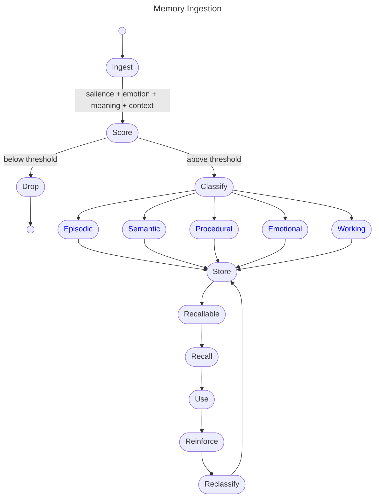

# Entity

<pre>
├── <a href="../README.md">..</a>
├── <a href="./1.MEMORY.md">Memory</a>
└── <a href="./2.ENTITY.md"><b>Ingestion</b></a> 👈
</pre>

```mermaid
---
title: Memory Ingestion
---

flowchart TB
  %% Start / End
  START(( ))
  END(( ))

  %% Core stages
  Ingest([Ingest])
  Score([Score])
  Drop([Drop])
  Classify([Classify])

  %% Memory types
  Episodic(["<a href='https://github.com/aacebo/merc/blob/main/docs/1.MEMORY.md#episodic-events'>Episodic</a>"])

  Semantic(["<a href='https://github.com/aacebo/merc/blob/main/docs/1.MEMORY.md#semantic-facts-concepts'>Semantic</a>"])

  Procedural(["<a href='https://github.com/aacebo/merc/blob/main/docs/1.MEMORY.md#procedural-skills-habits'>Procedural</a>"])

  Emotional(["<a href='https://github.com/aacebo/merc/blob/main/docs/1.MEMORY.md#emotional'>Emotional</a>"])

  Working(["<a href='https://github.com/aacebo/merc/blob/main/docs/1.MEMORY.md#working-temporary'>Working</a>"])

  %% Post-processing
  Store([Store])
  Recallable([Recallable])
  Recall([Recall])
  Use([Use])
  Reinforce([Reinforce])
  Reclassify([Reclassify])

  %% Flow
  START --> Ingest

  Ingest -->|salience + emotion + meaning + context| Score
  Score -->|below threshold| Drop
  Drop --> END

  Score -->|above threshold| Classify

  Classify --> Episodic
  Classify --> Semantic
  Classify --> Procedural
  Classify --> Emotional
  Classify --> Working

  Episodic --> Store
  Semantic --> Store
  Procedural --> Store
  Emotional --> Store
  Working --> Store

  Store --> Recallable

  Recallable --> Recall
  Recall --> Use
  Use --> Reinforce
  Reinforce --> Reclassify
  Reclassify --> Store

```