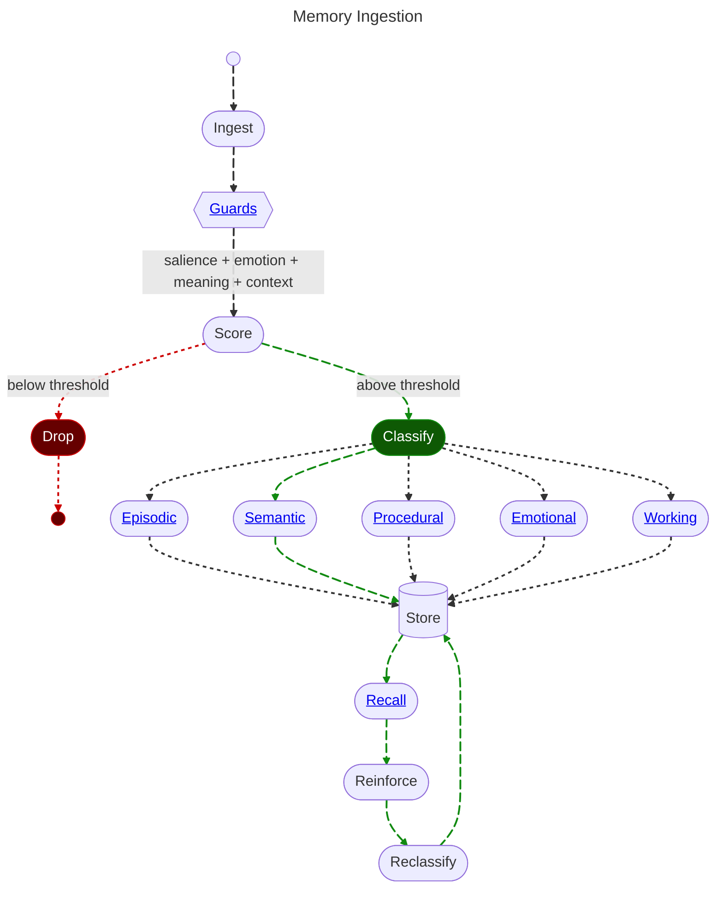
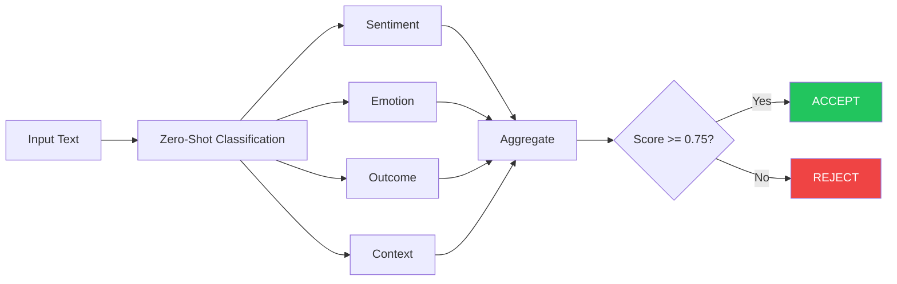
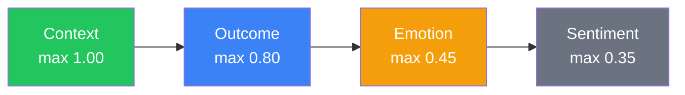
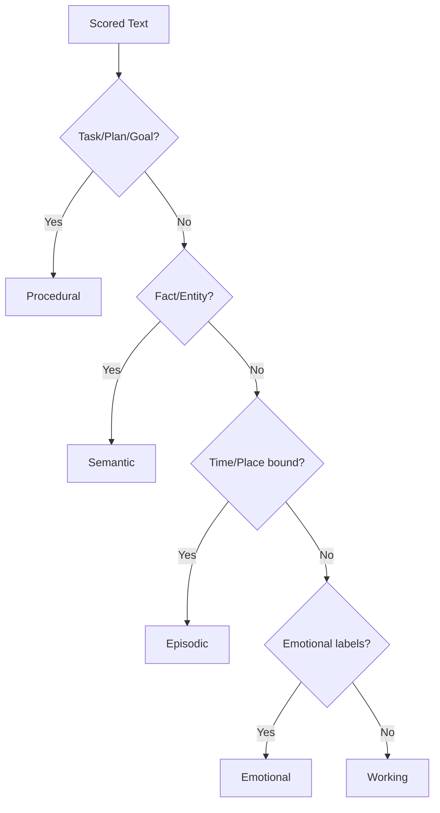

# 2. Memory: Ingestion

<pre>
├── <a href="../README.md">..</a>
├── <a href="./1.memory.md">1. Memory</a>
├── <span><a href="./2.ingestion.md"><b>2. Ingestion</b></a> 👈</span>
|   ├── <a href="#21-scoring">2.1 Scoring</a>
|   ├── <a href="#22-classification">2.2 Classification</a>
|   └── <a href="#23-storage">2.3 Storage</a>
├── <a href="./3.guards.md">3. Guards</a>
├── <a href="./4.recall.md">4. Recall</a>
├── <a href="./5.classification.md">5. Classification</a>
└── <a href="./README.md">▾ 6. Research/</a>
    ├── <a href="./merc/README.md">▸ 6.1 Merc/</a>
    ├── <a href="./reference/README.md">▸ 6.2 Reference/</a>
    └── <a href="./analysis/README.md">▸ 6.3 Analysis/</a>
</pre>

**Memory Ingestion** is the process of transforming raw conversational text into a structured object with metadata that will make similarity based retrieval possible.



## 2.1 Scoring

By measuring the input using a classifier against our significant [datapoints](./1.memory.md#14-datapoints), we can create a weighted score.

If said score is *under* our threshold, it is not worth remembering. Otherwise we continue on to further classification.

### How Scoring Works

The Merc scoring engine evaluates input text across **four independent dimensions** using zero-shot classification, then aggregates weighted predictions to produce a final importance score.



### Label Categories

| Category | Labels | Purpose |
|----------|--------|---------|
| **Sentiment** | Positive, Negative, Neutral | Basic emotional tone |
| **Emotion** | Joy, Fear, Shame, Pride, Stress, Anger, Sad | Specific emotional states |
| **Outcome** | Decision, Progress, Conflict, Success, Failure, Reward, Punishment | Life events and decisions |
| **Context** | Task, Plan, Goal, Preference, Fact, Entity, Time, Place, Phatic | Information type |

### Weight Hierarchy



**Context labels are prioritized** because they capture information most useful for memory systems:
- **Tasks** (1.00) and **Plans/Goals** (0.90) are weighted highest as explicit actionable items
- **Preferences** (0.85) and **Facts** (0.80) capture important personal information
- **Entity/Time/Place** (0.55-0.65) provide supporting context

For complete scoring algorithm details, see [Scoring Algorithm](./merc/scoring-algorithm.md).

## 2.2 Classification

Once text passes the scoring threshold, it is classified into one or more [memory types](./1.memory.md#13-types) based on the detected labels.

### Label to Memory Type Mapping

| Detected Labels | Primary Memory Type | Rationale |
|-----------------|---------------------|-----------|
| Task, Plan, Goal | [Procedural](./1.memory.md#procedural-skills-habits) | Actionable items become habits/skills |
| Fact, Entity | [Semantic](./1.memory.md#semantic-facts-concepts) | General knowledge storage |
| Time, Place + high context | [Episodic](./1.memory.md#episodic-events) | Time-bound events |
| Joy, Fear, Stress, etc. | [Emotional](./1.memory.md#emotional) | Emotion-strengthened encoding |
| Low score, borderline | [Working](./1.memory.md#working-temporary) | Temporary, may be promoted |

### Classification Flow



**Note:** A single memory can be stored in multiple types. For example, "I was so stressed about the meeting at 3pm" could be stored as both Emotional (stress) and Episodic (time-bound event).

## 2.3 Storage

Storage is handled by **downstream systems**—Merc is stateless and only provides scoring and classification signals.

### What Merc Provides

| Signal | Description | Downstream Use |
|--------|-------------|----------------|
| `score` | Overall importance (0.0-1.0) | Storage priority |
| `decision` | Accept/Reject | Gate write operations |
| `labels` | Detected labels with scores | Metadata enrichment |
| `category_scores` | Per-category aggregates | Type classification |

### What Downstream Systems Handle

| Concern | System | Notes |
|---------|--------|-------|
| Vector embedding | Storage layer | Semantic search |
| Entity extraction | LLM pipeline | Named entities, relationships |
| Temporal parsing | Downstream | Date/time extraction |
| Contradiction detection | Bi-temporal storage | Zep, Hindsight |
| PII masking | Compliance layer | Before storage |

### Storage Schema (Conceptual)

```
Memory {
    id: UUID
    content: String
    score: Float
    labels: [Label]
    memory_type: MemoryType
    created_at: Timestamp
    context: {
        thread_id: UUID
        previous_memory_id: UUID?
    }
}
```

For implementation details, see the storage crate documentation.
