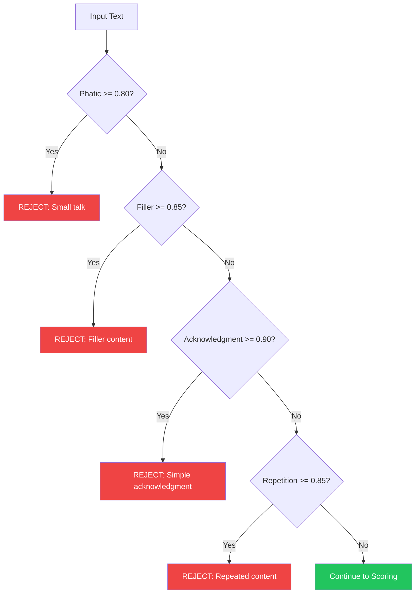

# 3. Memory: Guards

<pre>
├── <a href="../README.md">..</a>
├── <a href="./1.memory.md">1. Memory</a>
├── <a href="./2.ingestion.md">2. Ingestion</a>
├── <span><a href="./3.guards.md"><b>3. Guards</b></a> 👈</span>
|   ├── <a href="#31-phatic-filter">3.1 Phatic Filter</a>
|   ├── <a href="#32-negative-labels">3.2 Negative Labels</a>
|   └── <a href="#33-threshold-rejection">3.3 Threshold Rejection</a>
├── <a href="./4.recall.md">4. Recall</a>
├── <a href="./5.classification.md">5. Classification</a>
└── <a href="./README.md">▾ 6. Research/</a>
    ├── <a href="./merc/README.md">▸ 6.1 Merc/</a>
    ├── <a href="./reference/README.md">▸ 6.2 Reference/</a>
    └── <a href="./analysis/README.md">▸ 6.3 Analysis/</a>
</pre>

**Guards** are the filtering mechanisms that prevent low-value content from being stored as memories. They operate at write-time, rejecting noise before it can clutter the memory system.

---

## Why Write-Time Filtering?

| Approach | Pros | Cons |
|----------|------|------|
| **Write-time filtering (Merc)** | Low storage cost, fast retrieval | May miss context-dependent value |
| **Read-time filtering** | Preserves everything | High storage cost, slower retrieval |

Merc chooses write-time filtering because:
1. **Storage efficiency** — Don't store what you won't need
2. **Retrieval speed** — Less noise means better search results
3. **Cost** — Vector storage is expensive at scale

---

## 3.1 Phatic Filter

**Phatic communication** is social language that maintains relationships but carries no informational content worth remembering.

### Examples

| Text | Type | Decision |
|------|------|----------|
| "Hi, how are you?" | Greeting | REJECT |
| "Thanks!" | Acknowledgment | REJECT |
| "Got it" | Confirmation | REJECT |
| "Bye!" | Farewell | REJECT |
| "Uh huh" | Backchannel | REJECT |

### Detection

The **Phatic** label uses a high threshold (0.80) to ensure confident rejection:

```
IF Phatic_score >= 0.80 THEN REJECT
```

This threshold is deliberately conservative—we'd rather store a borderline greeting than miss an important statement that happens to start with "Hey".

---

## 3.2 Negative Labels

Beyond phatic detection, additional negative labels help filter low-value content:

| Label | Threshold | Description | Examples |
|-------|-----------|-------------|----------|
| **Phatic** | 0.80 | Greetings, farewells, small talk | "Hi", "Thanks", "Bye" |
| **Filler** | 0.85 | Content-free statements | "Um", "Like, you know", "Anyway" |
| **Acknowledgment** | 0.90 | Simple confirmations | "Okay", "Sure", "Right" |
| **Repetition** | 0.85 | Echoing previous content | "So you said X" |

### Rejection Flow



### High Thresholds

Negative labels use **higher thresholds** than positive labels because:
1. **False negatives are costly** — Rejecting valuable content is worse than storing noise
2. **Context matters** — "Thanks for the update on the project" contains both phatic AND valuable content
3. **Conservative approach** — Only reject when highly confident

---

## 3.3 Threshold Rejection

Content that passes negative label filters still faces **threshold rejection** based on overall score.

### Rejection Criteria

Text is rejected if **either** condition is met:

1. **Low Score:** `overall_score < 0.75`
2. **Phatic Detection:** `phatic_score >= 0.80`

### Score Calculation

```
overall_score = max(
    sentiment_score,
    emotion_score,
    outcome_score,
    context_score
)
```

Each category score is the average of its top-k label scores (k = min(2, active_labels)).

### Dynamic Thresholds

For short text (< 50 characters), the threshold is adjusted:

```
effective_threshold = base_threshold * (0.8 + 0.2 * (length / 50))
```

This prevents short but meaningful statements like "I quit my job" from being incorrectly rejected.

---

## Edge Cases

### Mixed Content

Text containing both phatic AND valuable content:

| Text | Labels | Decision |
|------|--------|----------|
| "Thanks for reminding me about the deadline" | Phatic (0.6), Task (0.9) | ACCEPT |
| "Hey, I got the promotion!" | Phatic (0.7), Success (0.95) | ACCEPT |
| "Thanks!" | Phatic (0.95) | REJECT |

The phatic filter only triggers at high confidence (0.80+), allowing mixed content through.

### Context-Dependent Value

Some text only has value in context:

| Text | Without Context | With Context |
|------|-----------------|--------------|
| "Yes" | REJECT (acknowledgment) | Depends on question |
| "Tomorrow" | REJECT (too vague) | ACCEPT if answering "When?" |

**Current limitation:** Merc is stateless and doesn't consider conversation history. See [Phase 3: Context](./merc/roadmap/3.context.md) for planned improvements.

---

## Configuration

Guards can be configured through `ScoreOptions`:

```rust
let options = ScoreOptions::new()
    .with_threshold(0.75)        // Base acceptance threshold
    .with_dynamic_threshold(true) // Adjust for text length
```

See [Scoring Algorithm](./merc/scoring-algorithm.md) for full configuration options.
