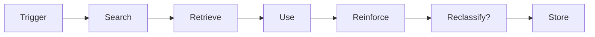
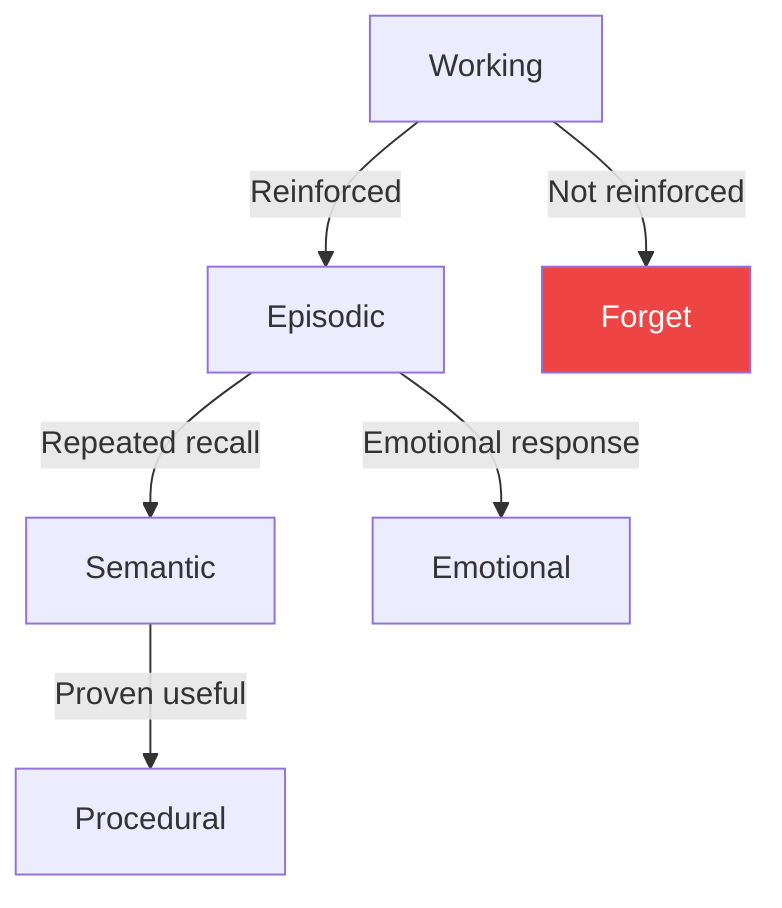
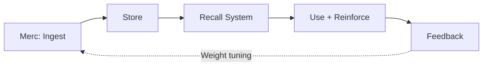

# 4. Memory: Recall

<pre>
├── <a href="../README.md">..</a>
├── <a href="./1.memory.md">1. Memory</a>
├── <a href="./2.ingestion.md">2. Ingestion</a>
├── <a href="./3.guards.md">3. Guards</a>
├── <span><a href="./4.recall.md"><b>4. Recall</b></a> 👈</span>
|   ├── <a href="#41-trigger">4.1 Trigger</a>
|   ├── <a href="#42-reinforce">4.2 Reinforce</a>
|   ├── <a href="#43-reclassify">4.3 Reclassify</a>
|   └── <a href="#44-store">4.4 Store</a>
├── <a href="./5.classification.md">5. Classification</a>
└── <a href="./README.md">▾ 6. Research/</a>
    ├── <a href="./merc/README.md">▸ 6.1 Merc/</a>
    ├── <a href="./reference/README.md">▸ 6.2 Reference/</a>
    └── <a href="./analysis/README.md">▸ 6.3 Analysis/</a>
</pre>

A **recall** is the act of retrieving a stored memory back into the "active workspace" when something in the present (a cue, a question, a situation) matches it enough to be useful.

> **Note:** Merc is stateless and handles only the ingestion/scoring phase. Recall is handled by downstream systems (Zep, Hindsight, etc.). This document describes the conceptual recall pipeline.

---

## Recall Flow



---

## 4.1 Trigger

A recall is triggered when the current context matches stored memories. Triggers can be:

### Explicit Triggers

| Type | Example | Source |
|------|---------|--------|
| Direct query | "What did I say about the project?" | User request |
| Keyword match | Conversation mentions "deadline" | Semantic search |
| Entity reference | "Remind me about John's email" | Named entity |

### Implicit Triggers

| Type | Example | Source |
|------|---------|--------|
| Temporal | Task deadline approaching | Time-based |
| Contextual | Similar conversation pattern | Embedding similarity |
| Emotional | High-stress situation recalls past stress | Emotional state |

### Search Strategies

Different memory systems use different search strategies:

| System | Strategy | Description |
|--------|----------|-------------|
| **Vector search** | Embedding similarity | Find semantically similar memories |
| **Keyword search** | Lexical match | Exact term matching |
| **Graph traversal** | Entity relationships | Follow connections in knowledge graph |
| **Temporal search** | Time-based | Memories from specific time periods |

See [reference docs](./reference/) for how specific systems (Zep, Hindsight) implement search.

---

## 4.2 Reinforce

When a memory is recalled and used successfully, it should be **reinforced**—increasing its strength and durability.

### Reinforcement Signals

| Signal | Effect | Rationale |
|--------|--------|-----------|
| **Recall frequency** | Increase strength | Frequently recalled = important |
| **Successful use** | Increase confidence | Memory was helpful |
| **Positive feedback** | Boost priority | User confirmed value |
| **Time decay** | Decrease strength | Unused memories fade |

### Strength Update

```
new_strength = old_strength + α * (1 - old_strength)
```

Where:
- `α` = learning rate (typically 0.1-0.3)
- Higher strength memories receive smaller boosts (diminishing returns)

### Decay Function

```
decayed_strength = strength * e^(-λ * days_since_recall)
```

Where:
- `λ` = decay rate (system-dependent)
- Memories not recalled gradually fade

---

## 4.3 Reclassify

Over time, memories may need **reclassification** based on new information or usage patterns.

### Reclassification Triggers

| Trigger | Example | Action |
|---------|---------|--------|
| **Repeated recall** | Task recalled 10+ times | Episodic → Semantic |
| **Contradiction** | New info conflicts with stored | Update or flag |
| **Context change** | Preference has changed | Mark as outdated |
| **Aggregation** | Multiple related memories | Merge into summary |

### Type Transitions



Based on memory theory from [1.memory.md](./1.memory.md#13-types):
- **Episodic → Semantic:** Specific events become general knowledge through repetition
- **Working → Episodic:** Short-term memories consolidated through reinforcement
- **Working → Forget:** Unreinforced working memories decay

### Contradiction Handling

When new information contradicts stored memories:

| Strategy | System | Description |
|----------|--------|-------------|
| **Bi-temporal** | Zep | Keep both with timestamps |
| **Confidence update** | Hindsight | Lower confidence of old memory |
| **Replace** | Simple | Overwrite with new |

See [Merc vs Zep](./analysis/2.merc-vs-zep.md) for contradiction handling comparison.

---

## 4.4 Store

After recall, reinforcement, and potential reclassification, the memory is stored back.

### Update Operations

| Operation | When | Effect |
|-----------|------|--------|
| **Strength update** | Every recall | Increase/decrease strength |
| **Type change** | Reclassification | Move to different store |
| **Metadata update** | New context | Add recall context |
| **Merge** | Aggregation | Combine related memories |

### Storage Considerations

- **Atomic updates** — Ensure consistency during updates
- **Version history** — Track changes for bi-temporal queries
- **Index updates** — Keep search indices current
- **Cascade effects** — Update related memories (knowledge graph)

---

## Integration with Merc

While Merc doesn't handle recall directly, it provides signals useful for downstream recall systems:

| Merc Signal | Recall Use |
|-------------|------------|
| `labels` | Index by topic for search |
| `score` | Initial strength value |
| `category_scores` | Type classification hints |
| Temporal labels | Time-based search support |

### Feedback Loop

Downstream recall systems can feed back to Merc:



See [Phase 4: Learning](./merc/roadmap/4.learning.md) for how feedback improves Merc's scoring.
