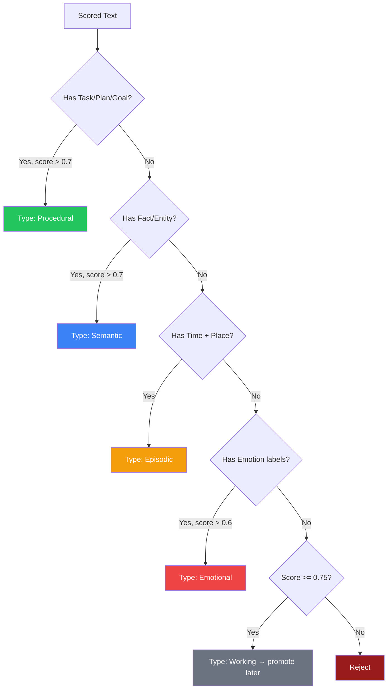

# 5. Memory: Classification

<pre>
├── <a href="../README.md">..</a>
├── <a href="./1.memory.md">1. Memory</a>
├── <a href="./2.ingestion.md">2. Ingestion</a>
├── <a href="./3.guards.md">3. Guards</a>
├── <a href="./4.recall.md">4. Recall</a>
├── <span><a href="./5.classification.md"><b>5. Classification</b></a> 👈</span>
|   ├── <a href="#51-memory-types">5.1 Memory Types</a>
|   ├── <a href="#52-label-to-type-mapping">5.2 Label to Type Mapping</a>
|   └── <a href="#53-multi-type-assignment">5.3 Multi-Type Assignment</a>
└── <a href="./README.md">▾ 6. Research/</a>
    ├── <a href="./merc/README.md">▸ 6.1 Merc/</a>
    ├── <a href="./reference/README.md">▸ 6.2 Reference/</a>
    └── <a href="./analysis/README.md">▸ 6.3 Analysis/</a>
</pre>

**Memory Classification** assigns scored text to one or more [memory types](./1.memory.md#13-types) based on detected labels and scores. This enables downstream systems to store and retrieve memories appropriately.

---

## 5.1 Memory Types

From [memory theory](./1.memory.md#13-types), memories fall into five types:

| Type | Description | Storage Characteristics |
|------|-------------|------------------------|
| [**Episodic**](./1.memory.md#episodic-events) | Time-bound events | High detail, context-rich, decays |
| [**Semantic**](./1.memory.md#semantic-facts-concepts) | Facts and concepts | Compressed, durable, supports reasoning |
| [**Procedural**](./1.memory.md#procedural-skills-habits) | Skills and habits | Non-verbal, learned through practice |
| [**Emotional**](./1.memory.md#emotional) | Emotion-strengthened | Fast encoding, durable, can override logic |
| [**Working**](./1.memory.md#working-temporary) | Temporary | Short-lived, gateway to long-term |

---

## 5.2 Label to Type Mapping

Merc's labels provide signals for type classification:

### Primary Type Indicators

| Labels | Primary Type | Confidence | Rationale |
|--------|--------------|------------|-----------|
| Task, Plan, Goal | Procedural | High | Actionable items become skills/habits |
| Fact, Entity | Semantic | High | General knowledge |
| Time + Place + narrative | Episodic | High | Time-bound events |
| Joy, Fear, Stress, Anger, Sad | Emotional | High | Strong emotional content |
| Decision, Progress, Commitment | Semantic | Medium | Life decisions are durable knowledge |
| Preference | Semantic | Medium | Personal preferences are durable |

### Classification Rules



### Score Thresholds by Type

| Memory Type | Required Labels | Min Score | Notes |
|-------------|-----------------|-----------|-------|
| Procedural | Task OR Plan OR Goal | 0.70 | Highest bar for actionable items |
| Semantic | Fact OR Entity | 0.70 | High bar for "knowledge" |
| Episodic | Time AND (Place OR narrative) | 0.65 | Moderate bar with context |
| Emotional | Any emotion label | 0.60 | Lower bar for emotional content |
| Working | Any label | 0.75 | Default for borderline content |

---

## 5.3 Multi-Type Assignment

A single memory can belong to **multiple types**. This reflects how human memory works—an emotional event is both Episodic (time-bound) and Emotional (strengthened by emotion).

### Multi-Type Examples

| Text | Labels | Types |
|------|--------|-------|
| "I was so stressed about the meeting at 3pm" | Stress, Time, Task | Emotional + Episodic + Procedural |
| "I learned that Paris is in France" | Fact, Place | Semantic + Episodic |
| "I decided to quit my job" | Decision, Stress | Semantic + Emotional |
| "Remember to call mom tomorrow" | Task, Time | Procedural + Episodic |

### Assignment Algorithm

```python
def classify_memory(labels, scores):
    types = []

    # Check each type independently
    if has_actionable(labels) and scores['context'] > 0.70:
        types.append('Procedural')

    if has_factual(labels) and scores['context'] > 0.70:
        types.append('Semantic')

    if has_temporal_context(labels):
        types.append('Episodic')

    if has_emotion(labels) and scores['emotion'] > 0.60:
        types.append('Emotional')

    # Default to Working if no strong type signal
    if not types and overall_score >= 0.75:
        types.append('Working')

    return types
```

### Storage Implications

Multi-type memories should be:
1. **Indexed for each type** — Searchable via type-specific queries
2. **Stored once** — Single storage with multiple type tags
3. **Retrieved contextually** — Type selection based on recall context

---

## Integration with Merc

Merc provides the signals needed for classification but doesn't perform classification itself:

### Merc Output for Classification

```json
{
  "score": 0.85,
  "decision": "accept",
  "labels": [
    { "label": "Task", "score": 0.92 },
    { "label": "Time", "score": 0.78 },
    { "label": "Stress", "score": 0.65 }
  ],
  "category_scores": {
    "context": 0.85,
    "emotion": 0.65,
    "outcome": 0.40,
    "sentiment": 0.35
  }
}
```

### Downstream Classification

The downstream system uses this output to:
1. **Apply classification rules** based on labels
2. **Assign memory types** based on thresholds
3. **Store with type metadata** for retrieval

---

## Research Context

Memory classification is informed by cognitive science research on how humans categorize memories:

- **Episodic vs Semantic** distinction from Tulving's work
- **Emotional memory** enhancement from McGaugh's research
- **Working memory** as gateway from Baddeley's model

See [1.memory.md](./1.memory.md#16-citations) for academic citations.

### Related Analysis

- [Hindsight's epistemic networks](./reference/1.hindsight.md) — World/Experience/Opinion/Observation
- [Zep's memory graph](./reference/2.zep.md) — Entity-based memory organization
- [Enterprise patterns](./reference/3.enterprise.md) — Classification for compliance

---

## Sources

- [A Survey on the Memory Mechanism of Large Language Model based Agents](https://arxiv.org/html/2411.05050v1)
