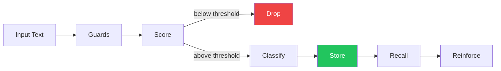

# 6. Research

Research documentation for the MERC system.

<pre>
├── <a href="../README.md">..</a>
├── <a href="./README.md"><b>▾ 6. Research/</b></a> 👈
├── <a href="./merc/README.md">▸ 6.1 Merc/</a> — Scoring engine documentation
├── <a href="./reference/README.md">▸ 6.2 Reference/</a> — External system references
└── <a href="./analysis/README.md">▸ 6.3 Analysis/</a> — Comparative analyses
</pre>

---

## Pipeline Overview

| Stage | Documentation | Description |
|-------|---------------|-------------|
| **Memory** | [1.memory.md](./1.memory.md) | What memories are and how they work |
| **Ingestion** | [2.ingestion.md](./2.ingestion.md) | How content is scored for memory worthiness |
| **Guards** | [3.guards.md](./3.guards.md) | Filtering mechanisms (negative labels, phatic detection) |
| **Recall** | [4.recall.md](./4.recall.md) | Memory retrieval and reinforcement |
| **Classification** | [5.classification.md](./5.classification.md) | Memory type assignment (episodic, semantic, etc.) |

---

## What is MERC?

MERC is a **write-time memory gating** system that decides whether text is worth storing as a memory. It uses:

- **Zero-shot classification** with BART-large-MNLI for label scoring
- **26 labels** across 4 categories (Sentiment, Emotion, Outcome, Context)
- **Weighted scoring** to prioritize memory-bearing content
- **Negative filters** to reject small talk and filler

### What MERC Does

- Scores text for memory worthiness (accept/reject)
- Provides label breakdown and confidence scores
- Filters out noise (greetings, acknowledgments, filler)

### What MERC Doesn't Do

- Store memories (downstream systems handle storage)
- Retrieve memories (stateless scoring only)
- Parse temporal information (flags for downstream systems)
- Handle contradictions (flags for downstream systems)

---

## Design Philosophy

| Principle | Description |
|-----------|-------------|
| **Write-time gating** | Filter at write time, not read time |
| **Stateless** | No memory of previous interactions |
| **Fast** | Local inference, ~50-100ms per score |
| **Composable** | Provides signals for downstream systems |

---

## Quick Links

### Conceptual Pipeline

- [1. Memory](./1.memory.md) — Memory theory, types, and datapoints
- [2. Ingestion](./2.ingestion.md) — Scoring pipeline and classification
- [3. Guards](./3.guards.md) — Filtering and rejection
- [4. Recall](./4.recall.md) — Retrieval and reinforcement
- [5. Classification](./5.classification.md) — Memory type mapping

### Merc Engine

- [Scoring Algorithm](./merc/scoring-algorithm.md) — How Merc scores text
- [Improvement Roadmap](./merc/roadmap/) — Phased improvements (MERC-001 through MERC-014)

### Analysis

- [Merc vs Hindsight](./analysis/1.merc-vs-hindsight.md) — Write-time vs store-everything comparison
- [Merc vs Zep](./analysis/2.merc-vs-zep.md) — Comparison with graph-based memory
- [Merc vs Enterprise](./analysis/3.merc-vs-enterprise.md) — Comparison with enterprise model

### Reference

- [Hindsight](./reference/1.hindsight.md) — Biomimetic memory with epistemic networks
- [Zep](./reference/2.zep.md) — Graph-based memory with bi-temporal model
- [Enterprise](./reference/3.enterprise.md) — Enterprise-scale memory architecture
