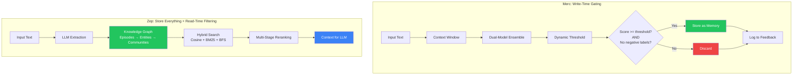
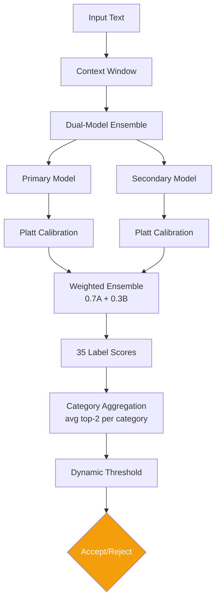
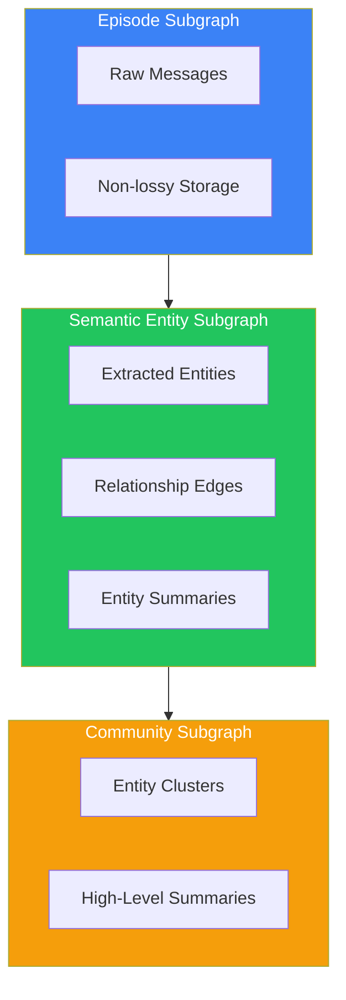
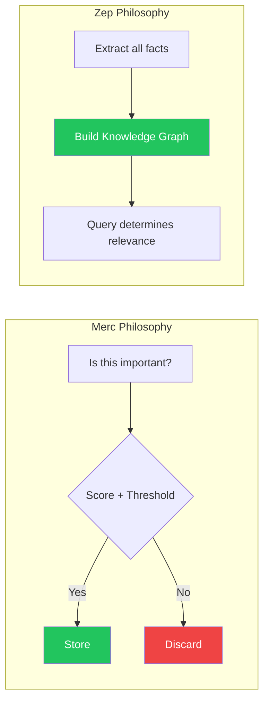

# 6.3.2 Merc vs Zep

<pre>
├── <a href="../README.md">..</a>
├── <a href="../1.memory.md">▸ 1. Memory</a>
├── <a href="../2.ingestion.md">▸ 2. Ingestion</a>
├── <a href="../3.guards.md">▸ 3. Guards</a>
├── <a href="../4.recall.md">▸ 4. Recall</a>
├── <a href="../5.classification.md">▸ 5. Classification</a>
└── <a href="../README.md">▾ 6. Research/</a>
    ├── <a href="../merc/README.md">▸ 6.1 Merc/</a>
    ├── <a href="../reference/README.md">▸ 6.2 Reference/</a>
    └── <a href="./README.md">▾ 6.3 Analysis/</a>
        ├── <a href="./1.merc-vs-hindsight.md">6.3.1 Merc vs Hindsight</a>
        ├── <span><a href="./2.merc-vs-zep.md"><b>6.3.2 Merc vs Zep</b></a> 👈</span>
        ├── <a href="./3.merc-vs-enterprise.md">6.3.3 Merc vs Enterprise</a>
        └── <a href="./4.hindsight-vs-zep.md">6.3.4 Hindsight vs Zep</a>
</pre>

A comparison of how each system decides what qualifies as a memory worth storing and retrieving.

## Core Architectural Difference



**Key difference:** Merc gates at write time with scoring, accepting or rejecting each input. Zep stores everything in a temporal knowledge graph and filters at read time via sophisticated retrieval and reranking.

## Memory Qualification Approaches

| Aspect | Merc | Zep |
|--------|------|-----|
| **When filtering happens** | Write time | Read time |
| **What gets stored** | High-scoring, non-trivial text | Everything (as graph nodes/edges) |
| **Gating mechanism** | Ensemble score + adaptive threshold | None (stores all, retrieves selectively) |
| **Rejection criteria** | Score < threshold OR negative labels | N/A (relevance determined at query) |
| **Context awareness** | 1 previous utterance | Full conversation via graph structure |
| **Data model** | Label scores + categories | Temporal knowledge graph (triplets) |
| **Temporal handling** | Timestamps for feedback | Bi-temporal model (event + ingestion time) |

## Merc: Write-Time Scoring

### Scoring Pipeline



### Label Categories

| Category | Count | Examples |
|----------|-------|----------|
| Sentiment | 3 | Positive, Negative, Neutral |
| Emotion | 8 | Stress, Fear, Joy, Concern |
| Outcome | 8 | Decision, Commitment, Success |
| Context | 13 | Task, Goal, Fact, Question |
| Negative | 3 | Filler, Acknowledgment, Repetition |

### Dynamic Thresholds

| Text Length | Threshold |
|-------------|-----------|
| < 20 chars | 0.70 |
| 20-200 chars | 0.75 |
| > 200 chars | 0.80 |

## Zep: Knowledge Graph Construction

### Three-Tier Architecture



### Retrieval Pipeline

| Stage | Method | Purpose |
|-------|--------|---------|
| Search | φ_cos (Cosine) | Semantic similarity |
| Search | φ_bm25 (Full-text) | Lexical matching |
| Search | φ_bfs (Graph traversal) | Contextual proximity |
| Rerank | RRF | Combine search rankings |
| Rerank | MMR | Diversity optimization |
| Rerank | Cross-Encoder | LLM relevance scoring |

## Direct Comparison Examples

### Example: Commitment Statement

```
Input: "I'll have the report done by Friday"

MERC:
  - Commitment: 0.91 (calibrated)
  - Task: 0.78
  - Time: 0.85
  - Category score: 0.845
  - Dynamic threshold (38 chars): 0.75
  - ACCEPTED (0.845 >= 0.75)

ZEP:
  - Entity extraction: "report", "Friday"
  - Fact: "User committed to completing report by Friday"
  - Edge: User → report (committed, t_valid: now)
  - STORED in knowledge graph
```

**Both accept**, but through different mechanisms: Merc via scoring, Zep via graph construction.

---

### Edge Case: Acknowledgment

```
Input: "Got it, thanks"

MERC:
  - Acknowledgment: 0.94 >= 0.90 threshold
  - Phatic: 0.87 >= 0.80 threshold
  - REJECTED (negative label filter)

ZEP:
  - Episode stored (raw message)
  - Minimal entity extraction possible
  - STORED but low retrieval priority
    - Few entities = fewer graph connections
    - Low mention frequency = deprioritized by episode-mentions reranker
```

**Result:** Merc explicitly rejects; Zep stores but naturally deprioritizes through graph structure.

---

### Edge Case: Temporal Update

```
Previous: "I live in New York"
Current: "I just moved to Los Angeles"

MERC:
  - Context: "Context: I live in New York | Current: I just moved to Los Angeles"
  - Update: 0.88 (boosted by context)
  - Place: 0.92
  - ACCEPTED as new memory
  - No automatic invalidation of previous memory

ZEP:
  - Extract: Entity "Los Angeles", Fact "User lives in LA"
  - Bi-temporal handling:
    - Old edge "lives in NYC": t_invalid = now
    - New edge "lives in LA": t_valid = now
  - Contradiction automatically resolved
  - Point-in-time queries preserve history
```

**Key difference:** Zep's bi-temporal model handles contradictions automatically; Merc stores both without invalidation logic.

---

### Edge Case: Complex Temporal Reasoning

```
Query: "Where did I live in 2023?"

MERC:
  - Not designed for this use case
  - Would need external temporal index
  - Memory retrieval is application-layer concern

ZEP:
  - Query parsed with temporal constraint
  - Edges filtered by t_valid/t_invalid ranges
  - Returns facts valid during 2023
  - +48% accuracy on temporal reasoning tasks
```

## Trade-offs

### Merc Write-Time Gating

| Pros | Cons |
|------|------|
| Smaller memory footprint | No built-in retrieval |
| Sub-200ms write latency | Context limited to 1 turn |
| Interpretable scores | No temporal reasoning |
| No LLM cost at write time | No contradiction handling |
| Feedback loop for improvement | Fixed label vocabulary |

### Zep Knowledge Graph

| Pros | Cons |
|------|------|
| Rich temporal reasoning | LLM cost at write time |
| Automatic contradiction handling | More complex architecture |
| Full conversation context | Higher storage requirements |
| Sophisticated retrieval | Graph maintenance overhead |
| Point-in-time queries | Slower ingestion |

## Performance Comparison

| Metric | Merc | Zep | Delta |
|--------|------|-----|-------|
| **Write Latency** | ~100-150ms | ~1-5s | 7-50x faster (Merc) |
| **Write Cost** | ~$0.0002 | ~$0.01-0.05 | 50-250x cheaper (Merc) |
| **Storage per Input** | 0 or 1 record | 2-10 nodes/edges | 2-10x less (Merc) |
| **Read Latency** | N/A | ~2-3s | - |
| **Temporal Reasoning** | None | Bi-temporal | Zep only |
| **DMR Accuracy** | - | 94.8-98.2% | - |
| **Label Coverage** | 35 fixed | Unlimited (LLM) | Zep more flexible |

## Complexity Comparison

| Operation | Merc | Zep |
|-----------|------|-----|
| Write-time model calls | 2 (parallel classifiers) | 1+ (LLM extraction) |
| Write-time compute | O(2) parallel | O(n) tokens |
| Storage structure | Flat records | Graph (Neo4j/etc.) |
| Query complexity | External | Built-in hybrid search |
| Reranking | None | 5 strategies available |
| Contradiction handling | Manual | Automatic bi-temporal |
| Configuration params | ~50+ | ~30+ |

## Architectural Philosophy



- **Merc** asks: "Is this important enough to remember?" (selective, efficient)
- **Zep** asks: "What facts exist and when were they true?" (comprehensive, temporal)

---

## TL;DR

| Dimension | Merc | Zep | Delta | Winner |
|-----------|------|-----|-------|--------|
| **Write latency** | ~100-150ms | ~1-5s | 7-50x faster | **Merc** |
| **Write cost** | ~$0.0002 | ~$0.01-0.05 | 50-250x cheaper | **Merc** |
| **Storage efficiency** | Selective storage | Stores everything | 2-10x less | **Merc** |
| **Temporal reasoning** | None | Bi-temporal model | - | **Zep** |
| **Contradiction handling** | Manual | Automatic | - | **Zep** |
| **Retrieval sophistication** | None built-in | Hybrid + reranking | - | **Zep** |
| **Context awareness** | 1 previous turn | Full graph | - | **Zep** |
| **Interpretability** | Clear scores | Graph structure | - | Tie |
| **Operational simplicity** | 2 classifiers | Graph DB + LLM | - | **Merc** |

**Merc** prioritizes efficiency, cost, and simplicity for write-time filtering.
**Zep** prioritizes temporal reasoning, retrieval sophistication, and comprehensive capture.

**Bottom Line:**

- **Choose Merc** for high-volume ingestion where storage costs matter and you handle retrieval externally
- **Choose Zep** for applications requiring temporal reasoning, contradiction resolution, and sophisticated retrieval
- **They solve different problems:** Merc is a write-time filter; Zep is a complete memory system with retrieval
