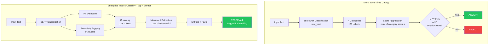
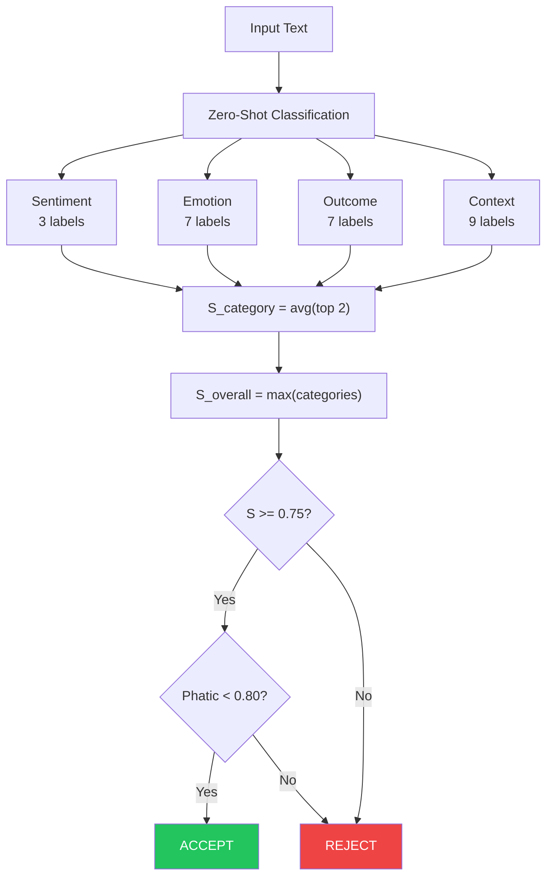
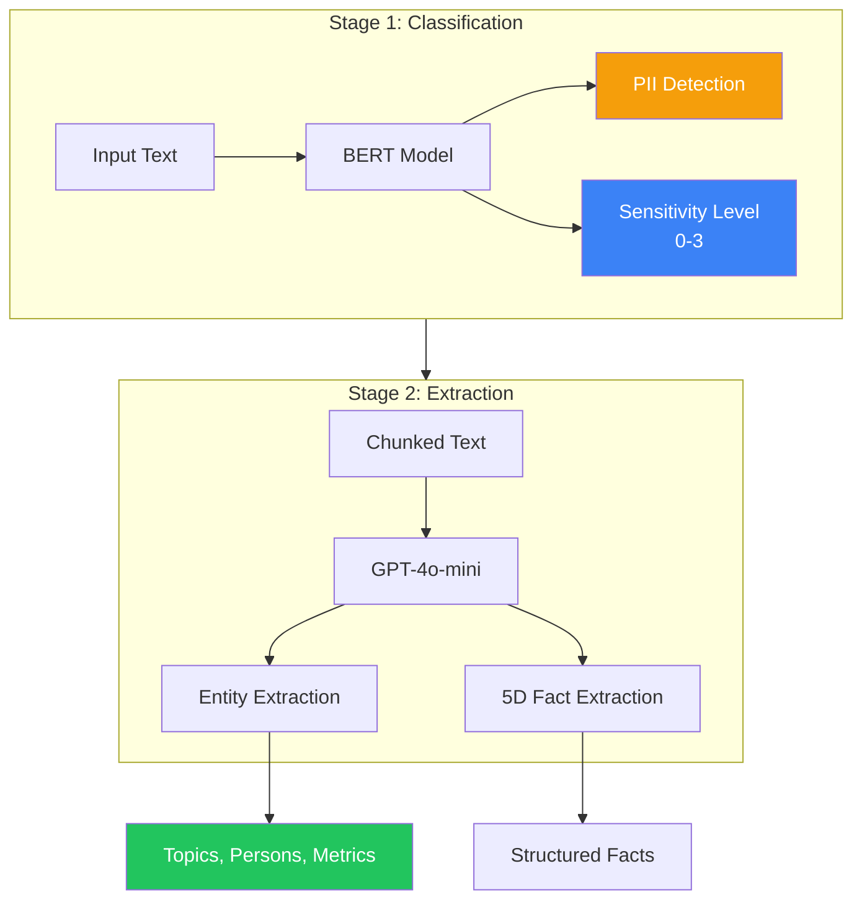
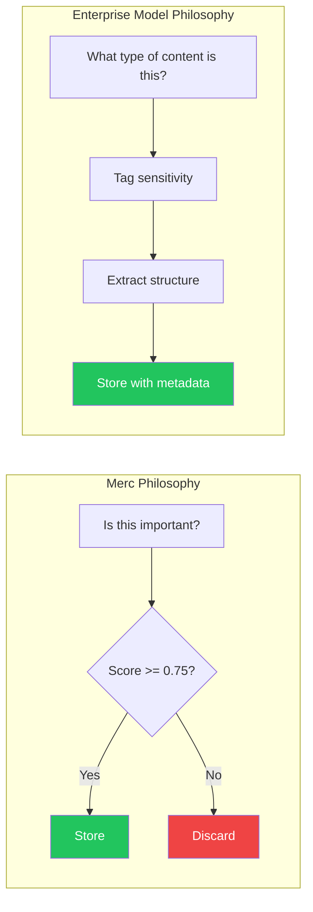
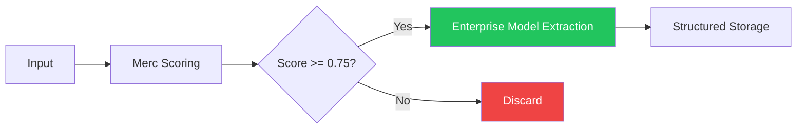

# 6.3.3 Merc vs Enterprise

<pre>
├── <a href="../README.md">..</a>
├── <a href="../1.memory.md">▸ 1. Memory</a>
├── <a href="../2.ingestion.md">▸ 2. Ingestion</a>
├── <a href="../3.guards.md">▸ 3. Guards</a>
├── <a href="../4.recall.md">▸ 4. Recall</a>
├── <a href="../5.classification.md">▸ 5. Classification</a>
└── <a href="../README.md">▾ 6. Research/</a>
    ├── <a href="../merc/README.md">▸ 6.1 Merc/</a>
    ├── <a href="../reference/README.md">▸ 6.2 Reference/</a>
    └── <a href="./README.md">▾ 6.3 Analysis/</a>
        ├── <a href="./1.merc-vs-hindsight.md">6.3.1 Merc vs Hindsight</a>
        ├── <a href="./2.merc-vs-zep.md">6.3.2 Merc vs Zep</a>
        ├── <span><a href="./3.merc-vs-enterprise.md"><b>6.3.3 Merc vs Enterprise</b></a> 👈</span>
        └── <a href="./4.hindsight-vs-zep.md">6.3.4 Hindsight vs Zep</a>
</pre>

A comparison of Merc's approach vs. enterprise memory patterns (synthesized from public research, referred to as "Enterprise Model" for comparison).

## Core Architectural Difference



**Key difference:** Merc gates at write time—scoring and rejecting low-value content. Enterprise Model classifies and tags **all** content, storing everything with metadata that determines handling and retention.

---

## Classification Approaches

| Aspect | Merc | Enterprise Model |
|--------|------|--------|
| **Model type** | Zero-shot classifier (rust_bert) | BERT (fine-tuned) |
| **Classification target** | Memory importance (26 labels, 4 categories) | PII + Sensitivity (4 levels) |
| **When classification happens** | Write time | Write time |
| **Gating decision** | Accept/Reject based on score | Tag + Store (no rejection) |
| **LLM dependency (classification)** | None | None |
| **LLM dependency (extraction)** | None | Yes (GPT-4o-mini) |
| **Context window** | Single message | 20K token chunks |
| **Output** | Binary (accept/reject) + scores | Sensitivity tags + entities + facts |

---

## Merc: Write-Time Scoring

### 4-Category System (26 Labels)



### Label Categories

| Category | Labels | Max Weight | Purpose |
|----------|--------|------------|---------|
| **Context** | Task, Plan, Goal, Preference, Fact, Entity, Time, Place, Phatic | 1.00 | Actionable information |
| **Outcome** | Decision, Progress, Conflict, Success, Failure, Reward, Punishment | 0.80 | Life events |
| **Emotion** | Stress, Fear, Anger, Sad, Shame, Pride, Joy | 0.45 | Emotional significance |
| **Sentiment** | Negative, Positive, Neutral | 0.35 | Basic polarity |

### Scoring Formula

```
S_label = confidence * weight (if confidence >= threshold)
S_category = avg(top 2 label scores)
S_overall = max(S_sentiment, S_emotion, S_outcome, S_context)

Accept if: S_overall >= 0.75 AND S_phatic < 0.80
```

---

## Enterprise Model: BERT Classification + Integrated Extraction

### Two-Stage Pipeline



### PII Detection

| PII Type | Handling |
|----------|----------|
| Email | Detect + Tag |
| Phone | Detect + Tag |
| SSN | Detect + Tag + Flag Level 3 |
| Credit Card | Detect + Tag + Flag Level 3 |
| Address | Detect + Tag |

### Sensitivity Levels

| Level | Name | Retention | Auto-Triggers |
|-------|------|-----------|---------------|
| 0 | Public | Indefinite | General content |
| 1 | Internal | 90 days | Business names, projects |
| 2 | Confidential | 30 days | PII detected |
| 3 | Restricted | 7 days | SSN, credentials, health |

### 5D Fact Extraction

Facts extracted with five dimensions: What, When, Where, Who, Why

```
Format: {what} | Involving: {who} | {why}
```

---

## Direct Comparison Examples

### Example 1: Task Commitment

```
Input: "I'll have the DCR review done by Friday"

MERC:
  - Context: Task (0.85 * 1.00) = 0.85
  - Context: Plan (0.78 * 0.90) = 0.70
  - Category score: (0.85 + 0.70) / 2 = 0.775
  - S_overall = 0.775, Phatic = 0.12
  - ACCEPTED (0.775 >= 0.75, 0.12 < 0.80)

ATHENA:
  - BERT: Sensitivity 1 (Internal), no PII
  - Extraction: Topic entity "DCR Review" (status: pending, deadline: Friday)
  - Fact: "DCR Review deadline is Friday | Involving: User (owner) | Commitment"
  - STORED with sensitivity tag
```

**Key difference:** Merc produces a binary decision with score; Enterprise Model extracts structured project context.

---

### Example 2: PII Content (Email)

```
Input: "Send the contract to john.smith@company.com by EOD"

MERC:
  - Context: Task (0.88 * 1.00) = 0.88
  - Context: Entity (0.72 * 0.65) = 0.47
  - Category score: (0.88 + 0.47) / 2 = 0.675
  - S_overall = 0.675
  - REJECTED (0.675 < 0.75)
  OR if Task scores higher:
  - ACCEPTED (no PII awareness)

ATHENA:
  - BERT: PII detected (email), Sensitivity 2 (Confidential)
  - metadata.security.pii_types: ["email"]
  - Extraction: Task entity, Person entity "John Smith"
  - Fact: "Contract delivery task with deadline EOD | Involving: John Smith (recipient) | Urgent"
  - STORED with PII tag, 30-day retention
```

**Key difference:** Merc has no PII awareness; Enterprise Model detects, tags, and applies compliance handling.

---

### Example 3: Phatic/Acknowledgment

```
Input: "Got it, thanks!"

MERC:
  - Context: Phatic (0.94 * 0.40) = 0.376
  - Phatic confidence: 0.94 >= 0.80 threshold
  - REJECTED (phatic filter triggered)

ATHENA:
  - BERT: Sensitivity 0 (Public), no PII
  - Extraction: Minimal—no entities, no meaningful facts
  - STORED (but low retrieval priority due to sparse graph connections)
```

**Key difference:** Merc explicitly rejects phatic content; Enterprise Model stores but naturally deprioritizes via graph sparsity.

---

### Example 4: Sensitive Business Information

```
Input: "Q3 revenue hit $4.2M, beating target by 15%"

MERC:
  - Outcome: Success (0.82 * 0.55) = 0.45
  - Context: Fact (0.91 * 0.80) = 0.73
  - Context: Entity (0.75 * 0.65) = 0.49
  - Category score: (0.73 + 0.49) / 2 = 0.61
  - S_overall = 0.61
  - REJECTED (0.61 < 0.75)
  OR if stronger signals detected:
  - ACCEPTED (no sensitivity classification)

ATHENA:
  - BERT: Sensitivity 2 (Confidential—financial data)
  - Extraction: Metric entity "Q3 Revenue" (value: $4.2M, target: exceeded, trend: positive)
  - Fact: "Q3 revenue reached $4.2M, 15% above target | Involving: Company (reporter) | Performance milestone"
  - STORED with confidential tag, 30-day retention
```

**Key difference:** Merc may reject valuable business intel if scores are low; Enterprise Model stores with appropriate confidentiality handling.

---

## Trade-offs

### Merc Write-Time Gating

| Pros | Cons |
|------|------|
| Zero LLM cost | No PII detection |
| Sub-200ms latency | No sensitivity classification |
| Interpretable 26-label scores | No entity extraction |
| Explicit accept/reject decision | Fixed label vocabulary |
| Small memory footprint | No structured output |
| Phatic filter prevents noise | May reject valuable low-scoring content |

### Enterprise Model BERT + Extraction

| Pros | Cons |
|------|------|
| PII detection built-in | LLM cost for extraction (~$0.01-0.05/chunk) |
| Compliance-ready (GDPR/HIPAA) | Stores everything (no filtering) |
| Sensitivity-based retention | More complex pipeline |
| Rich entity extraction | Higher storage requirements |
| 5D structured facts | Slower end-to-end (~6-15s for 500 messages) |
| Enterprise audit trails | Requires chunking infrastructure |

---

## Performance Comparison

| Metric | Merc | Enterprise Model | Winner |
|--------|------|--------|--------|
| **Classification latency** | ~100-150ms | ~50-100ms (BERT only) | **Enterprise Model** |
| **End-to-end latency** | ~100-150ms | ~6-15s (with extraction) | **Merc** |
| **LLM cost (classification)** | $0 | $0 | Tie |
| **LLM cost (extraction)** | $0 | ~$0.01-0.05/chunk | **Merc** |
| **Storage per message** | 0 or 1 record | 2-10 entities/facts | **Merc** |
| **PII handling** | None | Full detection + tagging | **Enterprise Model** |
| **Compliance readiness** | None | GDPR/HIPAA/FedRAMP | **Enterprise Model** |
| **Label/category coverage** | 26 fixed labels | Unlimited (LLM extraction) | **Enterprise Model** |
| **Interpretability** | Clear weighted scores | Sensitivity levels + entities | Tie |

---

## Complexity Comparison

| Aspect | Merc | Enterprise Model |
|--------|------|--------|
| Model calls (classification) | 1 (zero-shot) | 1 (BERT) |
| Model calls (extraction) | 0 | 1+ (LLM per chunk) |
| Label count | 26 fixed | 4 sensitivity + unlimited entities |
| Output structure | Flat scores | Hierarchical (entities → facts) |
| Configuration params | ~15 (weights, thresholds) | ~30+ (retention, compliance) |
| Infrastructure | Single classifier | BERT + LLM + Chunking |
| Storage model | Optional (external) | Required (multiple containers) |

---

## Architectural Philosophy



- **Merc** asks: "Is this important enough to remember?" → Selective, efficient gating
- **Enterprise Model** asks: "What type of content is this and how should we handle it?" → Comprehensive capture with compliance

---

## TL;DR

| Dimension | Merc | Enterprise Model | Winner |
|-----------|------|--------|--------|
| **Classification speed** | ~100-150ms | ~50-100ms | **Enterprise Model** |
| **Total processing time** | ~100-150ms | ~6-15s | **Merc** |
| **Cost per message** | ~$0 | ~$0.0001 (classification only) | **Merc** |
| **Cost with extraction** | ~$0 | ~$0.01-0.05 | **Merc** |
| **PII detection** | None | Full | **Enterprise Model** |
| **Compliance** | None | GDPR/HIPAA | **Enterprise Model** |
| **Entity extraction** | None | 6 entity types | **Enterprise Model** |
| **Structured output** | Scores only | Entities + facts | **Enterprise Model** |
| **Write-time filtering** | Yes | No | **Merc** |
| **Operational simplicity** | 1 model | BERT + LLM | **Merc** |
| **Interpretability** | 26-label breakdown | Sensitivity + entities | Tie |

---

## Decision Framework

### Choose Merc When:

- High-volume ingestion where cost matters
- Real-time filtering requirements (<200ms)
- Simple accept/reject decisions needed
- External storage/retrieval system exists
- No compliance requirements
- Interpretable scores are valuable

### Choose Enterprise Model When:

- Enterprise deployment with compliance requirements
- PII detection and handling is mandatory
- Rich entity and fact extraction needed
- Audit trails required (nothing can be discarded)
- Building on Azure infrastructure
- Long-term retention policies matter

### Complementary Usage

Merc and Enterprise Model can work together:



- **Merc as pre-filter:** Use Merc's scoring to gate what enters Enterprise Model, reducing extraction costs
- **Merc for real-time:** Filter during conversation, batch accepted content to Enterprise Model
- **Cost optimization:** ~75% of messages rejected by Merc = ~75% LLM cost savings for Enterprise Model extraction
