# 6.3.4 Hindsight vs Zep

<pre>
├── <a href="../README.md">..</a>
├── <a href="../1.memory.md">▸ 1. Memory</a>
├── <a href="../2.ingestion.md">▸ 2. Ingestion</a>
├── <a href="../3.guards.md">▸ 3. Guards</a>
├── <a href="../4.recall.md">▸ 4. Recall</a>
├── <a href="../5.classification.md">▸ 5. Classification</a>
└── <a href="../README.md">▾ 6. Research/</a>
    ├── <a href="../merc/README.md">▸ 6.1 Merc/</a>
    ├── <a href="../reference/README.md">▸ 6.2 Reference/</a>
    └── <a href="./README.md">▾ 6.3 Analysis/</a>
        ├── <a href="./1.merc-vs-hindsight.md">6.3.1 Merc vs Hindsight</a>
        ├── <a href="./2.merc-vs-zep.md">6.3.2 Merc vs Zep</a>
        ├── <a href="./3.merc-vs-enterprise.md">6.3.3 Merc vs Enterprise</a>
        └── <span><a href="./4.hindsight-vs-zep.md"><b>6.3.4 Hindsight vs Zep</b></a> 👈</span>
</pre>

A comparison of two "store everything, filter at read time" memory systems for AI agents.

## Core Architectural Difference

```mermaid
flowchart TD
    subgraph Hindsight [Hindsight: Epistemic Networks]
        H1[Input Text] --> H2[LLM Extraction]
        H2 --> H3[Classify into Networks<br/>World / Experience / Opinion / Observation]
        H3 --> H4[Store in Memory Graph]
        H4 --> H5[4-Channel TEMPR Retrieval<br/>Semantic + Lexical + Graph + Temporal]
        H5 --> H6[RRF → Cross-Encoder]
        H6 --> H7[Context for LLM]
    end

    subgraph Zep [Zep: Temporal Knowledge Graph]
        Z1[Input Text] --> Z2[LLM Extraction]
        Z2 --> Z3[Build 3-Tier Graph<br/>Episode → Entity → Community]
        Z3 --> Z4[Bi-Temporal Timestamps]
        Z4 --> Z5[3-Channel Hybrid Search<br/>Cosine + BM25 + BFS]
        Z5 --> Z6[Multi-Strategy Reranking]
        Z6 --> Z7[Context for LLM]
    end

    style H3 fill:#3b82f6,color:#fff
    style H6 fill:#22c55e,color:#fff
    style Z3 fill:#f59e0b,color:#fff
    style Z6 fill:#22c55e,color:#fff
```



**Key difference:** Hindsight organizes memories by epistemic type (facts vs experiences vs opinions). Zep organizes by abstraction level (raw episodes → extracted entities → community clusters) with explicit temporal modeling.

## Memory Organization

| Aspect | Hindsight | Zep |
|--------|-----------|-----|
| **Organization principle** | Epistemic networks | Hierarchical abstraction |
| **Memory types** | World, Experience, Opinion, Observation | Episode, Semantic Entity, Community |
| **Temporal model** | Timestamps + recency decay | Bi-temporal (event time + ingestion time) |
| **Contradiction handling** | Opinion confidence decay | Automatic edge invalidation |
| **Entity handling** | Linked within facts | Dedicated entity subgraph |
| **Summarization** | Observation network (entity profiles) | Community nodes (cluster summaries) |

### Hindsight: Four Epistemic Networks


### Zep: Three-Tier Knowledge Graph


## Temporal Handling

### Hindsight: Timestamps + Decay

```mermaid
flowchart LR
    A[Fact Created] --> B[Timestamp τ]
    B --> C[Temporal Channel]
    C --> D["score = e^(-λ × age)"]
    D --> E[Recency-Weighted Results]
```



- Simple timestamp model
- Recency decay during retrieval
- No explicit invalidation mechanism
- Opinion confidence decays on contradiction

### Zep: Bi-Temporal Model


- Four timestamps per edge
- Automatic contradiction detection
- New information invalidates old edges
- Point-in-time queries possible

**Example:**
```
Hindsight: Stores "lives in NYC" and "moved to LA" as separate facts
           Opinion confidence may decay if marked contradictory

Zep:       "lives in NYC" edge gets t_invalid = now
           "lives in LA" edge created with t_valid = now
           Query "Where in 2023?" returns NYC automatically
```

## Retrieval Architecture

### Channel Comparison

| Channel Type | Hindsight | Zep |
|--------------|-----------|-----|
| **Semantic** | Cosine similarity (384-dim BGE-small) | Cosine similarity (1024-dim BGE-m3) |
| **Lexical** | BM25 (GIN index) | BM25 (Lucene via Neo4j) |
| **Graph** | Spreading activation (multi-hop) | Breadth-first search (n-hop) |
| **Temporal** | Window filter + recency decay | Bi-temporal range queries |

### Retrieval Pipeline


### Reranking Strategies

| Strategy | Hindsight | Zep |
|----------|-----------|-----|
| **RRF** | Primary fusion method | Available |
| **MMR** | Not mentioned | Available (diversity) |
| **Cross-Encoder** | ms-marco-MiniLM (max 300 candidates) | BGE-m3 (highest cost) |
| **Episode-Mentions** | Not available | Prioritizes frequently referenced |
| **Node Distance** | Not available | Orders by graph proximity |

## Direct Comparison Examples

### Example: Commitment Statement

```
Input: "I'll have the report done by Friday"

HINDSIGHT:
  - LLM extracts: "User committed to completing report by Friday"
  - Classified as: Experience network (first-person action)
  - Entity links: report, Friday
  - Stored with timestamp

ZEP:
  - Episode stored (raw message)
  - Entities extracted: User, report, Friday
  - Fact edge: User → report (committed, deadline=Friday)
  - t_valid = now, t_invalid = NULL
```

**Both store**, but Zep creates explicit entity-relationship triplet with temporal validity.

---

### Edge Case: Temporal Reasoning

```
Query: "What did I say about the report last month?"

HINDSIGHT:
  - Temporal channel parses "last month"
  - Window filter: [30 days ago, now]
  - Recency decay applied
  - Returns facts within window

ZEP:
  - Query parsed with temporal constraint
  - Bi-temporal filter on t_valid range
  - Returns facts that were true during that period
  - Distinguishes "what was true then" from "what was said then"
```

**Key difference:** Zep can distinguish between "when fact was stated" (t'_created) and "when fact was true" (t_valid).

---

### Edge Case: Contradiction

```
Previous: "My favorite color is blue"
Current: "Actually, I prefer green now"

HINDSIGHT:
  - New fact stored in Opinion network
  - Old fact remains with original confidence
  - May decay confidence if CARA identifies contradiction
  - Both accessible during retrieval

ZEP:
  - Old edge "favorite=blue": t_invalid = now
  - New edge "favorite=green": t_valid = now
  - Query "current favorite?" returns only green
  - Query "favorite in 2024?" returns blue
```

---

### Edge Case: Entity Profile

```
Query: "Tell me about John"

HINDSIGHT:
  - Observation network contains synthesized entity profile
  - "John: Software engineer, likes coffee, works remotely"
  - Profile updated incrementally as facts arrive
  - Preference-neutral summary

ZEP:
  - Entity node "John" in semantic subgraph
  - Entity summary generated during extraction
  - All edges connected to John traversable
  - Community node may summarize John's domain
```

## Reasoning Systems

### Hindsight: CARA

```mermaid
flowchart TD
    A[Behavioral Profile Θ] --> B[Preference-Conditioned Reasoning]

    subgraph Profile [Θ = S, L, E, β]
        S[Skepticism]
        L[Literalism]
        E[Empathy]
        Beta[Bias Strength]
    end

    B --> C[Opinion Confidence Updates]
    C --> D[Response Generation]
```



- Behavioral profiles influence reasoning
- Opinion confidence updates with evidence
- Strong support: `c' = c + α(1 - c)`
- Contradiction: `c' = c × γ`

### Zep: No Built-in Reasoning

- Provides memory context to external LLM
- No behavioral profile system
- No opinion confidence tracking
- Reasoning delegated to application layer

## Trade-offs

### Hindsight

| Pros | Cons |
|------|------|
| Epistemic organization (facts vs opinions) | Self-reported benchmarks (unverified) |
| Opinion confidence tracking | No automatic contradiction handling |
| CARA behavioral profiles | Simpler temporal model |
| 4-channel retrieval | Single reranking strategy |
| Synthesized entity profiles | Smaller embedding model (384-dim) |

### Zep

| Pros | Cons |
|------|------|
| Bi-temporal contradiction handling | No built-in reasoning system |
| Multiple reranking strategies | No opinion confidence tracking |
| Peer-reviewed benchmarks | No epistemic classification |
| Larger embedding model (1024-dim) | More complex graph maintenance |
| Point-in-time queries | Higher infrastructure requirements |

## Performance Comparison

| Metric | Hindsight | Zep | Delta |
|--------|-----------|-----|-------|
| **Write Latency** | ~500-2000ms | ~1-5s | 2-2.5x faster (Hindsight) |
| **Read Latency** | ~100-500ms | ~2-3s | 4-6x faster (Hindsight) |
| **Embedding Dimensions** | 384 | 1024 | 2.7x larger (Zep) |
| **Retrieval Channels** | 4 | 3 | 1 more (Hindsight) |
| **Reranking Options** | 1 | 5 | 5x more (Zep) |
| **Temporal Model** | Single timestamp | Bi-temporal | More sophisticated (Zep) |

### Benchmark Results

| Benchmark | Hindsight | Zep | Notes |
|-----------|-----------|-----|-------|
| **LongMemEval** | 91.4%* | 71.2% | *Self-reported vs peer-reviewed |
| **DMR** | Not reported | 94.8% | Peer-reviewed |
| **LoCoMo** | 89.61%* | Not reported | *Self-reported |

> **Caveat:** Hindsight benchmarks are self-reported by creators. Zep benchmarks are from peer-reviewed arXiv paper.

## Complexity Comparison

| Operation | Hindsight | Zep |
|-----------|-----------|-----|
| Memory organization | 4 epistemically-distinct networks | 3 hierarchical subgraphs |
| Write-time processing | LLM extraction + classification | LLM extraction + entity resolution |
| Graph structure | Facts + entity links | Nodes + edges + communities |
| Temporal handling | Timestamps + decay | 4 timestamps per edge |
| Contradiction resolution | Manual (CARA) | Automatic (edge invalidation) |
| Reasoning system | Built-in (CARA) | External (application layer) |
| Database requirements | Postgres + pgvector | Neo4j + Lucene |

## Architectural Philosophy


- **Hindsight** asks: "What type of knowledge is this, and how confident are we?" (epistemic + belief tracking)
- **Zep** asks: "What facts exist and when were they true?" (temporal + graph structure)

---

## TL;DR

| Dimension | Hindsight | Zep | Delta | Winner |
|-----------|-----------|-----|-------|--------|
| **Read latency** | ~100-500ms | ~2-3s | 4-6x faster | **Hindsight** |
| **Write latency** | ~500-2000ms | ~1-5s | 2-2.5x faster | **Hindsight** |
| **Temporal reasoning** | Timestamps + decay | Bi-temporal model | - | **Zep** |
| **Contradiction handling** | Manual via CARA | Automatic invalidation | - | **Zep** |
| **Epistemic classification** | 4 networks | None | - | **Hindsight** |
| **Opinion tracking** | Confidence scores | None | - | **Hindsight** |
| **Reranking flexibility** | 1 strategy | 5 strategies | 5x more | **Zep** |
| **Benchmark verification** | Self-reported | Peer-reviewed | - | **Zep** |
| **Built-in reasoning** | CARA system | None | - | **Hindsight** |

**Hindsight** prioritizes epistemic organization, opinion tracking, and built-in reasoning.
**Zep** prioritizes temporal accuracy, contradiction handling, and retrieval flexibility.

**Bottom Line:**

- **Choose Hindsight** for applications needing epistemic classification, opinion confidence tracking, and faster retrieval
- **Choose Zep** for applications requiring precise temporal reasoning, automatic contradiction resolution, and flexible reranking
- **Key tradeoff:** Hindsight has faster retrieval but self-reported benchmarks; Zep has verified benchmarks but higher latency
