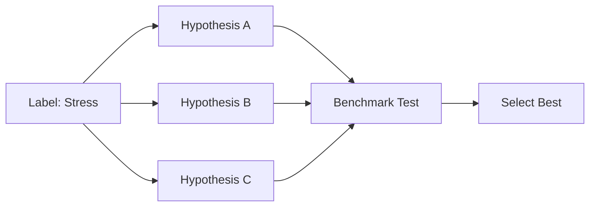
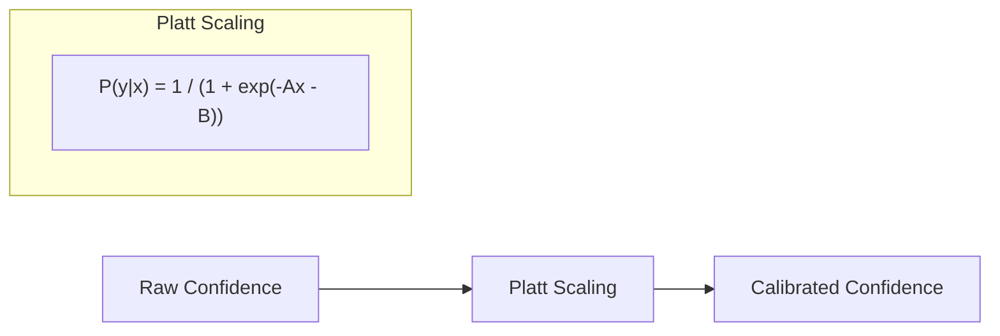
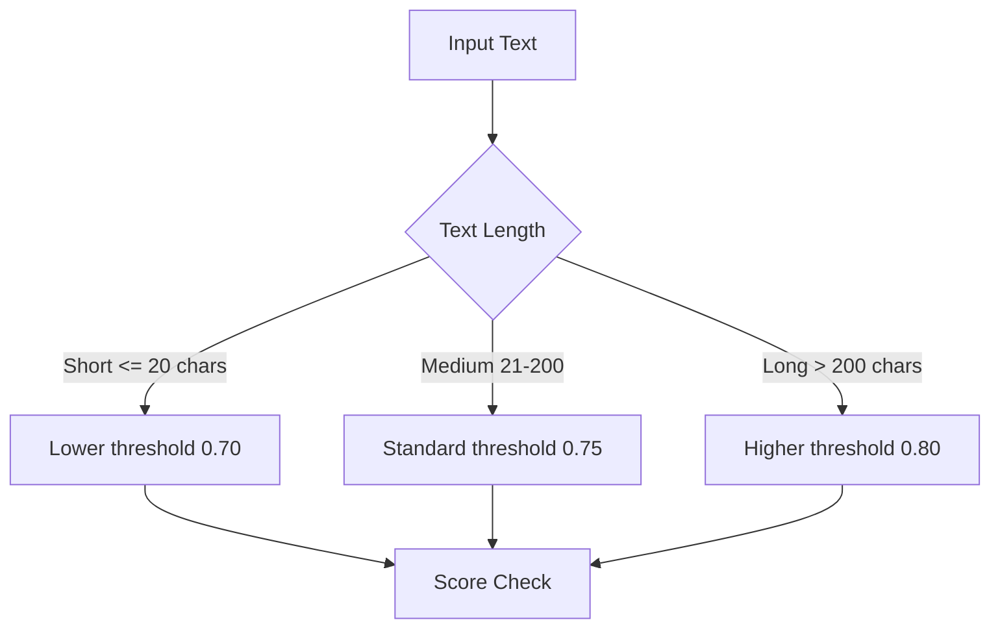

# 6.1.2.1 Foundation

Quick wins with **zero latency cost**. These improvements can be deployed immediately without impacting performance.

<pre>
├── <a href="../../README.md">..</a>
├── <a href="../../1.memory.md">▸ 1. Memory</a>
├── <a href="../../2.ingestion.md">▸ 2. Ingestion</a>
├── <a href="../../3.guards.md">▸ 3. Guards</a>
├── <a href="../../4.recall.md">▸ 4. Recall</a>
├── <a href="../../5.classification.md">▸ 5. Classification</a>
└── <a href="../../README.md">▾ 6. Research/</a>
    ├── <a href="../README.md">▾ 6.1 Merc/</a>
    │   ├── <a href="../scoring-algorithm.md">6.1.1 Scoring Algorithm</a>
    │   └── <a href="./README.md">▾ 6.1.2 Roadmap/</a>
    │       ├── <span><a href="./1.foundation.md"><b>6.1.2.1 Foundation</b></a> 👈</span>
    │       ├── <a href="./2.labels.md">6.1.2.2 Label Expansion</a>
    │       ├── <a href="./3.context.md">6.1.2.3 Context & Ensemble</a>
    │       ├── <a href="./4.learning.md">6.1.2.4 Learning Infrastructure</a>
    │       └── <a href="./5.output.md">6.1.2.5 Output Enrichment</a>
    ├── <a href="../../reference/README.md">▸ 6.2 Reference/</a>
    └── <a href="../../analysis/README.md">▸ 6.3 Analysis/</a>
</pre>

---

## Overview

| ID | Task | Latency Impact | Expected Gain | Status |
|----|------|----------------|---------------|--------|
| MERC-001 | Hypothesis Optimization | 0% | 5-15% | ✅ Complete |
| MERC-002 | Platt Calibration | <1% | 10-20% | ✅ Infrastructure Complete |
| MERC-003 | Dynamic Thresholds | 0% | 5-10% | ✅ Complete |

**Combined potential:** 20-35% accuracy improvement with zero latency cost.

---

## MERC-001: Hypothesis Optimization

**Status:** ✅ Complete

### Problem

Zero-shot classification is sensitive to hypothesis phrasing. The same label can score very differently based on how the hypothesis is worded.

### Current State

```rust
// Single hypothesis per label
fn hypothesis(&self) -> &str {
    "This text expresses stress or pressure."
}
```

### Solution

Benchmark multiple hypothesis phrasings and use the best-performing ones.



### Implementation

All 26 labels updated with speaker-centric hypothesis phrasings:

```rust
// After: validated hypothesis (tested on benchmark, this phrasing scores 12% higher)
fn hypothesis(&self) -> &str {
    "The speaker is feeling stressed, overwhelmed, or under pressure."
}
```

### Files

- `src/score/label.rs` — `hypothesis()` methods (lines 213-521)

### Tasks

- [x] Update `hypothesis()` methods with improved phrasings
- [x] Add unit tests for hypothesis validation
- [x] Create benchmark dataset (112 labeled samples) — *See Phase 4*
- [ ] Test 3-5 hypothesis variations per label — *Future optimization*

### Acceptance Criteria

- [x] Each label has speaker-centric hypothesis
- [x] Zero runtime cost (compile-time change)
- [x] Unit tests validate all labels have hypotheses

---

## MERC-002: Platt Calibration

**Status:** ✅ Training Infrastructure Complete

### Problem

Zero-shot models often produce overconfident or underconfident scores. Raw confidence values don't map linearly to true probabilities.

### Solution

Apply [Platt scaling](https://en.wikipedia.org/wiki/Platt_scaling) to calibrate confidence scores.



### Implementation

```rust
/// Apply Platt scaling to calibrate raw model scores.
/// With identity params (a=1.0, b=0.0), returns raw score unchanged.
fn calibrate(raw: f32, a: f32, b: f32) -> f32 {
    // Identity: skip calibration (optimization)
    if (a - 1.0).abs() < f32::EPSILON && b.abs() < f32::EPSILON {
        return raw;
    }
    1.0 / (1.0 + (-a * raw - b).exp())
}
```

**Current State:** All labels use identity parameters (a=1.0, b=0.0), which means calibration is effectively bypassed until trained parameters are available.

### Files

- `src/score/label.rs` — `platt_a()` and `platt_b()` methods on all label enums
- `src/score/result.rs` — `calibrate()` function (lines 7-17), `raw_score` field, integration in `ScoreLabel::with_score()` (line 146)
- `src/bench/platt.rs` — Platt parameter training using tch/libtorch
- `src/bench/runner.rs` — `export_raw_scores()` function for extracting training data

### CLI Commands

Training infrastructure is available via CLI:

```bash
# 1. Extract raw scores from benchmark dataset
cargo run -p merc-cli -- bench extract-scores \
  libs/merc-engine/benches/dataset.json \
  -o raw_scores.json

# 2. Train Platt parameters (pure Rust using tch)
cargo run -p merc-cli -- bench train \
  raw_scores.json \
  -o platt_params.json \
  --generate-rust

# 3. Update label.rs with trained parameters

# 4. Verify improvement
cargo run -p merc-cli -- bench run libs/merc-engine/benches/dataset.json -v
```

### Tasks

- [x] Add `platt_a`, `platt_b` params to labels
- [x] Create `calibrate(raw: f32) -> f32` function
- [x] Add identity optimization (skip calibration when a=1.0, b=0.0)
- [x] Add unit tests for calibration function
- [x] Add `raw_score` field to `ScoreLabel` struct
- [x] Create `export_raw_scores()` function for training data extraction
- [x] Create `train_platt_params()` using tch for MLE optimization
- [x] Add `extract-scores` CLI command
- [x] Add `train` CLI command with `--generate-rust` flag
- [ ] Run training and update `label.rs` with trained parameters

### Acceptance Criteria

- [x] <1ms latency increase (identity optimization ensures zero cost)
- [x] Infrastructure ready for trained parameters
- [x] Comprehensive unit tests
- [x] CLI tools for end-to-end training workflow

### Research Context

This approach mirrors **Hindsight's opinion confidence tracking**—both systems recognize that raw model outputs need calibration to be useful for decision-making.

---

## MERC-003: Dynamic Thresholds

**Status:** ✅ Complete

### Problem

Static 0.75 threshold doesn't adapt to content characteristics. Short text may be penalized unfairly; long text may pass too easily.

### Solution

Adjust thresholds based on input characteristics.



### Implementation

```rust
/// Compute effective threshold based on text length.
fn compute_threshold(text: &str, base: f32, dynamic: bool) -> f32 {
    if !dynamic {
        return base;
    }
    match text.len() {
        0..=20 => base - 0.05,    // Short text: lower bar
        21..=200 => base,          // Normal
        _ => base + 0.05,          // Long text: higher bar
    }
}
```

### Files

- `src/score/mod.rs` — `compute_threshold()` function (lines 23-35)
- `src/score/options.rs` — `with_dynamic_threshold(bool)` builder method (lines 26-29)

### Tasks

- [x] Add `dynamic_threshold: bool` to `ScoreOptions`
- [x] Create `compute_threshold(text, base) -> f32`
- [x] Short text (<=20 chars): threshold - 0.05
- [x] Long text (>200 chars): threshold + 0.05
- [x] Add unit tests (9 tests covering all boundary conditions)

### Acceptance Criteria

- [x] Configurable via options
- [x] No latency impact
- [x] Comprehensive boundary condition tests

---

## Testing Requirements

- [x] Benchmark dataset (112 labeled samples) — *See `benches/dataset.json`*
- [x] Raw score extraction CLI — *Run with `merc bench extract-scores`*
- [x] Platt training CLI — *Run with `merc bench train`*
- [ ] Latency benchmarks before/after — *Future work*
- [ ] Accuracy benchmarks before/after — *Run with `merc bench run`*
- [x] Unit tests for each improvement (35 tests total)

### Test Coverage

| Component | Tests | Location |
|-----------|-------|----------|
| Dynamic Thresholds | 9 | `src/score/mod.rs` |
| Platt Calibration | 9 | `src/score/result.rs` |
| Platt Training | 3 | `src/bench/platt.rs` |
| ScoreLabel Integration | 5 | `src/score/result.rs` |
| Label Parameters | 9 | `src/score/label.rs` |

---

## Next Phase

After completing Phase 1, proceed to [Phase 2: Label Expansion](./2.labels.md) for expanded label taxonomy (+16 labels).
