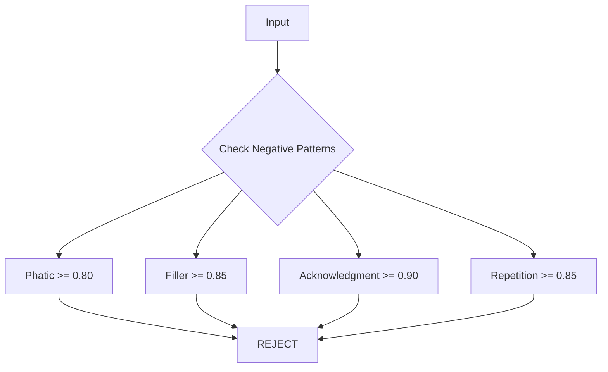

# 6.1.2.2 Label Expansion

Expand the label taxonomy from 27 to 43 labels. **+10-15% latency impact**.

<pre>
├── <a href="../../README.md">..</a>
├── <a href="../../1.memory.md">▸ 1. Memory</a>
├── <a href="../../2.ingestion.md">▸ 2. Ingestion</a>
├── <a href="../../3.guards.md">▸ 3. Guards</a>
├── <a href="../../4.recall.md">▸ 4. Recall</a>
├── <a href="../../5.classification.md">▸ 5. Classification</a>
└── <a href="../../README.md">▾ 6. Research/</a>
    ├── <a href="../README.md">▾ 6.1 Merc/</a>
    │   ├── <a href="../scoring-algorithm.md">6.1.1 Scoring Algorithm</a>
    │   └── <a href="./README.md">▾ 6.1.2 Roadmap/</a>
    │       ├── <a href="./1.foundation.md">6.1.2.1 Foundation</a>
    │       ├── <a href="./2.labels.md"><b>6.1.2.2 Label Expansion</b></a> 👈
    │       ├── <a href="./3.context.md">6.1.2.3 Context & Ensemble</a>
    │       ├── <a href="./4.learning.md">6.1.2.4 Learning Infrastructure</a>
    │       └── <a href="./5.output.md">6.1.2.5 Output Enrichment</a>
    ├── <a href="../../reference/README.md">▸ 6.2 Reference/</a>
    └── <a href="../../analysis/README.md">▸ 6.3 Analysis/</a>
</pre>

---

## Overview

| ID | Task | Labels Added | Expected Gain |
|----|------|--------------|---------------|
| MERC-004 | Negative Labels | 3 | 20-30% noise reduction |
| MERC-005 | Positive Labels | 6 | 10-15% recall |
| MERC-006 | Sensitivity Labels | 2 | Downstream routing |
| MERC-007 | Temporal Labels | 3 | Temporal awareness |

**Total:** +14 new labels (27 → 41), reorganized into 6 categories.

---

## Label Count Summary

| Category | Current | Proposed | Change |
|----------|---------|----------|--------|
| Sentiment | 3 | 3 | — |
| Emotion | 7 | 8 | +1 (Concern) |
| Outcome | 7 | 8 | +1 (Commitment) |
| Context | 9 | 15 | +6 |
| Negative | 1 | 4 | +3 |
| Temporal | 0 | 3 | +3 (new) |
| Sensitivity | 0 | 2 | +2 (new) |
| **Total** | **27** | **43** | **+16** |

---

## MERC-004: Negative Labels

**Status:** 🔲 Not Started

### Problem

The Phatic filter is binary; other low-value patterns exist that should be explicitly detected and rejected.

### Solution

Add explicit negative labels to reduce noise in stored memories.

### New Labels

| Label | Category | Weight | Threshold | Hypothesis |
|-------|----------|--------|-----------|------------|
| Filler | Negative | 0.10 | 0.85 | "This text is filler with no meaningful content." |
| Acknowledgment | Negative | 0.10 | 0.90 | "This is just an acknowledgment like 'okay' or 'got it'." |
| Repetition | Negative | 0.10 | 0.85 | "This text repeats previously stated information." |

### Research Context

**Zep** stores everything but naturally deprioritizes low-value content through graph sparsity. Merc's approach is more explicit—reject at write time to reduce storage and downstream noise.

### Files

- `src/score/label.rs` — Add to `NegativeLabel` enum

### Tasks

- [ ] Add `Filler` label (threshold: 0.85, weight: 0.10)
- [ ] Add `Acknowledgment` label (threshold: 0.90, weight: 0.10)
- [ ] Add `Repetition` label (threshold: 0.85, weight: 0.10)
- [ ] Update `Label::all()` and `Label::negative()`
- [ ] Extend rejection logic in `mod.rs`

### Acceptance Criteria

- 3 new negative labels
- 20-30% noise reduction

---

## MERC-005: Positive Labels

**Status:** 🔲 Not Started

### Problem

Current 26 labels may miss important signals. Common patterns like questions, requests, and commitments aren't explicitly detected.

### Solution

Add high-value labels to improve recall without bloating the model.

### New Labels

| Label | Category | Weight | Threshold | Hypothesis |
|-------|----------|--------|-----------|------------|
| Question | Context | 0.70 | 0.70 | "This text asks a question or seeks information." |
| Request | Context | 0.85 | 0.70 | "This text makes a request or asks for something." |
| Update | Context | 0.60 | 0.70 | "This text provides an update or status report." |
| Announcement | Context | 0.70 | 0.70 | "This text announces news or information." |
| Commitment | Outcome | 0.75 | 0.70 | "This text contains a promise or commitment." |
| Concern | Emotion | 0.50 | 0.70 | "This text expresses worry or concern about something." |

### Research Context

**Hindsight** separates memories into epistemic networks (World/Experience/Opinion/Observation). These new labels help Merc better categorize the *type* of information being stored, enabling smarter downstream routing.

### Files

- `src/score/label.rs` — Add to appropriate enums

### Tasks

- [ ] Add `Question` to Context (weight: 0.70)
- [ ] Add `Request` to Context (weight: 0.85)
- [ ] Add `Update` to Context (weight: 0.60)
- [ ] Add `Announcement` to Context (weight: 0.70)
- [ ] Add `Commitment` to Outcome (weight: 0.75)
- [ ] Add `Concern` to Emotion (weight: 0.50)
- [ ] Benchmark hypotheses

### Acceptance Criteria

- 6 new positive labels
- 10-15% better recall

---

## MERC-006: Sensitivity Labels

**Status:** 🔲 Not Started

### Problem

Merc has no awareness of content sensitivity. Downstream systems need to know if content requires special handling.

### Solution

Add sensitivity labels that **flag** (not reject) content for downstream compliance handling.

### New Labels

| Label | Category | Weight | Threshold | Hypothesis |
|-------|----------|--------|-----------|------------|
| Sensitive | Sensitivity | 0.30 | 0.75 | "This text contains potentially sensitive information (personal, financial, health)." |
| Confidential | Sensitivity | 0.30 | 0.80 | "This text contains confidential business information." |

### Research Context

**Enterprise Model** uses a 4-level sensitivity scale (0-3) with different retention policies:

| Level | Name | Retention |
|-------|------|-----------|
| 0 | Public | Indefinite |
| 1 | Internal | 90 days |
| 2 | Confidential | 30 days |
| 3 | Restricted | 7 days |

Merc's sensitivity labels provide a simpler binary signal that downstream systems can use to apply their own retention/handling policies.

### Important

These labels **flag for downstream handling**, not for rejection. Sensitive content should still be stored—just with appropriate metadata.

### Files

- `src/score/label.rs` — Add new `SensitivityLabel` enum

### Tasks

- [ ] Create `SensitivityLabel` enum
- [ ] Add `Sensitive` (weight: 0.30, threshold: 0.75)
- [ ] Add `Confidential` (weight: 0.30, threshold: 0.80)
- [ ] Add sensitivity flags to `ScoreResult`

### Acceptance Criteria

- 2 new sensitivity labels
- Flags exposed in output for downstream use

---

## MERC-007: Temporal Labels

**Status:** 🔲 Not Started

### Problem

Merc has no awareness of temporal content. Time-sensitive information (deadlines, updates, schedules) isn't explicitly detected.

### Solution

Add temporal labels to flag time-related content for downstream temporal reasoning systems.

### New Labels

| Label | Category | Weight | Threshold | Hypothesis |
|-------|----------|--------|-----------|------------|
| Temporal_Update | Temporal | 0.70 | 0.70 | "This text updates or changes previously stated information." |
| Deadline | Temporal | 0.75 | 0.70 | "This text mentions a deadline, due date, or time constraint." |
| Schedule | Temporal | 0.65 | 0.70 | "This text describes a scheduled event, meeting, or appointment." |

### Research Context

**Zep** uses a bi-temporal model with four timestamps per edge:
- `t_valid`: When fact became true
- `t_invalid`: When fact stopped being true
- `t'_created`: When ingested
- `t'_expired`: When invalidated

Merc can't do bi-temporal reasoning (it's stateless), but these labels help downstream systems:
- `Temporal_Update` flags potential contradictions
- `Deadline` and `Schedule` flag time-sensitive content

### Files

- `src/score/label.rs` — Add new `TemporalLabel` enum

### Tasks

- [ ] Create `TemporalLabel` enum
- [ ] Add `Temporal_Update` (weight: 0.70, threshold: 0.70)
- [ ] Add `Deadline` (weight: 0.75, threshold: 0.70)
- [ ] Add `Schedule` (weight: 0.65, threshold: 0.70)
- [ ] Add temporal flags to `ScoreResult`

### Acceptance Criteria

- 3 new temporal labels
- Enables downstream temporal reasoning

---

## Complete Label Taxonomy (Proposed)

### Sentiment (3 labels)

| Label | Weight | Threshold | Hypothesis |
|-------|--------|-----------|------------|
| Negative | 0.35 | 0.70 | "This text expresses a negative sentiment." |
| Positive | 0.30 | 0.70 | "This text expresses a positive sentiment." |
| Neutral | 0.10 | 0.70 | "This text expresses a neutral sentiment." |

### Emotion (8 labels)

| Label | Weight | Threshold | Hypothesis |
|-------|--------|-----------|------------|
| Stress | 0.45 | 0.70 | "This text expresses stress or pressure." |
| Fear | 0.40 | 0.70 | "This text expresses fear or anxiety." |
| Anger | 0.40 | 0.70 | "This text expresses anger or frustration." |
| Sad | 0.40 | 0.70 | "This text expresses sadness or grief." |
| Shame | 0.35 | 0.70 | "This text expresses shame or embarrassment." |
| Pride | 0.30 | 0.70 | "This text expresses pride or accomplishment." |
| Joy | 0.30 | 0.70 | "This text expresses joy or happiness." |
| **Concern** | **0.50** | **0.70** | **"This text expresses worry or concern about something."** |

### Outcome (8 labels)

| Label | Weight | Threshold | Hypothesis |
|-------|--------|-----------|------------|
| Decision | 0.80 | 0.70 | "This text describes making a decision or choice." |
| Progress | 0.65 | 0.70 | "This text describes progress, completion, or forward movement." |
| Conflict | 0.65 | 0.70 | "This text describes disagreement, conflict, argument, or tension." |
| Success | 0.55 | 0.70 | "This text describes achieving a goal or success." |
| Failure | 0.55 | 0.70 | "This text describes a failure or setback." |
| Reward | 0.45 | 0.70 | "This text describes receiving a reward or benefit." |
| Punishment | 0.45 | 0.70 | "This text describes a punishment or consequence." |
| **Commitment** | **0.75** | **0.70** | **"This text contains a promise or commitment."** |

### Context (15 labels)

| Label | Weight | Threshold | Hypothesis |
|-------|--------|-----------|------------|
| Task | 1.00 | 0.65 | "This text describes a task, todo item, or reminder." |
| Plan | 0.90 | 0.65 | "This text describes a plan, commitment, or intention." |
| Goal | 0.90 | 0.65 | "This text describes a goal, objective, or aspiration." |
| Preference | 0.85 | 0.65 | "This text expresses a preference, like, dislike, or opinion." |
| Fact | 0.80 | 0.70 | "This text states a factual piece of information." |
| Entity | 0.65 | 0.75 | "This text mentions a specific named person, organization, or entity." |
| Time | 0.55 | 0.70 | "This text references a specific time or date." |
| Place | 0.55 | 0.70 | "This text references a specific location or place." |
| Phatic | 0.40 | 0.80 | "This text is a greeting, thanks, farewell, or polite small talk." |
| **Question** | **0.70** | **0.70** | **"This text asks a question or seeks information."** |
| **Request** | **0.85** | **0.70** | **"This text makes a request or asks for something."** |
| **Update** | **0.60** | **0.70** | **"This text provides an update or status report."** |
| **Announcement** | **0.70** | **0.70** | **"This text announces news or information."** |

### Negative (4 labels)

| Label | Weight | Threshold | Hypothesis |
|-------|--------|-----------|------------|
| Phatic | 0.40 | 0.80 | "This text is a greeting, thanks, farewell, or polite small talk." |
| **Filler** | **0.10** | **0.85** | **"This text is filler with no meaningful content."** |
| **Acknowledgment** | **0.10** | **0.90** | **"This is just an acknowledgment like 'okay' or 'got it'."** |
| **Repetition** | **0.10** | **0.85** | **"This text repeats previously stated information."** |

### Temporal (3 labels) — NEW CATEGORY

| Label | Weight | Threshold | Hypothesis |
|-------|--------|-----------|------------|
| **Temporal_Update** | **0.70** | **0.70** | **"This text updates or changes previously stated information."** |
| **Deadline** | **0.75** | **0.70** | **"This text mentions a deadline, due date, or time constraint."** |
| **Schedule** | **0.65** | **0.70** | **"This text describes a scheduled event, meeting, or appointment."** |

### Sensitivity (2 labels) — NEW CATEGORY

| Label | Weight | Threshold | Hypothesis |
|-------|--------|-----------|------------|
| **Sensitive** | **0.30** | **0.75** | **"This text contains potentially sensitive information (personal, financial, health)."** |
| **Confidential** | **0.30** | **0.80** | **"This text contains confidential business information."** |

---

## Testing Requirements

- [ ] Benchmark all new hypotheses
- [ ] Latency benchmarks (+10-15% expected)
- [ ] Accuracy benchmarks per label
- [ ] False positive/negative rates

---

## Next Phase

After completing Phase 2, proceed to [Phase 3: Context & Ensemble](./3.context.md) for context window and ensemble scoring.
