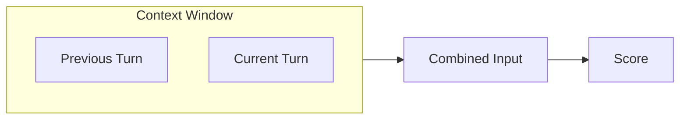
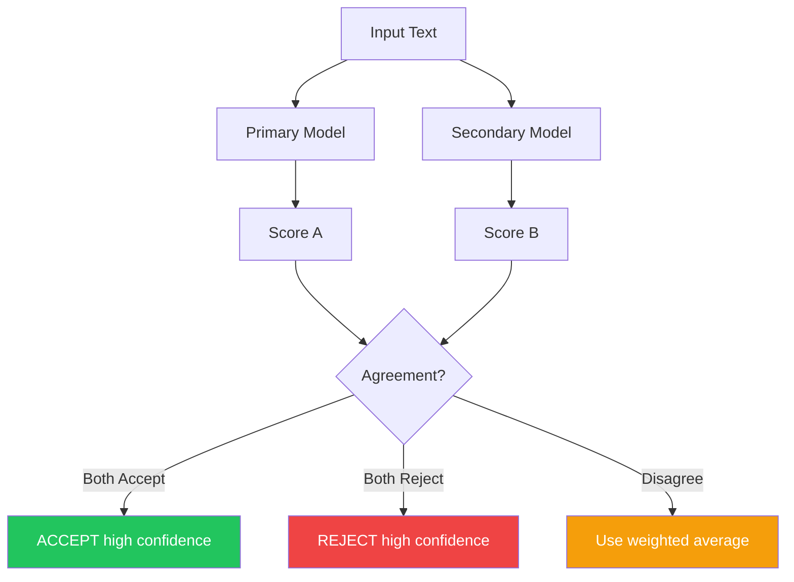
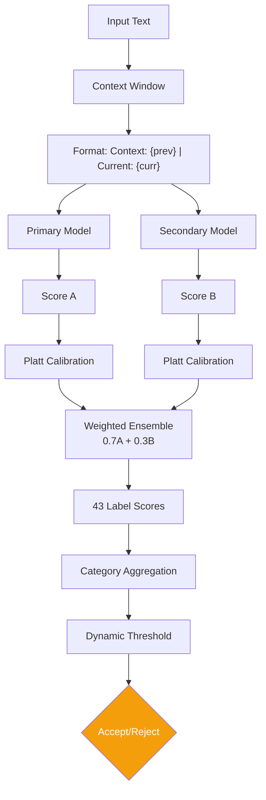

# 6.1.2.3 Context & Ensemble

Add context awareness and model redundancy. **+50-100% latency impact**.

<pre>
├── <a href="../../README.md">..</a>
├── <a href="../../1.memory.md">▸ 1. Memory</a>
├── <a href="../../2.ingestion.md">▸ 2. Ingestion</a>
├── <a href="../../3.guards.md">▸ 3. Guards</a>
├── <a href="../../4.recall.md">▸ 4. Recall</a>
├── <a href="../../5.classification.md">▸ 5. Classification</a>
└── <a href="../../README.md">▾ 6. Research/</a>
    ├── <a href="../README.md">▾ 6.1 Merc/</a>
    │   ├── <a href="../scoring-algorithm.md">6.1.1 Scoring Algorithm</a>
    │   └── <a href="./README.md">▾ 6.1.2 Roadmap/</a>
    │       ├── <a href="./1.foundation.md">6.1.2.1 Foundation</a>
    │       ├── <a href="./2.labels.md">6.1.2.2 Label Expansion</a>
    │       ├── <span><a href="./3.context.md"><b>6.1.2.3 Context & Ensemble</b></a> 👈</span>
    │       ├── <a href="./4.learning.md">6.1.2.4 Learning Infrastructure</a>
    │       └── <a href="./5.output.md">6.1.2.5 Output Enrichment</a>
    ├── <a href="../../reference/README.md">▸ 6.2 Reference/</a>
    └── <a href="../../analysis/README.md">▸ 6.3 Analysis/</a>
</pre>

---

## Overview

| ID | Task | Latency Impact | Expected Gain |
|----|------|----------------|---------------|
| MERC-008 | Context Window | +50% | 10-20% on follow-ups |
| MERC-009 | Lightweight Ensemble | +100% | 15-25% error reduction |

**Combined potential:** 25-45% accuracy improvement at the cost of ~100-150ms total latency.

---

## MERC-008: Context Window

**Status:** 🔲 Not Started

### Problem

Scoring text in isolation misses conversational context. Follow-up utterances like "It's really getting to me" lack meaning without the previous turn.

### Current State

```rust
// Single utterance, no context
fn score(text: &str) -> ScoreResult {
    model.classify(text)
}
```

### Solution

Include previous utterance(s) in scoring to capture conversational flow.



### Implementation

```rust
struct ScoringContext {
    previous: Option<String>,
    current: String,
}

fn score_with_context(ctx: &ScoringContext) -> ScoreResult {
    let input = match &ctx.previous {
        Some(prev) => format!("Context: {} | Current: {}", prev, ctx.current),
        None => ctx.current.clone(),
    };
    model.classify(&input)
}
```

### Example

```
Previous: "I've been stressed about the deadline"
Current:  "It's really getting to me"

Without context:
  - Stress: 0.45 (borderline)
  - REJECTED (score too low)

With context:
  - Input: "Context: I've been stressed about the deadline | Current: It's really getting to me"
  - Stress: 0.89 (boosted by context)
  - ACCEPTED with high confidence
```

### Research Context

| System | Context Approach |
|--------|------------------|
| Merc (proposed) | 1 previous turn |
| Zep | Full conversation via graph structure |
| Hindsight | Full conversation context |
| Enterprise Model | 20K token chunks with 10% overlap |

Merc's approach balances context awareness with latency. One previous turn provides significant improvement with minimal cost.

### Files

- `src/score/mod.rs` — New method
- `src/score/options.rs` — Add config

### Tasks

- [ ] Create `ScoringContext` struct
- [ ] Add `invoke_with_context()` method
- [ ] Format: `"Context: {prev} | Current: {curr}"`
- [ ] Benchmark accuracy impact
- [ ] Maintain backward compatibility (optional context)

### Acceptance Criteria

- Optional, backward compatible
- 10-20% better accuracy on follow-up utterances
- ~1.5x latency (longer input to process)

---

## MERC-009: Lightweight Ensemble

**Status:** 🔲 Not Started

### Problem

Single model = single point of failure. Ambiguous inputs can produce inconsistent results.

### Solution

Run two fast models and combine scores for redundancy and improved accuracy.



### Implementation

```rust
pub enum Confidence {
    High,  // Both models agree
    Low,   // Models disagree
}

fn ensemble_score(text: &str) -> (f32, Confidence) {
    // Run models in parallel
    let (score_a, score_b) = rayon::join(
        || primary_model.score(text),
        || secondary_model.score(text),
    );

    let agreement = (score_a >= 0.75) == (score_b >= 0.75);
    let combined = 0.7 * score_a + 0.3 * score_b;

    let confidence = if agreement {
        Confidence::High
    } else {
        Confidence::Low
    };

    (combined, confidence)
}
```

### Model Selection

| Role | Model | Purpose |
|------|-------|---------|
| Primary | Current model (facebook/bart-large-mnli) | Main scorer |
| Secondary | Smaller/different model | Redundancy check |

Options for secondary model:
- `roberta-large-mnli` — Different architecture
- `deberta-v3-base-mnli` — Microsoft DeBERTa
- Distilled version of primary — Faster, similar behavior

### Research Context

| System | Redundancy Approach |
|--------|---------------------|
| Merc (proposed) | 2-model ensemble |
| Zep | Single LLM (no redundancy) |
| Hindsight | Single LLM (no redundancy) |
| Enterprise Model | Single BERT + single LLM |

Merc's ensemble approach is unique among these systems. The cost is latency, but the benefit is significantly reduced errors on ambiguous inputs.

### Files

- `src/score/mod.rs` — Major refactor
- `src/score/ensemble.rs` (new)

### Tasks

- [ ] Select secondary model
- [ ] Implement parallel execution with rayon
- [ ] Add `Confidence` enum (High/Low)
- [ ] Weighted averaging (0.7/0.3)
- [ ] Expose confidence in `ScoreResult`
- [ ] Benchmark latency and accuracy

### Acceptance Criteria

- <150ms total latency
- 15-25% error reduction
- Confidence signal exposed for downstream use

---

## Combined Pipeline

After Phase 3, the full scoring pipeline:



---

## Performance Comparison

| Configuration | Latency | Accuracy Gain |
|---------------|---------|---------------|
| Baseline | ~50ms | — |
| + Context Window | ~75ms | +10-20% |
| + Ensemble | ~100-150ms | +15-25% |
| **Full Phase 3** | **~100-150ms** | **+25-45%** |

---

## Testing Requirements

- [ ] Benchmark dataset with follow-up utterances
- [ ] Measure agreement rate between models
- [ ] Track confidence distribution
- [ ] Latency benchmarks with parallel execution
- [ ] A/B testing against baseline

---

## Next Phase

After completing Phase 3, proceed to [Phase 4: Learning Infrastructure](./4.learning.md) for feedback loops and continuous improvement.
