# 6.2.2 Zep

<pre>
├── <a href="../README.md">..</a>
├── <a href="../1.memory.md">▸ 1. Memory</a>
├── <a href="../2.ingestion.md">▸ 2. Ingestion</a>
├── <a href="../3.guards.md">▸ 3. Guards</a>
├── <a href="../4.recall.md">▸ 4. Recall</a>
├── <a href="../5.classification.md">▸ 5. Classification</a>
└── <a href="../README.md">▾ 6. Research/</a>
    ├── <a href="../merc/README.md">▸ 6.1 Merc/</a>
    ├── <a href="./README.md">▾ 6.2 Reference/</a>
    │   ├── <a href="./1.hindsight.md">6.2.1 Hindsight</a>
    │   ├── <span><a href="./2.zep.md"><b>6.2.2 Zep</b></a> 👈</span>
    │   └── <a href="./3.enterprise.md">6.2.3 Enterprise</a>
    └── <a href="../analysis/README.md">▸ 6.3 Analysis/</a>
</pre>

A comprehensive reference for the Zep memory system, based on the arXiv paper and Graphiti documentation.

## Overview

Zep is a memory layer service for AI agents built on Graphiti, a temporally-aware knowledge graph engine. Unlike traditional RAG frameworks limited to static document retrieval, Zep dynamically synthesizes conversational and structured data while maintaining historical relationships.

```mermaid
flowchart TD
    subgraph Input [Input Layer]
        I1[Messages]
        I2[Text]
        I3[JSON]
    end

    subgraph Zep [Zep Memory Layer]
        subgraph Graph [Knowledge Graph G = N, E, φ]
            E1[Episode Subgraph]
            E2[Semantic Entity Subgraph]
            E3[Community Subgraph]
        end

        subgraph Retrieval [Hybrid Retrieval]
            R1[Semantic Search]
            R2[BM25 Search]
            R3[Graph Traversal]
        end

        subgraph Rerank [Reranking]
            RR1[RRF]
            RR2[MMR]
            RR3[Cross-Encoder]
        end
    end

    Input --> E1
    E1 --> E2
    E2 --> E3

    Graph --> Retrieval
    Retrieval --> Rerank
    Rerank --> Output[Context for LLM]

    style E1 fill:#3b82f6,color:#fff
    style E2 fill:#22c55e,color:#fff
    style E3 fill:#f59e0b,color:#fff
```



**Key Innovation:** Bi-temporal data model explicitly tracking both when events occurred (T) and when they were ingested (T'), enabling accurate point-in-time queries and contradiction handling.

---

## Three-Tier Knowledge Graph

The graph **G = (N, E, φ)** comprises three hierarchical subgraphs that mirror human memory systems.


### Episode Subgraph

Houses raw input data (messages, text, JSON) as non-lossy storage. Episodes anchor entities and relationships, preserving the original conversational context.

- Stores complete message history
- Enables traceability back to source
- No information loss during extraction

### Semantic Entity Subgraph

Builds on episodes by extracting entity nodes and connecting them through semantic edges (relationships/facts).

- Entities derived from episodes via LLM extraction
- Edges represent relationships between entities
- Entity summaries facilitate resolution and retrieval

### Community Subgraph

Clusters of strongly connected entity nodes with high-level summaries representing a global view of the knowledge graph.

- Formed via label propagation algorithm
- Contains map-reduce style summarizations
- Embedded keywords enable similarity search

---

## Knowledge Graph Construction

### Entity Extraction Pipeline


**Process:**
1. Current message + 4 preceding messages provide context
2. LLM extracts named entities (speaker automatically included)
3. Each entity name embedded to 1024-dimensional vector (BGE-m3)
4. Deduplication via hybrid search + LLM resolution
5. Reflexion technique minimizes hallucinations

### Fact Extraction and Resolution

Facts represent relationships between entities as triplets: **(Entity A, Relation, Entity B)**

```
Input: "Kendra loves Adidas shoes"

Extracted:
  - Entity A: Kendra
  - Relation: loves
  - Entity B: Adidas shoes

Result: Edge connecting Kendra → Adidas shoes with "loves" relation
```

**Edge Deduplication:** Constrains search to entity pairs matching proposed relationships, reducing computational overhead.

---

## Bi-Temporal Data Model

A distinguishing feature enabling accurate temporal reasoning.


### Four Timestamps Per Edge

| Timestamp | Timeline | Description |
|-----------|----------|-------------|
| `t_valid` | T (event) | When the fact became true in the world |
| `t_invalid` | T (event) | When the fact stopped being true |
| `t'_created` | T' (transaction) | When Zep ingested this information |
| `t'_expired` | T' (transaction) | When the fact was invalidated in Zep |

### Contradiction Handling

When new information contradicts existing facts:
1. New edge created with current `t_valid`
2. Old edge's `t_invalid` set to new edge's `t_valid`
3. **Priority:** Graphiti consistently prioritizes new information

```
Existing: "Kendra lives in NYC" (t_valid: 2024-01)
New:      "Kendra moved to LA" (t_valid: 2025-01)

Result:
  - Old edge: t_invalid = 2025-01
  - New edge: t_valid = 2025-01, t_invalid = NULL
```

---

## Community Detection

### Label Propagation Algorithm

Unlike Leiden, Zep uses label propagation for dynamic community management:


**Dynamic Extension:**
- Single recursive step for new nodes
- Assign to community held by neighboring node plurality
- Complete refresh when communities diverge from full propagation

**Community Nodes:**
- Map-reduce style summarizations
- Embedded keywords for similarity search
- Represent global view of related entities

---

## Memory Retrieval Architecture

Retrieval function composition: **f(α) = χ(ρ(φ(α))) = β**

Where:
- **φ** = Search functions
- **ρ** = Reranking
- **χ** = Context construction

```mermaid
flowchart TD
    Q[Query α] --> S1[φ_cos: Cosine Similarity]
    Q --> S2[φ_bm25: Full-Text Search]
    Q --> S3[φ_bfs: Graph Traversal]

    S1 --> TOP[Top-20 Results Each]
    S2 --> TOP
    S3 --> TOP

    TOP --> R[Reranking ρ]

    R --> RRF[RRF]
    R --> MMR[MMR]
    R --> EM[Episode-Mentions]
    R --> ND[Node Distance]
    R --> CE[Cross-Encoder]

    RRF --> CTX[Context Construction χ]
    MMR --> CTX
    EM --> CTX
    ND --> CTX
    CE --> CTX

    CTX --> OUT[Context β for LLM]
```



### Search Functions (φ)

| Function | Method | Targets |
|----------|--------|---------|
| **φ_cos** | Cosine semantic similarity | Entity names, fact content, community names |
| **φ_bm25** | Okapi BM25 full-text | Fact fields, entity names, community keywords |
| **φ_bfs** | Breadth-first graph traversal | N-hop neighbors from seed nodes |

**Coverage:** Each method targets different similarity aspects:
- Full-text: Word similarities
- Cosine: Semantic similarities
- BFS: Contextual similarities (graph proximity)

**Implementation:** Neo4j with Lucene indexing, BGE-m3 embeddings (1024-dim)

### Reranking Strategies (ρ)

| Reranker | Purpose | Cost |
|----------|---------|------|
| **RRF** | Combine rankings across search methods | Low |
| **MMR** | Balance relevance with diversity | Low |
| **Episode-Mentions** | Prioritize frequently referenced entities | Low |
| **Node Distance** | Order by graph distance from centroid | Low |
| **Cross-Encoder** | LLM-based relevance scoring | High |

### Context Construction (χ)

Formats retrieved results for LLM consumption:

| Node Type | Returned Fields |
|-----------|-----------------|
| Semantic Edge | fact, t_valid, t_invalid |
| Entity Node | name, summary |
| Community Node | summary |

---

## Configuration & Backends

### Database Support

| Backend | Version | Notes |
|---------|---------|-------|
| Neo4j | 5.26+ | Primary, with Lucene |
| FalkorDB | 1.1.2+ | Alternative graph DB |
| Kuzu | 0.11.2+ | Embedded option |
| Amazon Neptune | - | With OpenSearch Serverless |

### LLM Providers

- OpenAI (default)
- Anthropic
- Google Gemini
- Groq
- Azure OpenAI
- OpenAI-compatible APIs

### Performance Tuning

| Setting | Default | Purpose |
|---------|---------|---------|
| `SEMAPHORE_LIMIT` | 10 | Concurrent LLM calls |
| Embedding model | BGE-m3 | 1024-dim vectors |
| Query latency | Sub-second | Typical response time |

---

## Benchmark Results

### Deep Memory Retrieval (DMR) Benchmark

500 conversations, 5 sessions each, 12 messages maximum.

| System | Model | Accuracy |
|--------|-------|----------|
| MemGPT | gpt-4-turbo | 93.4% |
| **Zep** | gpt-4-turbo | **94.8%** |
| **Zep** | gpt-4o-mini | **98.2%** |

**Delta:** Zep outperforms MemGPT by 1.4-4.8 percentage points.

### LongMemEval Benchmark

Average 115,000-token conversations across six question types.

| System | Model | Accuracy | Latency | Context Tokens |
|--------|-------|----------|---------|----------------|
| Full-context | gpt-4o-mini | 55.4% | 31.3s | 115k |
| **Zep** | gpt-4o-mini | **63.8%** | **3.20s** | 1.6k |
| Full-context | gpt-4o | 60.2% | 28.9s | 115k |
| **Zep** | gpt-4o | **71.2%** | **2.58s** | 1.6k |

**Improvements:**
- **90% latency reduction** (10x faster)
- **15-18% accuracy improvement**
- **72x context reduction** (115k → 1.6k tokens)

### Performance by Question Type

| Question Type | Improvement (gpt-4o-mini) |
|---------------|---------------------------|
| Temporal reasoning | +48.2% |
| Single-session preference | +77.7% |
| Multi-session | +16.7% |

---

## Graphiti: Open Source Component

Graphiti is the open-source core powering Zep's knowledge graph engine.

**Choose Graphiti if:**
- You want flexible OSS
- You're comfortable building surrounding infrastructure
- You need custom entity schemas

**Choose Zep if:**
- You want turnkey enterprise platform
- You need security, performance, support built-in
- You prefer managed service

### Installation

```bash
pip install graphiti-core

# Optional backends
pip install graphiti-core[falkordb]
pip install graphiti-core[kuzu]
pip install graphiti-core[neptune]

# LLM providers
pip install graphiti-core[anthropic]
pip install graphiti-core[google-genai]
```

---

## Sources

- [Zep: A Temporal Knowledge Graph Architecture for Agent Memory (arXiv)](https://arxiv.org/abs/2501.13956)
- [Graphiti GitHub Repository](https://github.com/getzep/graphiti)
- [Athena Intel: Memories in Agents Case Study](https://blog.athenaintel.com/memories-in-agents-a-case-study/)
- [Zep Official Website](https://www.getzep.com/)
