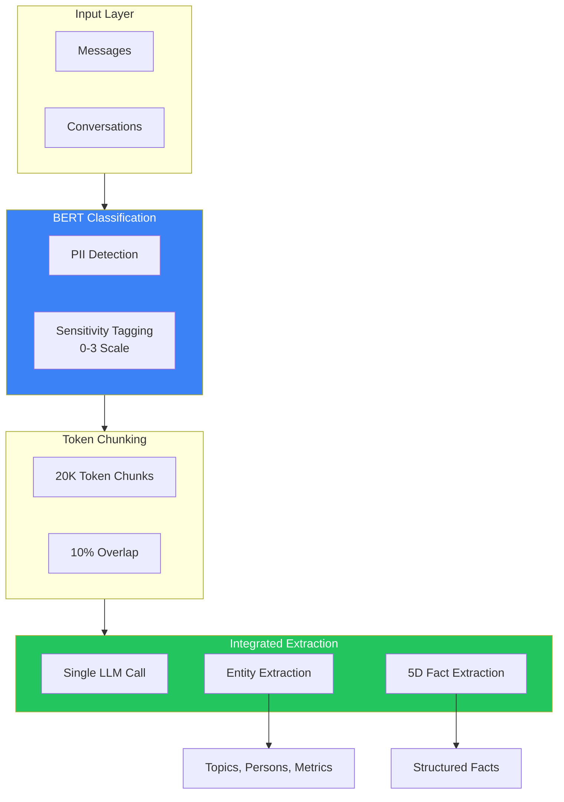
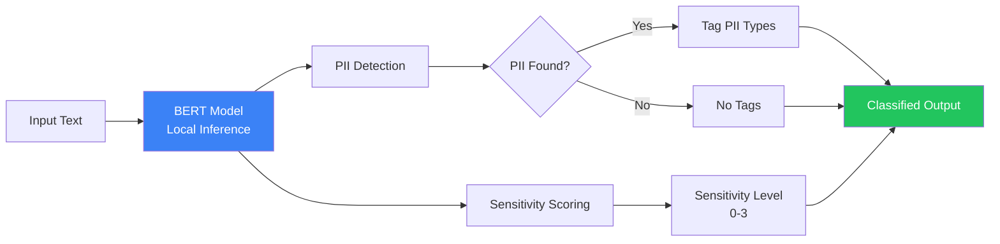
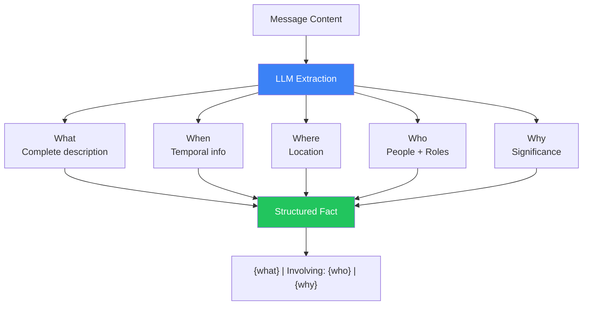
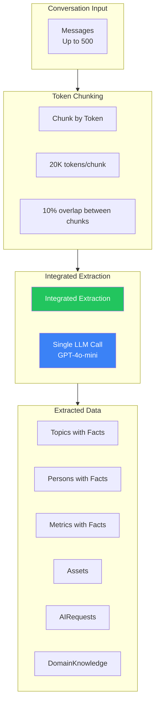

# 6.2.3 Enterprise

<pre>
├── <a href="../README.md">..</a>
├── <a href="../1.memory.md">▸ 1. Memory</a>
├── <a href="../2.ingestion.md">▸ 2. Ingestion</a>
├── <a href="../3.guards.md">▸ 3. Guards</a>
├── <a href="../4.recall.md">▸ 4. Recall</a>
├── <a href="../5.classification.md">▸ 5. Classification</a>
└── <a href="../README.md">▾ 6. Research/</a>
    ├── <a href="../merc/README.md">▸ 6.1 Merc/</a>
    ├── <a href="./README.md">▾ 6.2 Reference/</a>
    │   ├── <a href="./1.hindsight.md">6.2.1 Hindsight</a>
    │   ├── <a href="./2.zep.md">6.2.2 Zep</a>
    │   └── <span><a href="./3.enterprise.md"><b>6.2.3 Enterprise</b></a> 👈</span>
    └── <a href="../analysis/README.md">▸ 6.3 Analysis/</a>
</pre>

A reference architecture for classification and fact extraction systems in enterprise AI memory, synthesized from public research papers and industry patterns.

## Overview

This document describes a hypothetical enterprise memory system for AI agents, inspired by published research (particularly Microsoft's Hindsight paper). It focuses on **classification** and **extraction** components—the systems that evaluate, tag, and structure incoming content.



**Key Innovation:** 99.4% reduction in LLM calls through integrated extraction—a single LLM call per 20K token chunk extracts both entities and embedded facts simultaneously.

---

## BERT Classification System

This architecture uses BERT for local inference classification, avoiding LLM API calls for content evaluation.



### PII Detection

BERT detects personally identifiable information without external API calls:

| PII Type | Examples | Detection Method |
|----------|----------|------------------|
| Email | john@company.com | Pattern + Context |
| Phone | +1-555-123-4567 | Pattern + Context |
| SSN | 123-45-6789 | Pattern |
| Credit Card | 4111-1111-1111-1111 | Luhn + Pattern |
| Address | Physical locations | NER extraction |

**Output:** `metadata.security.pii_types: ["email", "phone"]`

### Sensitivity Tagging (0-3 Scale)

Content is classified into sensitivity levels that determine handling and retention:

| Level | Name | Description | Retention TTL | Examples |
|-------|------|-------------|---------------|----------|
| 0 | Public | Non-sensitive, shareable | Default (indefinite) | Meeting times, general topics |
| 1 | Internal | Business-sensitive | 90 days | Project names, team info |
| 2 | Confidential | Contains PII or proprietary data | 30 days | Customer names, financials |
| 3 | Restricted | Highly sensitive | 7 days | SSNs, credentials, health data |

**Scoring:** BERT outputs a confidence score per level; highest confidence determines classification.

### Classification vs. Gating

Unlike Merc's accept/reject gating, this approach classifies and tags **all** content:

```
Merc:              Score → Threshold → Accept/Reject
Enterprise Model:  Classify → Tag → Store (all content stored, tagged for handling)
```

**Rationale:** Enterprise compliance requires audit trails; nothing is discarded, but handling differs by sensitivity.

---

## 5-Dimensional Fact Extraction

This architecture extracts structured facts using a 5D model adapted from the Hindsight research paper.



### The Five Dimensions

| Dimension | Description | Required | Example |
|-----------|-------------|----------|---------|
| **What** | Complete description with ALL specifics (names, numbers, dates) | Yes | "DCR Timeline status is In Progress, deadline March 15" |
| **When** | Temporal information (dates, times, durations) | If present | "March 15", "next week", "N/A" |
| **Where** | Location or venue | If present | "Building 34", "Teams channel", "N/A" |
| **Who** | ALL people with their roles/context | Yes | "Emily Chen (DCR owner), Security Team (approval blocker)" |
| **Why** | Emotional or contextual significance | Yes | "Critical path item for March release" |

### Fact Format

Facts are serialized as a single string with structured sections:

```
{what} | Involving: {who} | {why}
```

**Example:**

```
Input: "Emily said the DCR timeline depends on security approval, which is blocking us for March"

Extracted Fact:
"DCR Timeline status is In Progress, deadline March 15, depends on Security Approval |
Involving: Emily Chen (DCR owner), Security Team (approval blocker) |
Critical path item for March release"
```

### Why "Involving:" Matters

The `Involving:` section is **critical** for citation and attribution:

- Enables participant-based access control
- Supports "who said what" queries
- Required for enterprise compliance (attribution tracking)
- Maps to message participant metadata from the source system

---

## Integrated Extraction Pipeline

The key architectural innovation: a **single LLM call** per conversation chunk extracts both entities and embedded facts.



### Token Chunking Strategy

| Parameter | Value | Rationale |
|-----------|-------|-----------|
| Chunk size | 20,000 tokens | Fits GPT-4o context with room for prompt |
| Overlap | 10% (2,000 tokens) | Prevents entity splitting at boundaries |
| Max messages | 500 per sync | API batch limit |

**Result:** 500 messages → ~3 chunks → 3 LLM calls

### Entity Types Extracted

A single integrated extraction call extracts 6 entity types:

| Entity Type | Fields | Fact Embedding |
|-------------|--------|----------------|
| **Topic** | name, status, dependencies[], owner, impact, deadline | Yes - project context |
| **Person** | name, expertise[], preferences[], roles[], contact | Yes - relationship facts |
| **Metric** | name, value, target, trend, unit, timeframe | Yes - performance facts |
| **Asset** | name, type, location, owner, status | Yes - resource facts |
| **AIRequest** | query, intent, response_type, urgency | No |
| **DomainKnowledge** | concept, definition, relationships[] | Yes - domain facts |

### Embedded Facts in Entities

Each entity contains a `Fact` field with the 5D-structured narrative:

```json
{
  "entityType": "Topic",
  "name": "DCR Review Process",
  "status": "In Progress",
  "dependencies": ["Security Approval"],
  "owner": "Emily Chen",
  "deadline": "March 15",
  "Fact": "DCR Review Process is in progress with March 15 deadline, blocked by Security Approval | Involving: Emily Chen (owner), Security Team (blocker) | Critical path for Q1 release"
}
```

### LLM Call Reduction

| Approach | Messages | LLM Calls | Reduction |
|----------|----------|-----------|-----------|
| Per-message extraction | 500 | 500+ | Baseline |
| Integrated extraction | 500 | 3 | **99.4%** |

**Cost Impact:** ~$0.01-0.05 per conversation sync vs. ~$2.50-5.00 for per-message extraction.

---

## Entity Scoring and Validation

### Entity Name Normalization

All entity names are normalized for consistent graph storage and retrieval:

```
normalizeEntityName(name, type)

"DCR Review Process" → "topic:dcr_review_process"
"Emily Chen"         → "person:emily_chen"
"Q1 Revenue Target"  → "metric:q1_revenue_target"
```

**Normalization Rules:**
- Lowercase conversion
- Whitespace → underscore
- Special characters removed
- Type prefix added

### Alias Generation for Fuzzy Matching

```
generateAliases(name)

"Emily Chen" → ["emily chen", "emily", "chen", "e. chen", "e chen"]
```

Aliases enable retrieval even with partial or variant name mentions.

### Deduplication Strategy

| Stage | Method | Purpose |
|-------|--------|---------|
| Pre-extraction | Exact name match | Prevent duplicate entities |
| Post-extraction | Normalized ID match | Merge across chunks |
| Cross-conversation | Graph vertex lookup | Link to existing entities |

### Extraction Quality Indicators

Extraction quality can be tracked through:

| Metric | Description | Target |
|--------|-------------|--------|
| Entity extraction rate | Entities per 1000 tokens | 5-15 |
| Fact coverage | % of messages with associated facts | >80% |
| Citation linkage | % of facts with valid messageIds[] | 100% |
| Deduplication rate | Merged vs. new entities | <20% duplicates |

---

## Performance Benchmarks

### Classification Performance (BERT)

| Metric | Value | Notes |
|--------|-------|-------|
| Latency (p95) | ~50-100ms | Local inference |
| PII detection recall | >95% | Email, phone, SSN |
| Sensitivity accuracy | ~90% | 4-class classification |
| Throughput | 1000+ msg/sec | Batched inference |

### Extraction Performance (LLM)

| Metric | Value | Notes |
|--------|-------|-------|
| Latency per chunk (p95) | 2-5s | GPT-4o-mini |
| Entities per chunk | 10-50 | Varies by content |
| Facts per chunk | 20-100 | With embedded facts |
| Token efficiency | ~85% | Prompt + response overhead |

### End-to-End Pipeline

| Stage | Latency | Cost |
|-------|---------|------|
| BERT Classification | ~50-100ms | $0 |
| Token Chunking | ~10ms | $0 |
| Integrated Extraction | ~2-5s/chunk | ~$0.01-0.02/chunk |
| **Total (500 messages)** | **~6-15s** | **~$0.03-0.06** |

---

## Sources

- [Hindsight: A Memory System for AI Agents](https://www.microsoft.com/en-us/research/publication/hindsight/) - Microsoft Research paper on memory systems for AI agents
- [BERT: Pre-training of Deep Bidirectional Transformers](https://arxiv.org/abs/1810.04805) - Foundation for local classification models
- Industry patterns for enterprise memory systems and PII detection
- General knowledge graph and entity extraction best practices
