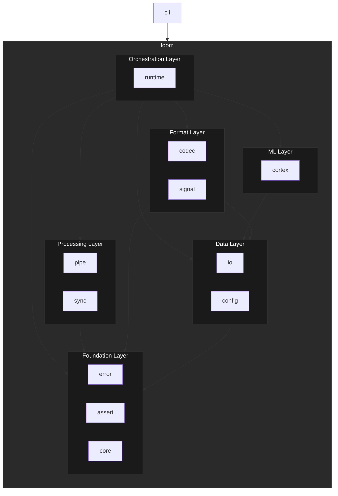

# Loom Libraries

The `loom` crate provides unified access to all framework components through feature-gated modules. It follows a layered architecture where foundational types flow upward through data, format, and processing layers, culminating in a runtime that orchestrates everything together.

## Architecture

## Crates

### Foundation Layer

| Crate | Description |
|-------|-------------|
| [**loom-error**](./loom-error/README.md) | Error handling utilities with error codes, messages, and backtraces |
| [**loom-assert**](./loom-assert/README.md) | Assertion utilities for testing |
| [**loom-core**](./loom-core/README.md) | Core data types, value system, formats, identifiers, and paths |

### Data Layer

| Crate | Description |
|-------|-------------|
| [**loom-io**](./loom-io/README.md) | Async I/O and data source abstraction with CRUD operations |
| [**loom-config**](./loom-config/README.md) | Configuration management with multiple providers (env, file, memory) |

### Format Layer

| Crate | Description |
|-------|-------------|
| [**loom-codec**](./loom-codec/README.md) | Format encoding/decoding registry (JSON, YAML, TOML) |
| [**loom-signal**](./loom-signal/README.md) | Event/signal emission system for telemetry and observability |

### Processing Layer

| Crate | Description |
|-------|-------------|
| [**loom-pipe**](./loom-pipe/README.md) | Data pipeline and stream processing with operators (Map, Filter, FanOut, Router, Parallel) |
| [**loom-sync**](./loom-sync/README.md) | Synchronization primitives for async operations |

### ML Layer

| Crate | Description |
|-------|-------------|
| [**loom-cortex**](./loom-cortex/README.md) | Machine learning and neural network capabilities (PyTorch, BERT) |

### Orchestration Layer

| Crate | Description |
|-------|-------------|
| [**loom-runtime**](./loom-runtime/README.md) | Core runtime orchestration integrating all components |

### CLI

| Crate | Description |
|-------|-------------|
| [**loom-cli**](./loom-cli/README.md) | Command-line interface binary |
