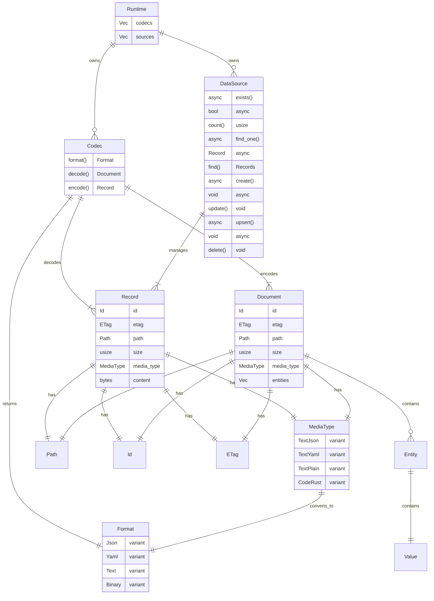

# loom-runtime

Core runtime library for Loom providing data source abstractions, codec transformations, and content type handling.

## Architecture



## Key Types

| Type | Description |
|------|-------------|
| **Runtime** | Top-level container holding codecs and data sources |
| **DataSource** | Async trait for storage backends (file system, memory, etc.) |
| **Codec** | Trait for encoding/decoding between Record and Document |
| **Record** | Raw bytes with metadata (storage layer) |
| **Document** | Parsed content with entities (application layer) |
| **MediaType** | Content type classification (78 variants) |
| **Format** | High-level format grouping (Json, Yaml, Text, Binary, etc.) |

## Data Flow

```
Read:  DataSource.find_one().await -> Record -> Codec.decode() -> Document
Write: Document -> Codec.encode() -> Record -> DataSource.create().await
```

## Usage

```rust
use loom_runtime::{Builder, FileSystemSource, JsonCodec, TextCodec};

let runtime = Builder::new()
    .codec(JsonCodec::new())
    .codec(TextCodec::new())
    .source(FileSystemSource::new())
    .build();
```
