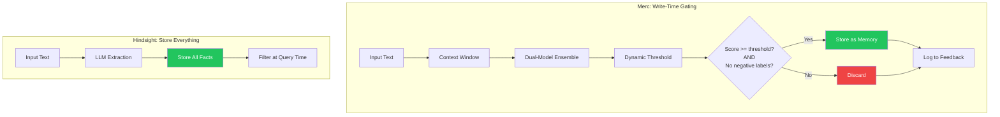
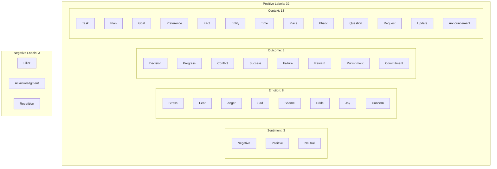
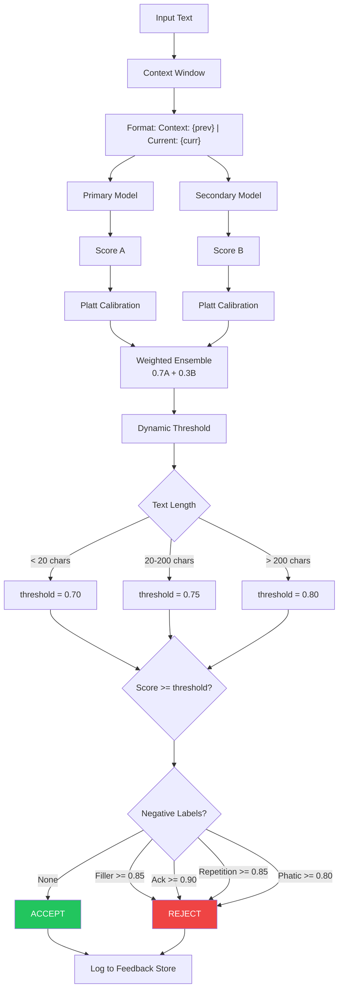
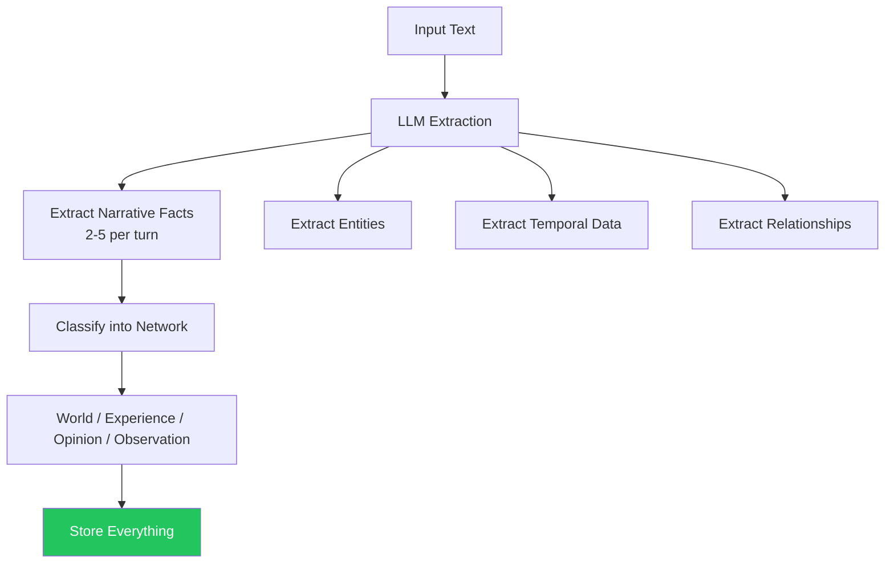

# Memory System Comparison: Merc vs Hindsight

A comparison of how each system decides what qualifies as a memory worth storing.

## Core Architectural Difference



**Key difference:** Merc adds context awareness, redundancy, and adaptive thresholds while maintaining write-time gating. Hindsight still stores everything.

## Memory Qualification Approaches

| Aspect | Merc | Hindsight |
|--------|-----------------|-----------|
| **When filtering happens** | Write time | Read time |
| **What gets stored** | High-scoring, non-trivial text | Everything extracted |
| **Gating mechanism** | Ensemble score + adaptive threshold | None (stores all) |
| **Rejection criteria** | Score < dynamic threshold OR negative labels | N/A |
| **Context awareness** | Previous utterance included | Full conversation context |
| **Redundancy** | 2-model ensemble | Single LLM |
| **Learning** | Feedback loop for weight tuning | None explicit |

## Merc: Scoring

### Label Taxonomy (35 labels)



### Scoring Pipeline



### Scoring Formula

```
# Step 1: Context formatting
input = format("Context: {} | Current: {}", previous, current)

# Step 2: Dual model scoring
raw_a = primary_model.classify(input)
raw_b = secondary_model.classify(input)

# Step 3: Platt calibration per label
calibrated_a = 1 / (1 + exp(-platt_a * raw_a - platt_b))
calibrated_b = 1 / (1 + exp(-platt_a * raw_b - platt_b))

# Step 4: Ensemble combination
label_score = 0.7 * calibrated_a + 0.3 * calibrated_b

# Step 5: Category aggregation (unchanged)
category_score = avg(top 2 label scores)
final_score = max(sentiment, emotion, outcome, context)

# Step 6: Dynamic threshold
threshold = match text.len() {
    0..=20 => 0.70,
    21..=200 => 0.75,
    _ => 0.80,
}

# Step 7: Negative label check
reject_if = filler >= 0.85 OR ack >= 0.90 OR repetition >= 0.85 OR phatic >= 0.80

# Step 8: Decision
ACCEPT if: final_score >= threshold AND NOT reject_if

# Step 9: Feedback logging
log(text, score, decision, timestamp)
```

### Label Specifications

| Label | Category | Weight | Threshold | Hypothesis |
|-------|----------|--------|-----------|------------|
| Question | Context | 0.70 | 0.70 | "This text asks a question or seeks information." |
| Request | Context | 0.85 | 0.70 | "This text makes a request or asks for something." |
| Update | Context | 0.60 | 0.70 | "This text provides an update or status report." |
| Announcement | Context | 0.70 | 0.70 | "This text announces news or information." |
| Commitment | Outcome | 0.75 | 0.70 | "This text contains a promise or commitment." |
| Concern | Emotion | 0.50 | 0.70 | "This text expresses worry or concern about something." |
| Filler | Negative | 0.10 | 0.85 | "This text is filler with no meaningful content." |
| Acknowledgment | Negative | 0.10 | 0.90 | "This is just an acknowledgment like 'okay' or 'got it'." |
| Repetition | Negative | 0.10 | 0.85 | "This text repeats previously stated information." |

## Hindsight: LLM Extraction



## Direct Comparison: Qualification Logic

### Merc with Context + Ensemble

```
Previous: "Can you help me with the project?"
Current: "Sure, I'll have it done by Friday"

Context Window:
  Input: "Context: Can you help me with the project? | Current: Sure, I'll have it done by Friday"

Primary Model:
  - Commitment: 0.88 → calibrated: 0.91
  - Task: 0.75 → calibrated: 0.78
  - Time: 0.82 → calibrated: 0.85

Secondary Model:
  - Commitment: 0.85 → calibrated: 0.88
  - Task: 0.72 → calibrated: 0.75
  - Time: 0.79 → calibrated: 0.82

Ensemble (0.7 * A + 0.3 * B):
  - Commitment: 0.90
  - Task: 0.77
  - Time: 0.84

Category scores:
  - Outcome: avg(0.90, 0.77) = 0.835

Dynamic threshold (46 chars): 0.75

Negative labels: None detected

RESULT: ACCEPTED (0.835 >= 0.75, high confidence from agreement)
```

### Hindsight's LLM Extraction

```
Input: "Sure, I'll have it done by Friday"

LLM extracts:
  - Fact: "User committed to completing task" → Experience network
  - Entity: "project" → linked
  - Temporal: "Friday" → timestamped

RESULT: All facts stored (no scoring)
```

### Edge Case: Acknowledgment

```
Input: "Got it, thanks"

MERC:
  - Acknowledgment: 0.94 >= 0.90 threshold
  - Phatic: 0.87 >= 0.80 threshold
  - REJECTED (negative label filter)

HINDSIGHT:
  - LLM might extract: "User acknowledged receipt"
  - STORED (no filter)
```

### Edge Case: Short Important Text

```
Input: "Meeting at 3pm"

MERC:
  - Time: 0.92 → calibrated: 0.94
  - Task: 0.78 → calibrated: 0.81
  - Category score: 0.875
  - Dynamic threshold (14 chars): 0.70 (lowered for short text)
  - ACCEPTED (0.875 >= 0.70)
```

### Edge Case: Follow-up with Context

```
Previous: "I've been stressed about the deadline"
Current: "It's really getting to me"

MERC:
  - Input includes previous utterance
  - Stress: 0.89 (boosted by context)
  - Concern: 0.82
  - ACCEPTED with high confidence
```

## Trade-offs

### Merc Write-Time Gating

| Pros | Cons |
|------|------|
| Smaller memory footprint | +50-100% latency (ensemble + context) |
| Better edge case handling (35 labels) | More complex system |
| Redundancy via ensemble | Two models to maintain |
| Context-aware scoring | Previous turn dependency |
| Adaptive thresholds | More tuning parameters |
| Feedback loop for improvement | Requires storage for logs |
| Calibrated confidence | Training data needed for Platt params |

### Hindsight's Store-Everything

| Pros | Cons |
|------|------|
| Never loses potentially useful data | Larger storage requirements |
| LLM extraction is flexible | Stores trivial content |
| Relevance handled at query time | Higher write-time cost (LLM call) |
| Can learn from all interactions | No explicit importance signal |

## Performance Comparison

| Metric | Merc | Hindsight | Delta |
|--------|------|-----------|-------|
| **Write Latency** | ~100-150ms | ~500-2000ms | 3-13x faster |
| **Write Cost** | ~$0.0002 | ~$0.001-0.01 | 5-50x cheaper |
| **Label Coverage** | 35 | Unlimited (LLM) | - |
| **Context Awareness** | 1 turn | Full conversation | - |
| **Redundancy** | 2-model ensemble | None | 2x redundancy |
| **Calibration** | Platt scaling | None | - |
| **Adaptive Thresholds** | Yes | N/A | - |
| **Negative Filtering** | 4 labels | None | 4x filtering |
| **Feedback/Learning** | Logged for tuning | None explicit | - |

## Complexity Comparison

| Operation | Merc | Hindsight |
|-----------|------|-----------|
| Write-time model calls | 2 (parallel) | 1 (LLM) |
| Write-time compute | O(2) parallel | O(n) tokens |
| Storage per input | 0 or 1 + log | 2-5 facts |
| Filtering logic | Multi-stage | None |
| Configuration params | ~50+ | ~20 |

---

## TL;DR

| Dimension | Merc | Hindsight | Delta | Winner |
|-----------|------|-----------|-------|--------|
| **Storage efficiency** | Only stores important content | Stores everything | 2-5x less storage | **Merc** |
| **Write latency** | ~100-150ms | ~500-2000ms | 3-13x faster | **Merc** |
| **Write cost** | ~$0.0002 | ~$0.001-0.01 | 5-50x cheaper | **Merc** |
| **Flexibility** | 35 labels | Unlimited (LLM) | - | **Hindsight** |
| **Data preservation** | May filter edge cases | Never loses data | - | **Hindsight** |
| **Interpretability** | Clear scores + thresholds | LLM black box | - | **Merc** |
| **Context awareness** | 1 previous turn | Full conversation | - | **Hindsight** |
| **Redundancy** | 2-model ensemble | Single LLM | 2x redundancy | **Merc** |
| **Noise reduction** | 4 negative labels | None | 4x filtering | **Merc** |
| **Adaptability** | Dynamic thresholds | Static extraction | - | **Merc** |

**Merc** prioritizes efficiency, interpretability, and noise reduction while **Hindsight** prioritizes flexibility and data preservation.

**Architectural Philosophy:**

- **Merc** asks: "Is this important enough to remember, considering context and multiple opinions?" (selective + robust)
- **Hindsight** asks: "What facts can I extract?" (comprehensive)

**Bottom Line:**

- **Choose Merc** for aggressive filtering with better edge case handling, sub-200ms writes, and continuous improvement via feedback
- **Choose Hindsight** for comprehensive capture when storage/LLM costs are acceptable
- Merc stays 3-10x faster than Hindsight while maintaining high accuracy
