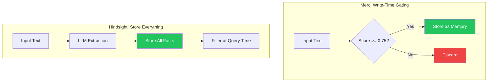
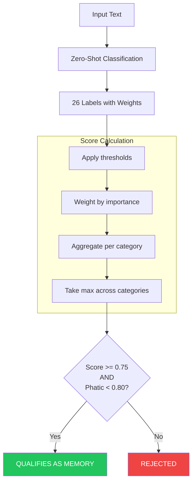
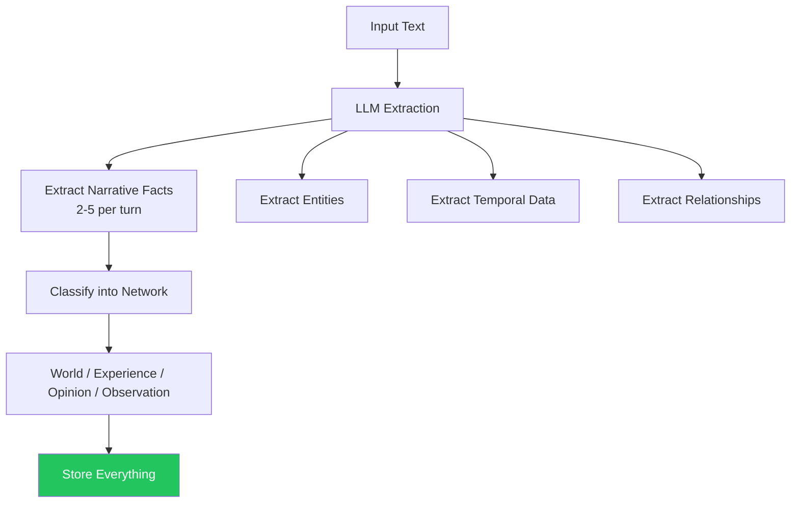

# Memory System Comparison: Merc vs Hindsight

A comparison of how each system decides what qualifies as a memory worth storing.

## Core Architectural Difference



**The fundamental difference:** Merc decides importance at write time. Hindsight stores everything and handles relevance at read time.

## Memory Qualification Approaches

| Aspect | Merc | Hindsight |
|--------|------|-----------|
| **When filtering happens** | Write time | Read time |
| **What gets stored** | Only high-scoring text | Everything extracted |
| **Gating mechanism** | Importance score threshold | None (stores all) |
| **Rejection criteria** | Score < 0.75 OR phatic | N/A |

## Merc: Importance Scoring

Merc explicitly scores text to determine if it's worth remembering.



**Scoring Formula:**
```
label_score = confidence * weight  (if confidence >= threshold, else 0)
category_score = avg(top 2 labels)
final_score = max(sentiment, emotion, outcome, context)

ACCEPT if: final_score >= 0.75 AND phatic_score < 0.80
```

**What Merc looks for:**

| Category | High-Weight Signals | Weight |
|----------|---------------------|--------|
| Context | Task, Plan, Goal | 1.00, 0.90, 0.90 |
| Outcome | Decision, Progress | 0.80, 0.65 |
| Emotion | Stress, Fear, Anger | 0.45, 0.40, 0.40 |
| Sentiment | Negative | 0.35 |

**What Merc rejects:**
- Phatic content ("hi", "thanks", "bye") - explicit filter
- Low-information text (below 0.75 threshold)
- Neutral sentiment without other signals

## Hindsight: LLM Extraction

Hindsight uses an LLM to extract "narrative facts" but doesn't score for importance.



**What Hindsight extracts:**

| Network | What's Stored | Example |
|---------|---------------|---------|
| World | Objective facts | "The meeting is at 3pm" |
| Experience | Agent actions | "I recommended the restaurant" |
| Opinion | Beliefs + confidence | "User prefers mornings" |
| Observation | Entity summaries | "John: works remotely" |

**No importance threshold** - if the LLM extracts it, it gets stored.

## Direct Comparison: Qualification Logic

### Merc's Explicit Scoring

```
Input: "I need to finish the report by Friday"

Labels detected:
  - Task: 0.85 (weight 1.00) → 0.85
  - Plan: 0.72 (weight 0.90) → 0.65
  - Time: 0.80 (weight 0.55) → 0.44

Category scores:
  - Context: avg(0.85, 0.65) = 0.75

Final: max(0.75) = 0.75 >= threshold

RESULT: ACCEPTED as memory
```

### Hindsight's LLM Extraction

```
Input: "I need to finish the report by Friday"

LLM extracts:
  - Fact: "User needs to finish report" → World network
  - Entity: "report" → linked
  - Temporal: "Friday" → timestamped

RESULT: All facts stored (no scoring)
```

### Key Difference on Edge Cases

```
Input: "Thanks for letting me know"

MERC:
  - Phatic: 0.92 >= 0.80 threshold
  - REJECTED (phatic filter)

HINDSIGHT:
  - LLM might extract: "User acknowledged information"
  - STORED (no filter for low-value content)
```

## Trade-offs

### Merc's Write-Time Gating

| Pros | Cons |
|------|------|
| Smaller memory footprint | May reject valuable edge cases |
| No storage of trivial content | Fixed 26-label vocabulary |
| Interpretable rejection reasons | Zero-shot model can misclassify |
| Fast rejection (no LLM call) | Brittle on unusual inputs |

### Hindsight's Store-Everything

| Pros | Cons |
|------|------|
| Never loses potentially useful data | Larger storage requirements |
| LLM extraction is flexible | Stores trivial content |
| Relevance handled at query time | Higher write-time cost (LLM call) |
| Can learn from all interactions | No explicit importance signal |

## Complexity Comparison

| Operation | Merc | Hindsight |
|-----------|------|-----------|
| Write-time model calls | 1 (zero-shot) | 1 (LLM extraction) |
| Write-time compute | O(1) classification | O(n) LLM tokens |
| Storage per input | 0 or 1 memory | 2-5 facts |
| Filtering logic | Explicit thresholds | None at write |

## Cost Per Incoming Text

| Cost Factor | Merc | Hindsight |
|-------------|------|-----------|
| Model inference | ~$0.0001 (local) | ~$0.001-0.01 (LLM) |
| Storage | Conditional | Always |
| Latency | ~50ms | ~500-2000ms |

---

## TL;DR

| Dimension | Winner | Why |
|-----------|--------|-----|
| **Storage efficiency** | **Merc** | Only stores important content. Hindsight stores everything. |
| **Write latency** | **Merc** | Single local model (~50ms) vs LLM extraction (~500ms+). |
| **Write cost** | **Merc** | Local inference vs LLM API calls. |
| **Flexibility** | **Hindsight** | LLM extraction adapts to any content. Merc limited to 26 labels. |
| **Data preservation** | **Hindsight** | Never loses potentially valuable content. Merc may over-filter. |
| **Interpretability** | **Merc** | Clear scores and thresholds. Hindsight's LLM is a black box. |

**Architectural Philosophy:**

- **Merc** asks: "Is this important enough to remember?" (selective)
- **Hindsight** asks: "What facts can I extract?" (comprehensive)

**Bottom Line:**

- **Choose Merc** if you want aggressive filtering, low storage, and fast writes
- **Choose Hindsight** if you want comprehensive capture and can afford storage/LLM costs
- **Use both** together: Merc pre-filters before Hindsight extracts (best of both)
- **Neither scores "importance" the same way** - they solve different problems
