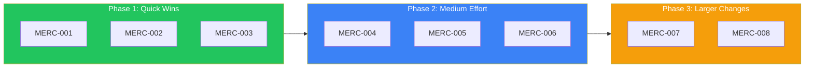

# Merc Scoring Backlog

Implementation tasks for scoring improvements. See [improvement-proposals.md](./improvement-proposals.md) for detailed rationale.

---

## Completed Work (2026-01-27)

Previous taxonomy improvements:
- ✅ Added `Phatic` context label for greetings/smalltalk
- ✅ Removed ambiguous `Response` outcome label
- ✅ Added `Neutral` sentiment label
- ✅ Added `Preference`, `Plan`, `Goal`, `Task` context labels
- ✅ Added `Progress`, `Conflict` outcome labels
- ✅ Renamed `Person` → `Entity`
- **Current total:** 26 labels

---

## Upcoming Improvements



| Phase | Tasks | Latency Impact | Combined Gain |
|-------|-------|----------------|---------------|
| Phase 1 | MERC-001, 002, 003 | 0% | 20-45% |
| Phase 2 | MERC-004, 005, 006 | +10-15% | +30-45% noise reduction |
| Phase 3 | MERC-007, 008 | +50-100% | +25-45% |

---

## Phase 1: Quick Wins (No Latency Cost)

### MERC-001: Hypothesis Optimization

**Status:** 🔲 Not Started

**Description:** Benchmark and optimize hypothesis phrasings for all 26 labels.

**Files:**
- `src/score/label.rs` - `hypothesis()` methods (lines 192-472)

**Tasks:**
- [ ] Create benchmark dataset (100+ labeled samples)
- [ ] Test 3-5 hypothesis variations per label
- [ ] Update `hypothesis()` methods with best phrasings
- [ ] Document phrasing decisions

**Acceptance Criteria:**
- Each label benchmarked
- 5-15% improvement on test set
- Zero runtime cost

---

### MERC-002: Confidence Calibration

**Status:** 🔲 Not Started

**Description:** Implement Platt scaling to calibrate confidence scores.

**Files:**
- `src/score/label.rs` - Add calibration params
- `src/score/result.rs` - Modify `ScoreLabel::with_score()` (line 132)

**Tasks:**
- [ ] Add `platt_a`, `platt_b` params to labels
- [ ] Create `calibrate(raw: f32) -> f32` function
- [ ] Train params on validation set
- [ ] Add unit tests

**Implementation:**
```rust
fn calibrate(raw: f32, a: f32, b: f32) -> f32 {
    1.0 / (1.0 + (-a * raw - b).exp())
}
```

**Acceptance Criteria:**
- <1ms latency increase
- 10-20% reduction in false positives/negatives

---

### MERC-003: Dynamic Thresholds

**Status:** 🔲 Not Started

**Description:** Adjust threshold based on text length.

**Files:**
- `src/score/mod.rs` - Modify `invoke()` (line 34)
- `src/score/options.rs` - Add config option

**Tasks:**
- [ ] Add `dynamic_threshold: bool` to `ScoreOptions`
- [ ] Create `compute_threshold(text, base) -> f32`
- [ ] Short text (<20 chars): threshold - 0.05
- [ ] Long text (>200 chars): threshold + 0.05
- [ ] Add tests

**Acceptance Criteria:**
- Configurable via options
- No latency impact
- 5-10% better precision

---

## Phase 2: Medium Effort (+10-15% Latency)

### MERC-004: Negative Label Boosting

**Status:** 🔲 Not Started

**Description:** Add Filler, Acknowledgment, Repetition labels to reduce noise.

**Files:**
- `src/score/label.rs` - Add to `ContextLabel` enum

**Tasks:**
- [ ] Add `Filler` (threshold: 0.85, weight: 0.10)
- [ ] Add `Acknowledgment` (threshold: 0.90, weight: 0.10)
- [ ] Add `Repetition` (threshold: 0.85, weight: 0.10)
- [ ] Update `Label::all()` and `Label::context()`
- [ ] Extend rejection logic in `mod.rs`

**Hypotheses:**
```
Filler: "This text is filler with no meaningful content."
Acknowledgment: "This is just an acknowledgment like 'okay' or 'got it'."
Repetition: "This text repeats previously stated information."
```

**Acceptance Criteria:**
- 3 new negative labels
- 20-30% noise reduction

---

### MERC-005: Label Expansion (+6 Positive Labels)

**Status:** 🔲 Not Started

**Description:** Add Question, Request, Commitment, Concern, Update, Announcement.

**Files:**
- `src/score/label.rs` - Add to appropriate enums

**Tasks:**
- [ ] Add `Question` to Context (weight: 0.70)
- [ ] Add `Request` to Context (weight: 0.85)
- [ ] Add `Commitment` to Outcome (weight: 0.75)
- [ ] Add `Concern` to Emotion (weight: 0.50)
- [ ] Add `Update` to Context (weight: 0.60)
- [ ] Add `Announcement` to Context (weight: 0.70)
- [ ] Benchmark hypotheses

**Acceptance Criteria:**
- 32 total labels
- 10-15% better recall

---

### MERC-006: Feedback Loop Infrastructure

**Status:** 🔲 Not Started

**Description:** Log decisions for analysis and weight tuning.

**Files:**
- `src/score/feedback.rs` (new)
- `src/score/mod.rs` - Add logging

**Tasks:**
- [ ] Create `FeedbackLog` struct
- [ ] Create `FeedbackStore` trait
- [ ] Implement file-based storage (MVP)
- [ ] Add `correct: Option<bool>` for labeling
- [ ] Create review CLI/API

**Implementation:**
```rust
pub struct FeedbackLog {
    pub id: Uuid,
    pub text: String,
    pub score: f32,
    pub decision: Decision,
    pub timestamp: DateTime<Utc>,
    pub correct: Option<bool>,
}
```

**Acceptance Criteria:**
- Decisions logged
- Pluggable storage
- <1ms overhead

---

## Phase 3: Larger Changes (+50-100% Latency)

### MERC-007: Context Window

**Status:** 🔲 Not Started

**Description:** Include previous utterance in scoring.

**Files:**
- `src/score/mod.rs` - New method
- `src/score/options.rs` - Add config

**Tasks:**
- [ ] Create `ScoringContext` struct
- [ ] Add `invoke_with_context()` method
- [ ] Format: `"Context: {prev} | Current: {curr}"`
- [ ] Benchmark accuracy impact

**Acceptance Criteria:**
- Optional, backward compatible
- 10-20% better on follow-ups

---

### MERC-008: Lightweight Ensemble

**Status:** 🔲 Not Started

**Description:** Two parallel models for redundancy.

**Files:**
- `src/score/mod.rs` - Major refactor
- `src/score/ensemble.rs` (new)

**Tasks:**
- [ ] Select secondary model
- [ ] Implement parallel execution
- [ ] Add `Confidence` enum (High/Low)
- [ ] Weighted averaging (0.7/0.3)

**Implementation:**
```rust
fn ensemble_score(text: &str) -> (f32, Confidence) {
    let (a, b) = rayon::join(
        || primary.score(text),
        || secondary.score(text),
    );
    let agreement = (a >= 0.75) == (b >= 0.75);
    (0.7 * a + 0.3 * b, if agreement { High } else { Low })
}
```

**Acceptance Criteria:**
- <150ms total latency
- 15-25% error reduction

---

## Testing Requirements

- [ ] Benchmark dataset (500+ labeled samples)
- [ ] Latency benchmarks per phase
- [ ] Accuracy benchmarks per phase
- [ ] Unit tests for each improvement

---

## Success Metrics

| Metric | Current | Phase 1 | Phase 2 | Phase 3 |
|--------|---------|---------|---------|---------|
| Accuracy | Baseline | +20% | +35% | +50% |
| False Positives | Baseline | -15% | -30% | -40% |
| Noise Stored | Baseline | - | -25% | -30% |
| Latency | ~50ms | ~50ms | ~60ms | ~100-150ms |
