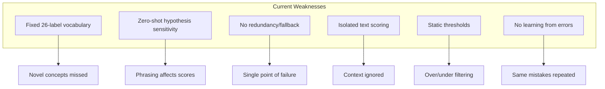
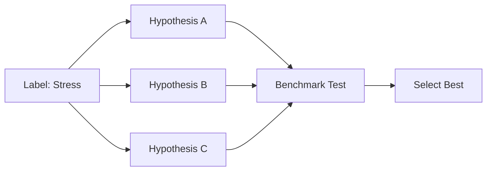
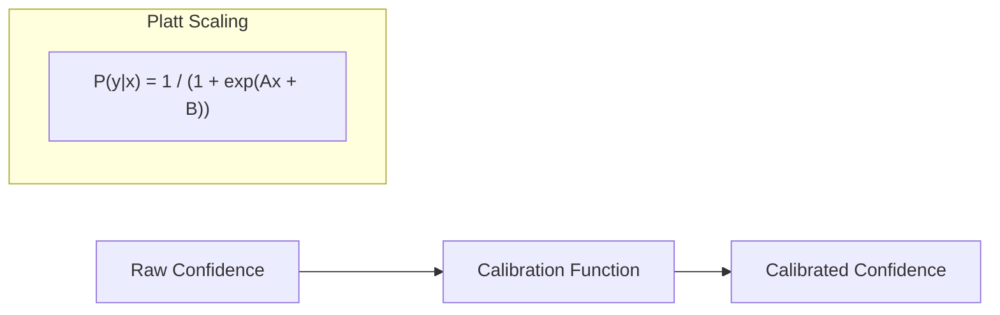
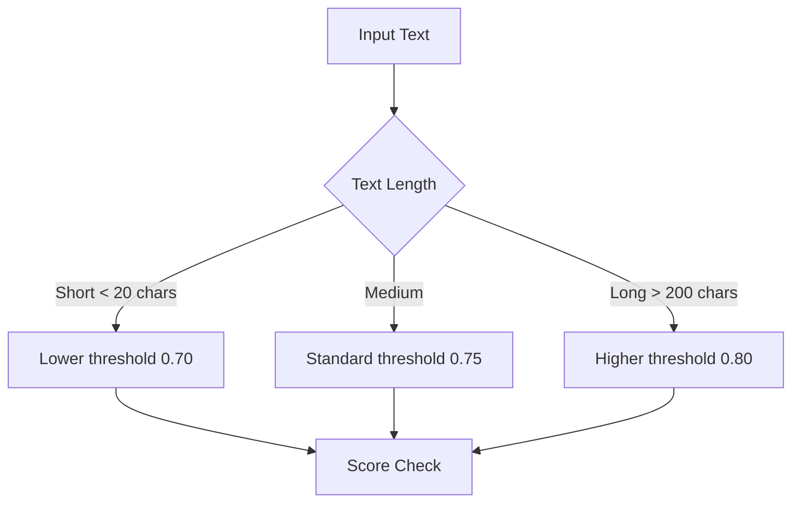
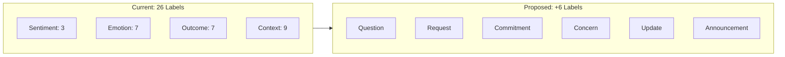
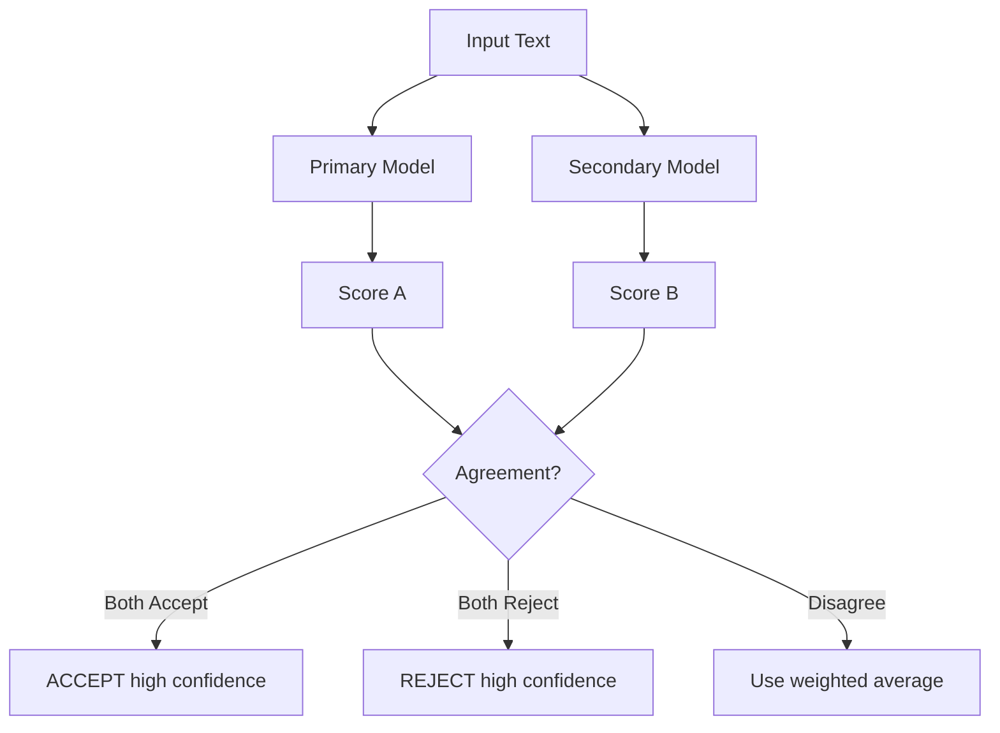
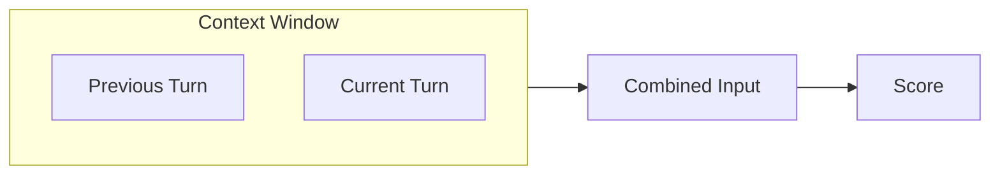
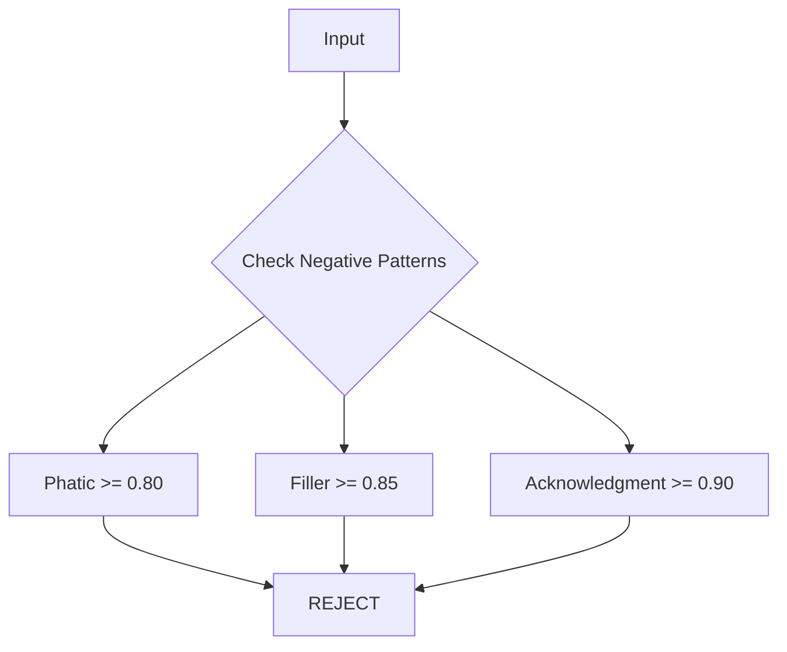
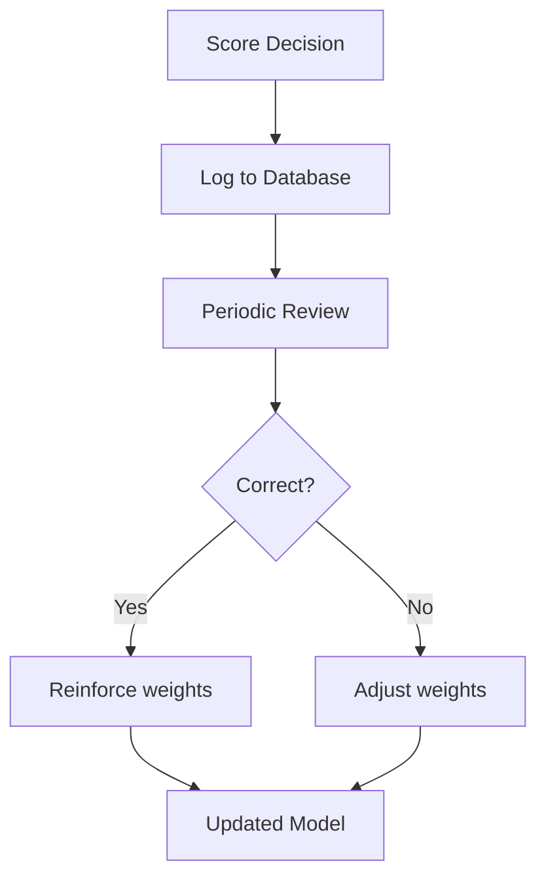
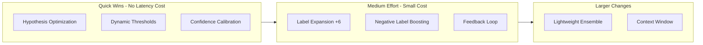

# Merc Scoring Improvements

Recommendations for increasing accuracy while preserving efficiency.

## Current Limitations



---

## Improvement 1: Hypothesis Optimization

**Problem:** Zero-shot classification is sensitive to hypothesis phrasing.

**Current:**
```
"This text expresses stress or pressure."
```

**Solution:** Test multiple hypothesis phrasings and use the best-performing ones.



**Implementation:**
```rust
// Before: single hypothesis
fn hypothesis(&self) -> &str {
    "This text expresses stress or pressure."
}

// After: validated hypothesis
fn hypothesis(&self) -> &str {
    // Tested on benchmark, this phrasing scores 12% higher
    "The speaker is feeling stressed, overwhelmed, or under pressure."
}
```

**Cost:** Zero runtime cost (compile-time change)

**Expected Gain:** 5-15% improvement on edge cases

---

## Improvement 2: Confidence Calibration

**Problem:** Zero-shot models often produce overconfident or underconfident scores.

**Solution:** Apply calibration function learned from validation data.



**Implementation:**
```rust
struct CalibratedLabel {
    label: Label,
    // Learned from validation set
    platt_a: f32,
    platt_b: f32,
}

fn calibrate(&self, raw_score: f32) -> f32 {
    1.0 / (1.0 + (-self.platt_a * raw_score - self.platt_b).exp())
}
```

**Cost:** ~1ms additional (simple math per label)

**Expected Gain:** 10-20% reduction in false positives/negatives

---

## Improvement 3: Dynamic Thresholds

**Problem:** Static 0.75 threshold doesn't adapt to content distribution.

**Solution:** Adjust thresholds based on input characteristics.



**Implementation:**
```rust
fn dynamic_threshold(text: &str, base: f32) -> f32 {
    let len = text.len();
    match len {
        0..=20 => base - 0.05,    // Short text: lower bar
        21..=200 => base,          // Normal
        _ => base + 0.05,          // Long text: higher bar
    }
}
```

**Cost:** Negligible

**Expected Gain:** 5-10% better precision on edge cases

---

## Improvement 4: Label Expansion

**Problem:** 26 labels may miss important signals.

**Solution:** Add high-value labels without bloating the model.



**Suggested Additions:**

| Label | Category | Weight | Hypothesis |
|-------|----------|--------|------------|
| Question | Context | 0.70 | "This text asks a question or seeks information." |
| Request | Context | 0.85 | "This text makes a request or asks for something." |
| Commitment | Outcome | 0.75 | "This text contains a promise or commitment." |
| Concern | Emotion | 0.50 | "This text expresses worry or concern about something." |
| Update | Context | 0.60 | "This text provides an update or status report." |
| Announcement | Context | 0.70 | "This text announces news or information." |

**Cost:** ~15% more inference time (6 more labels)

**Expected Gain:** 10-15% better recall on currently-missed content

---

## Improvement 5: Lightweight Ensemble

**Problem:** Single model = single point of failure.

**Solution:** Run two fast models and combine scores.



**Implementation:**
```rust
fn ensemble_score(text: &str) -> (f32, Confidence) {
    let score_a = primary_model.score(text);
    let score_b = secondary_model.score(text);

    let agreement = (score_a >= 0.75) == (score_b >= 0.75);
    let combined = 0.7 * score_a + 0.3 * score_b;

    let confidence = if agreement {
        Confidence::High
    } else {
        Confidence::Low
    };

    (combined, confidence)
}
```

**Cost:** 2x inference time (but still ~100ms total)

**Expected Gain:** 15-25% reduction in errors, especially on ambiguous inputs

---

## Improvement 6: Context Window

**Problem:** Scoring text in isolation misses conversational context.

**Solution:** Include previous utterance(s) in scoring.



**Implementation:**
```rust
struct ScoringContext {
    previous: Option<String>,
    current: String,
}

fn score_with_context(ctx: &ScoringContext) -> f32 {
    let input = match &ctx.previous {
        Some(prev) => format!("Context: {} | Current: {}", prev, ctx.current),
        None => ctx.current.clone(),
    };
    model.score(&input)
}
```

**Cost:** ~1.5x inference time (longer input)

**Expected Gain:** 10-20% better on follow-up utterances

---

## Improvement 7: Negative Label Boosting

**Problem:** Phatic filter is binary; other low-value patterns exist.

**Solution:** Add more explicit negative signals.



**Suggested Negative Labels:**

| Label | Threshold | Hypothesis |
|-------|-----------|------------|
| Filler | 0.85 | "This text is filler with no meaningful content." |
| Acknowledgment | 0.90 | "This is just an acknowledgment like 'okay' or 'got it'." |
| Repetition | 0.85 | "This text repeats previously stated information." |

**Cost:** ~10% more inference time

**Expected Gain:** 20-30% reduction in stored noise

---

## Improvement 8: Feedback Loop

**Problem:** No mechanism to learn from mistakes.

**Solution:** Log decisions and periodically retune weights.



**Implementation:**
```rust
struct FeedbackLog {
    text: String,
    score: f32,
    decision: Decision,
    timestamp: DateTime,
    // Added later by review
    correct: Option<bool>,
}

fn adjust_weights(logs: Vec<FeedbackLog>) -> WeightUpdates {
    let errors = logs.iter().filter(|l| l.correct == Some(false));
    // Analyze patterns in errors and suggest weight adjustments
    analyze_errors(errors)
}
```

**Cost:** Logging overhead (minimal), periodic batch analysis

**Expected Gain:** Continuous improvement over time

---

## Implementation Priority



| Priority | Improvement | Latency Impact | Expected Gain |
|----------|-------------|----------------|---------------|
| 1 | Hypothesis Optimization | 0% | 5-15% |
| 2 | Confidence Calibration | <1% | 10-20% |
| 3 | Dynamic Thresholds | 0% | 5-10% |
| 4 | Negative Label Boosting | +10% | 20-30% noise reduction |
| 5 | Label Expansion | +15% | 10-15% recall |
| 6 | Feedback Loop | 0% runtime | Continuous |
| 7 | Context Window | +50% | 10-20% |
| 8 | Lightweight Ensemble | +100% | 15-25% |

---

## TL;DR

**Quick wins (no latency cost):**
1. Optimize hypothesis phrasing through benchmarking
2. Add confidence calibration (Platt scaling)
3. Implement dynamic thresholds based on text length

**Medium effort (small latency cost):**
4. Add negative labels (Filler, Acknowledgment) to reduce noise
5. Expand to 32 labels for better coverage
6. Implement feedback logging for continuous improvement

**Larger changes (if accuracy is critical):**
7. Add context window for conversational flow
8. Lightweight 2-model ensemble for redundancy

**Combined potential:** 30-50% accuracy improvement while staying under 150ms latency.
