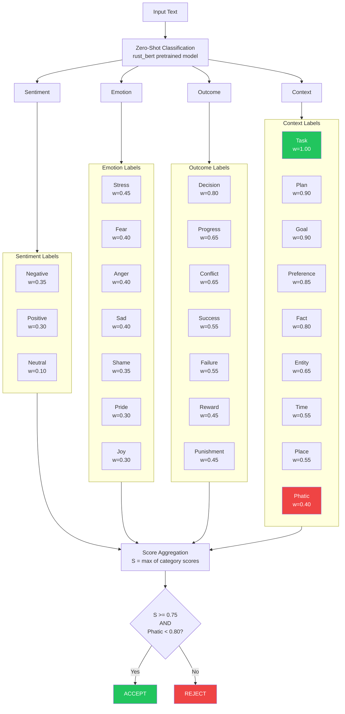
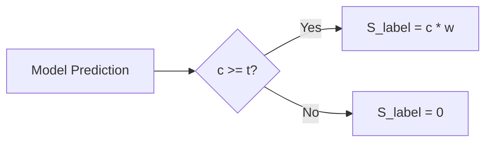
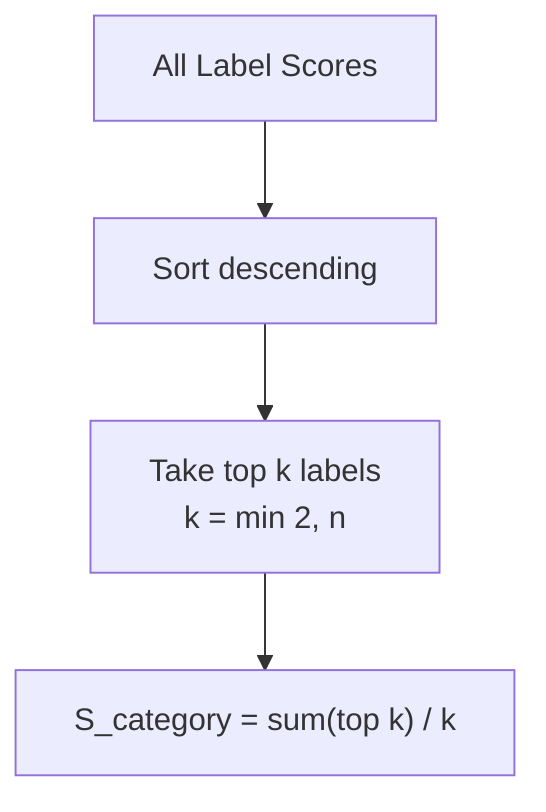
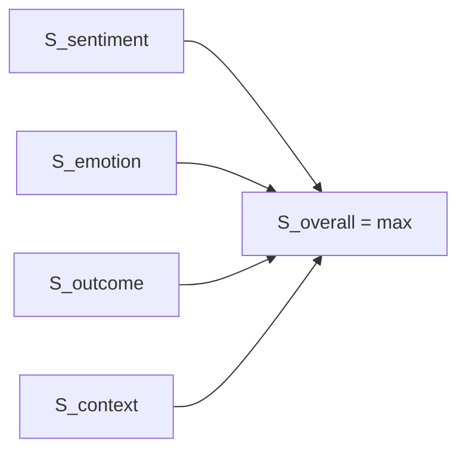
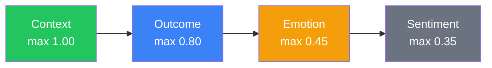
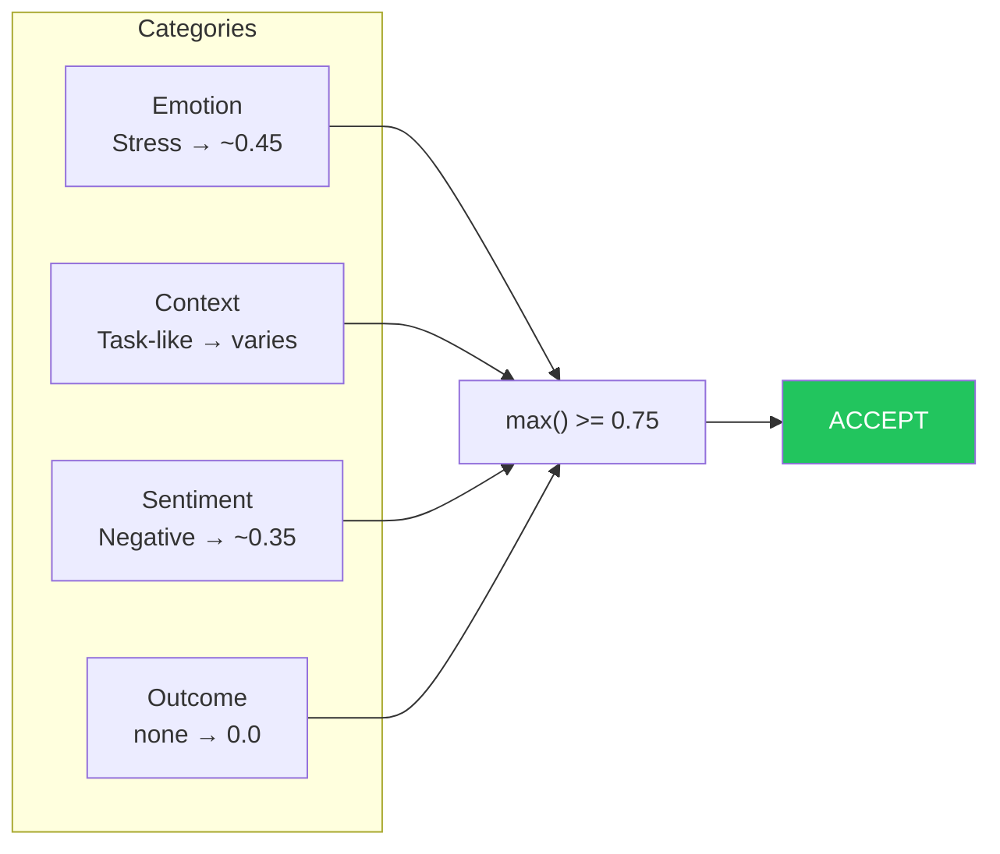
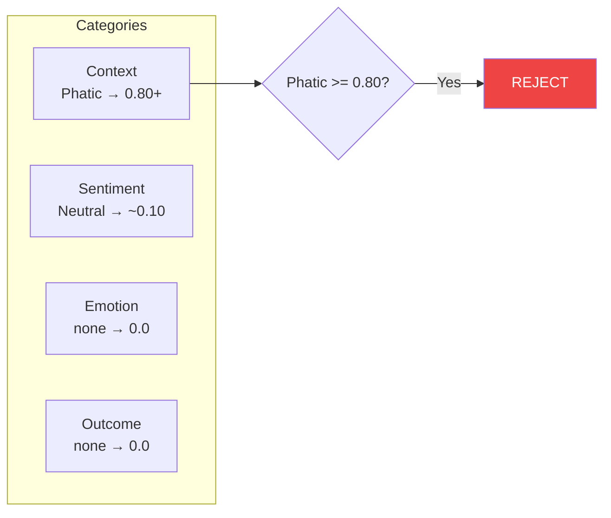

# Scoring Algorithm

A multi-dimensional text classification system for determining text importance and filtering trivial content.

## Overview

The scoring algorithm evaluates input text across four independent dimensions using zero-shot classification, then aggregates weighted predictions to produce a final importance score. Text that scores below a threshold or is detected as phatic (small talk) is rejected.

## Data Flow

## Mathematical Definitions

### Label Score

For each label prediction from the model:

Where:
- `c` = model confidence (0.0 to 1.0)
- `w` = label weight (predefined per label)
- `t` = label threshold (predefined per label)

### Category Score

Each category aggregates its top-k label scores:

Where:
- `k = min(2, n)` where n = number of labels with non-zero scores
- Labels are sorted in descending order by score
- k is at least 1 to avoid division by zero

### Overall Score

The final score is the maximum across all categories:

## Label Categories

### Sentiment (3 labels)

| Label    | Weight | Threshold | Hypothesis                                      |
|----------|--------|-----------|------------------------------------------------|
| Negative | 0.35   | 0.70      | "This text expresses a negative sentiment."    |
| Positive | 0.30   | 0.70      | "This text expresses a positive sentiment."    |
| Neutral  | 0.10   | 0.70      | "This text expresses a neutral sentiment."     |

### Emotion (7 labels)

| Label  | Weight | Threshold | Hypothesis                                      |
|--------|--------|-----------|------------------------------------------------|
| Stress | 0.45   | 0.70      | "This text expresses stress or pressure."      |
| Fear   | 0.40   | 0.70      | "This text expresses fear or anxiety."         |
| Anger  | 0.40   | 0.70      | "This text expresses anger or frustration."    |
| Sad    | 0.40   | 0.70      | "This text expresses sadness or grief."        |
| Shame  | 0.35   | 0.70      | "This text expresses shame or embarrassment."  |
| Pride  | 0.30   | 0.70      | "This text expresses pride or accomplishment." |
| Joy    | 0.30   | 0.70      | "This text expresses joy or happiness."        |

### Outcome (7 labels)

| Label      | Weight | Threshold | Hypothesis                                                          |
|------------|--------|-----------|---------------------------------------------------------------------|
| Decision   | 0.80   | 0.70      | "This text describes making a decision or choice."                  |
| Progress   | 0.65   | 0.70      | "This text describes progress, completion, or forward movement."    |
| Conflict   | 0.65   | 0.70      | "This text describes disagreement, conflict, argument, or tension." |
| Success    | 0.55   | 0.70      | "This text describes achieving a goal or success."                  |
| Failure    | 0.55   | 0.70      | "This text describes a failure or setback."                         |
| Reward     | 0.45   | 0.70      | "This text describes receiving a reward or benefit."                |
| Punishment | 0.45   | 0.70      | "This text describes a punishment or consequence."                  |

### Context (9 labels)

| Label      | Weight | Threshold | Hypothesis                                                           |
|------------|--------|-----------|----------------------------------------------------------------------|
| Task       | 1.00   | 0.65      | "This text describes a task, todo item, or reminder."                |
| Plan       | 0.90   | 0.65      | "This text describes a plan, commitment, or intention."              |
| Goal       | 0.90   | 0.65      | "This text describes a goal, objective, or aspiration."              |
| Preference | 0.85   | 0.65      | "This text expresses a preference, like, dislike, or opinion."       |
| Fact       | 0.80   | 0.70      | "This text states a factual piece of information."                   |
| Entity     | 0.65   | 0.75      | "This text mentions a specific named person, organization, or entity."|
| Time       | 0.55   | 0.70      | "This text references a specific time or date."                      |
| Place      | 0.55   | 0.70      | "This text references a specific location or place."                 |
| Phatic     | 0.40   | 0.80      | "This text is a greeting, thanks, farewell, or polite small talk."   |

## Rejection Criteria

Text is rejected (returns Cancel status) if **either** condition is met:

1. **Low Score:** `S_overall < 0.75`
2. **Phatic Detection:** `S_phatic >= 0.80`

The phatic filter ensures greetings and small talk ("hi", "thanks", "bye") are filtered out regardless of other detected signals.

## Weight Design Rationale

The weight hierarchy reflects the system's optimization for capturing actionable information:

**Context labels are prioritized** because they capture information most useful for memory/reminder systems:
- Tasks (1.00) and Plans/Goals (0.90) are weighted highest as they represent explicit actionable items
- Preferences (0.85) and Facts (0.80) capture important personal information
- Entity/Time/Place (0.55-0.65) provide supporting context
- Phatic (0.40) is weighted low but has a high threshold (0.80) for rejection

**Outcome labels** capture significant life events and decisions that may be worth remembering.

**Emotion labels** weight negative emotions (stress, fear, anger) slightly higher than positive ones, as distress signals may warrant attention.

**Sentiment labels** have the lowest weights since raw sentiment provides less actionable information than the other dimensions.

## Example Scoring

### Example 1: Accepted

**Input:** "oh my god, I'm going to be late for work!"

### Example 2: Rejected

**Input:** "hi how are you?"

