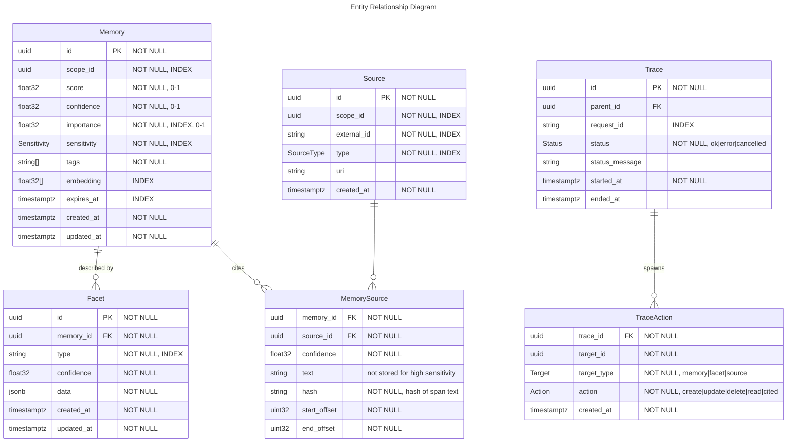

# MERC: Storage

## Entity

```mermaid
---
title: "Entity Relationship Diagram"
---

erDiagram
    Memory {
        uuid        id          PK  "NOT NULL"
        uuid        scope_id        "NOT NULL, INDEX"
        float32     score           "NOT NULL, 0-1"
        float32     confidence      "NOT NULL, 0-1"
        float32     importance      "NOT NULL, INDEX, 0-1"
        Sensitivity sensitivity     "NOT NULL, INDEX"
        string[]    tags            "NOT NULL"
        float32[]   embedding       "INDEX"
        timestamptz expires_at      "INDEX"
        timestamptz created_at      "NOT NULL"
        timestamptz updated_at      "NOT NULL"
    }

    Facet {
        uuid        id          PK  "NOT NULL"
        uuid        memory_id   FK  "NOT NULL"
        string      type            "NOT NULL, INDEX"
        float32     confidence      "NOT NULL"
        jsonb       data            "NOT NULL"
        timestamptz created_at      "NOT NULL"
        timestamptz updated_at      "NOT NULL"
    }

    Source {
        uuid        id          PK  "NOT NULL"
        uuid        scope_id        "NOT NULL, INDEX"
        string      external_id     "NOT NULL, INDEX"
        SourceType  type            "NOT NULL, INDEX"
        string      uri
        timestamptz created_at      "NOT NULL"
    }

    MemorySource {
        uuid        memory_id       FK  "NOT NULL"
        uuid        source_id       FK  "NOT NULL"
        float32     confidence          "NOT NULL"
        string      text                "not stored for high sensitivity"
        string      hash                "NOT NULL, hash of span text"
        uint32      start_offset        "NOT NULL"
        uint32      end_offset          "NOT NULL"
    }

    Trace {
        uuid        id          PK  "NOT NULL"
        uuid        parent_id   FK
        string      request_id      "INDEX"
        Status      status          "NOT NULL, ok|error|cancelled"
        string      status_message
        timestamptz started_at      "NOT NULL"
        timestamptz ended_at
    }

    TraceAction {
        uuid        trace_id    FK  "NOT NULL"
        uuid        target_id       "NOT NULL"
        Target      target_type     "NOT NULL, memory|facet|source"
        Action      action          "NOT NULL, create|update|delete|read|cited"
        timestamptz created_at      "NOT NULL"
    }

    Memory ||--o{ Facet : "described by"
    Memory ||--o{ MemorySource : "cites"
    Source ||--o{ MemorySource : ""
    Trace  ||--o{ TraceAction : "spawns"
```